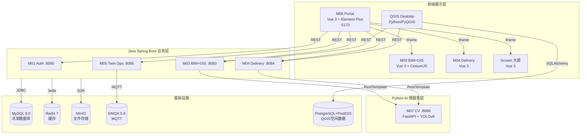
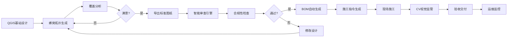

# 通信基建数智化全流程平台 — 项目总概括

**版本**: 1.0  
**最后更新**: 2026-07-02  
**文档用途**: 为AI系统和新成员提供快速、全面的项目理解入口

---

## 变更记录

| 版本 | 日期 | 更新内容 | 维护人 |
|------|------|----------|--------|
| v1.0 | 2026-07-02 | 初始版本，整合所有项目信息 | 人A |

---

## 一、项目背景

### 1.1 项目定位
本平台是参加**挑战杯"揭榜挂帅"擂台赛**的参赛作品，针对的是**通信基建工程数智化设计与交付关键技术**这个比赛题目，由**烽火通信科技股份有限公司**发起并提供赛题。

### 1.2 核心目标
为通信基础设施建设提供一套完整的数字化管理方案，覆盖从**规划设计 → 三维设计 → 交付验收 → 运行维护**的全过程，帮助提升设计效率、审查准确率和施工监管水平。

### 1.3 时间节点
| 阶段 | 时间 | 状态 |
|------|------|------|
| 报名 | 2026年5月30日—6月30日 | ✅ 已完成 |
| 开发 | 2026年6月—9月 | 🔄 进行中 |
| 作品提交 | 2026年9月15日 | ⏳ 待完成 |

---

## 二、核心功能与子赛题

### 2.1 子赛题覆盖
聚焦子赛题 **1/3/4/5**，形成完整"设计→审查→BOM→监管"闭环。

| 子赛题 | 名称 | 指标要求 | 目标值 |
|--------|------|----------|--------|
| 子赛题1 | QGIS基站智能辅助设计 | 效率提升≥30%，减少50%手动绘图 | ≥60% |
| 子赛题3 | 基于行业标准的设计智能审查 | 审查覆盖率≥80%，风险识别准确率≥95% | ≥90% / ≥98% |
| 子赛题4 | 设计成果向施工指令自动转化 | 施工准备资料编制时间缩短50% | ≥60% |
| 子赛题5 | 施工过程智能监管 | 违章识别准确率≥85%，隐蔽工程验真≥90% | ≥90% |

### 2.2 核心功能模块

| 模块 | 名称 | 端口 | 功能描述 |
|------|------|------|----------|
| M01 | 统一认证服务 | 8080 | 用户登录验证、账号管理、菜单权限控制 |
| M03 | BIM+GIS三维设计引擎 | 8083 | 三维地图展示、设备管理、信号覆盖分析 |
| M04 | 数智化交付与工作流 | 8084 | 工单管理、验收流程、物料清单（BOM）管理 |
| M05 | 数字孪生与智慧运维 | 8085 | 告警处理、设备监控、巡检管理 |
| M06 | 统一前端门户 | 5173 | 系统统一入口、动态菜单、内嵌页面展示 |
| M07 | AI视觉检测引擎 | 8088 | 违章行为识别、隐蔽工程影像验证（基于AI图像识别） |
| QGIS插件 | 基站智能设计 | — | 基站布局规划、信号覆盖计算、图纸导出 |

---

## 三、技术架构

### 3.1 系统架构图

### 3.2 技术栈

| 层级 | 技术 | 版本 | 说明 |
|------|------|------|------|
| 后端框架 | Spring Boot | 3.1.10 | Java 17 |
| ORM | MyBatis-Plus | 3.5.5 | 增强MyBatis |
| 认证 | JJWT | 0.11.5 | JWT令牌处理 |
| 前端框架 | Vue 3 | ^3.4.21 | 组合式API |
| UI组件 | Element Plus | ^2.6.3 | Vue3组件库 |
| 3D引擎 | CesiumJS | ^1.141.0 | 地理可视化 |
| 图表 | ECharts | ^6.1.0 | 数据可视化 |
| CV引擎 | FastAPI + YOLOv8 | — | 视觉检测 |
| QGIS插件 | Python + PyQGIS | 3.34+ | 桌面GIS设计 |

---

## 四、业务流程

### 4.1 完整业务闭环

### 4.2 关键流程说明

1. **设计阶段**: 使用QGIS插件自动生成基站布局方案，通过专业的信号传播模型（Okumura-Hata）计算信号覆盖范围
2. **审查阶段**: 根据国家和行业标准（如DL/T 741电力行业标准、GB 8702电磁环境控制限值）自动检查设计方案是否合规
3. **交付阶段**: 从设计图纸中自动提取物料清单（BOM），生成施工所需的详细指令包
4. **监管阶段**: 使用AI图像识别技术（YOLOv8）自动识别施工现场的违章行为，对隐蔽工程进行影像验证

---

## 五、关键指标

### 5.1 性能指标

| 指标 | 要求 | 当前状态 |
|------|------|----------|
| 接口响应时间 | < 200ms | ✅ 达标 |
| 系统可用性 | > 99.9% | ⏳ 待验证 |
| 审查覆盖率 | ≥ 80% | 🔄 开发中 |
| 风险识别准确率 | ≥ 95% | 🔄 开发中 |
| 违章识别准确率 | ≥ 85% | 🔄 开发中 |

### 5.2 效率指标

| 指标 | 要求 | 目标值 |
|------|------|--------|
| 设计效率提升 | ≥ 30% | ≥ 60% |
| 手动绘图减少 | ≥ 50% | ≥ 75% |
| BOM生成时间缩短 | ≥ 50% | ≥ 60% |

---

## 六、团队分工

### 6.1 成员分配

| 成员 | 角色 | 负责模块 |
|------|------|----------|
| **人A** | QGIS插件 + M03前端 | 基站设计、3D可视化、数据同步 |
| **人B** | QGIS插件·BOM | BOM生成引擎、物料清单提取 |
| **人C** | M04后端 | 审查引擎、BOM管理、监管模块 |
| **人D** | M05 + M07 | 数字孪生、CV视觉检测 |
| **人E** | M06 + 前端 | 门户、前端页面、大屏 |

### 6.2 协作模式
- **文件夹物理隔离**: 每个模块独立开发，互不干扰
- **Git分支规范**: `feature/mxx-xxx` 命名格式
- **API契约先行**: 先定义接口再开发

---

## 七、数据模型概览

### 7.1 核心数据库表

| 模块 | 表名 | 核心字段 |
|------|------|----------|
| M01 | m01_user | id, username, password, role_id |
| M01 | m01_role | id, role_code, role_name |
| M01 | m01_menu | id, parent_id, menu_name, permission_code |
| M03 | m03_project | id, project_name, region_code |
| M03 | m03_device | id, device_code, longitude, latitude, height |
| M04 | m04_acceptance_task | id, project_id, task_name, status |
| M04 | m04_bom_item | id, task_id, material_name, quantity |
| M05 | m05_device | id, device_code, status, manufacturer |
| M05 | m05_alert | id, device_id, alert_content, level |
| M05 | m05_inspection_task | id, station_code, route_json |

### 7.2 数据库同步
- **MySQL**: Web平台主数据库
- **PostgreSQL+PostGIS**: QGIS空间数据库
- **同步机制**: API同步，GeoJSON格式转换

---

## 八、快速索引

| 需要查找 | 推荐文档 |
|----------|----------|
| 详细架构设计 | [架构设计规范.md](架构设计规范.md) |
| API接口定义 | [API接口文档.md](API接口文档.md) |
| 数据库表结构 | [数据库设计.md](数据库设计.md) |
| 开发规范 | [开发规范.md](开发规范.md) |
| 部署指南 | [本地部署指南.md](本地部署指南.md) |
| 环境版本 | [环境依赖版本.md](环境依赖版本.md) |
| 实施计划 | [实施计划.md](实施计划.md) |
| 子赛题规格 | [子赛题规格设计/](子赛题规格设计/) |
| QGIS插件使用 | [qgis-plugin/docs/usage-guide.md](../qgis-plugin/docs/usage-guide.md) |

---

**文档结束** — 更多详细信息请参考索引中的专项文档。
