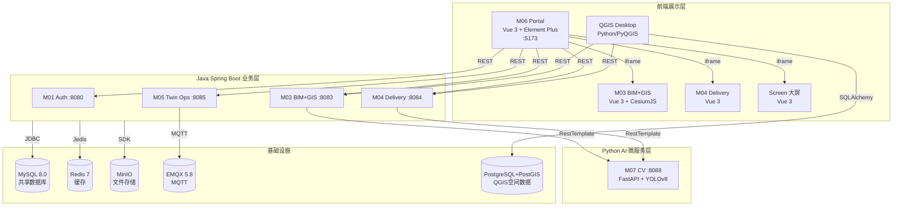
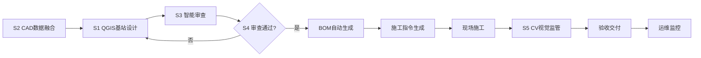

# 通信基建数智化全流程平台 — 项目总概括

**版本**: 2.0  
**最后更新**: 2026-07-14  
**文档用途**: 为AI系统和新成员提供快速、全面的项目理解入口

---

## 变更记录

| 版本 | 日期 | 更新内容 | 维护人 |
|------|------|----------|--------|
| v2.0 | 2026-07-14 | 更新为5赛题+姓氏分工+新增S2+Screen | 高 |
| v1.0 | 2026-07-02 | 初始版本，整合所有项目信息 | 高 |

---

## 一、项目背景

### 1.1 项目定位
本平台是参加**挑战杯"揭榜挂帅"擂台赛**的参赛作品，针对的是**通信基建工程数智化设计与交付关键技术**这个比赛题目，由**烽火通信科技股份有限公司**发起并提供赛题。

### 1.2 核心目标
为通信基础设施建设提供一套完整的数字化管理方案，覆盖从**规划设计 → 三维设计 → 交付验收 → 运行维护**的全过程，帮助提升设计效率、审查准确率和施工监管水平。

### 1.3 时间节点
| 阶段 | 时间 | 状态 |
|------|------|------|
| 报名 | 2026年5月30日—6月30日 | ✅ 已完成 |
| 开发 | 2026年6月—9月 | 🔄 进行中 |
| 作品提交 | 2026年9月15日 | ⏳ 待完成 |

---

## 二、核心功能与子赛题

### 2.1 子赛题覆盖
覆盖全部 **5个子赛题**，形成完整"数据融合→设计→审查→BOM→监管"闭环。

| 子赛题 | 名称 | 负责人 | 指标要求 | 目标值 |
|--------|------|--------|----------|--------|
| 子赛题1 | QGIS基站智能辅助设计 | **高** | 效率提升≥30%，减少50%手动绘图 | ≥60% |
| 子赛题2 | 多源异构工程数据融合 | **任** | DWG/DXF解析、坐标系转换、CAD↔GIS融合 | 新增 |
| 子赛题3 | 基于行业标准的设计智能审查 | **王** | 审查覆盖率≥80%，风险识别准确率≥95% | ≥90% / ≥98% |
| 子赛题4 | 设计成果向施工指令自动转化 | **庞** | 施工准备资料编制时间缩短50% | ≥60% |
| 子赛题5 | 施工过程智能监管 | **李** | 违章识别准确率≥85%，隐蔽工程验真≥90% | ≥90% |

### 2.2 核心功能模块

| 模块 | 名称 | 端口 | 归属 | 功能描述 |
|------|------|------|------|----------|
| M01 | 统一认证服务 | 8080 | 共享 | 用户登录验证、账号管理、菜单权限控制 |
| M03 | BIM+GIS三维设计引擎 | 8083 | S1-高 | 三维地图展示、设备管理、信号覆盖分析 |
| M04 | 数智化交付与工作流 | 8084 | 过渡 | 工单管理、验收流程、BOM管理（按赛题拆分中） |
| M05 | 数字孪生与智慧运维 | 8085 | S5-李 | 告警处理、设备监控、巡检管理 |
| M06 | 统一前端门户 | 5173 | 共享 | 系统统一入口、动态菜单、iframe嵌入 |
| M07 | AI视觉检测引擎 | 8088 | S5-李 | 违章行为识别、隐蔽工程影像验证 |
| Screen | 数据大屏聚合 | 8087 | 共享 | 各赛题数据聚合可视化 |
| S2 | CAD数据融合 | 8082 | S2-任 | DWG/DXF解析、坐标系转换 |
| S3 | 设计智能审查 | 8089 | S3-王 | 规则引擎、安全规范审查 |
| S4 | BOM施工指令转化 | 8090 | S4-庞 | BOM物料提取、施工指令生成 |
| S5 | 施工智能监管 | 8091 | S5-李 | CV检测扩展、施工监管 |
| QGIS插件 | 基站智能设计 | - | S1-高 | 基站布局规划、信号覆盖计算、图纸导出 |

---

## 三、技术架构

### 3.1 系统架构图

### 3.2 技术栈

| 层级 | 技术 | 版本 | 说明 |
|------|------|------|------|
| 后端框架 | Spring Boot | 3.1.10 | Java 17 |
| ORM | MyBatis-Plus | 3.5.5 | 增强MyBatis |
| 认证 | JJWT | 0.11.5 | JWT令牌处理 |
| 前端框架 | Vue 3 | ^3.4.21 | 组合式API |
| UI组件 | Element Plus | ^2.6.3 | Vue3组件库 |
| 3D引擎 | CesiumJS | ^1.141.0 | 地理可视化 |
| 图表 | ECharts | ^6.1.0 | 数据可视化 |
| CV引擎 | FastAPI + YOLOv8 | — | 视觉检测 |
| QGIS插件 | Python + PyQGIS | 3.34+ | 桌面GIS设计 |

---

## 四、业务流程

### 4.1 完整业务闭环（5赛题）

### 4.2 关键流程说明

1. **数据融合阶段(S2)**: 解析DWG/DXF工程图纸，提取建筑物/道路/电力线等矢量图层，统一转换为GeoJSON格式
2. **设计阶段(S1)**: 使用QGIS插件自动生成基站布局方案，通过专业信号传播模型（Okumura-Hata）计算覆盖范围
3. **审查阶段(S3)**: 根据国家和行业标准（DL/T 741、GB 8702）自动检查设计方案是否合规
4. **交付阶段(S4)**: 从设计图纸中自动提取物料清单（BOM），生成施工所需的详细指令包
5. **监管阶段(S5)**: 使用AI图像识别技术（YOLOv8）自动识别施工现场的违章行为，对隐蔽工程进行影像验证

---

## 五、关键指标

### 5.1 性能指标

| 指标 | 要求 | 当前状态 |
|------|------|----------|
| 接口响应时间 | < 200ms | ✅ 达标 |
| 系统可用性 | > 99.9% | ⏳ 待验证 |
| 审查覆盖率 | ≥ 80% | 🔄 开发中 |
| 风险识别准确率 | ≥ 95% | 🔄 开发中 |
| 违章识别准确率 | ≥ 85% | 🔄 开发中 |

### 5.2 效率指标

| 指标 | 要求 | 目标值 |
|------|------|--------|
| 设计效率提升 | ≥ 30% | ≥ 60% |
| 手动绘图减少 | ≥ 50% | ≥ 75% |
| BOM生成时间缩短 | ≥ 50% | ≥ 60% |

---

## 六、团队分工

### 6.1 成员分配

| 成员 | 赛题 | 负责模块 | 核心职责 |
|------|------|----------|----------|
| **高** | S1 | qgis-plugin, m03-bim-gis, m03-topology-engine | 基站设计、3D可视化、数据同步 + 共享设施统筹 |
| **任** | S2 | s2-cad-fusion（新建） | DWG/DXF解析、坐标系转换、数据融合 |
| **王** | S3 | M04验收/审查代码 + s3-review-engine（新建） | 规则引擎、安全审查、审查报告 |
| **庞** | S4 | M04交付/工单代码 + s4-bom-transform（新建） | BOM生成、施工指令转化 |
| **李** | S5 | m07-cv-engine, m05-twin-ops, M04施工代码 + s5-construction-monitor（新建） | CV检测、数字孪生、施工监管 |

### 6.2 协作模式
- **文件夹物理隔离**: 每个模块独立开发，互不干扰
- **Git分支规范**: `feature/mxx-xxx` 命名格式
- **API契约先行**: 先定义接口再开发

---

## 七、数据模型概览

### 7.1 核心数据库表

| 模块 | 表名 | 核心字段 |
|------|------|----------|
| M01 | m01_user | id, username, password, role_id |
| M01 | m01_role | id, role_code, role_name |
| M01 | m01_menu | id, parent_id, menu_name, permission_code |
| M03 | m03_project | id, project_name, region_code |
| M03 | m03_device | id, device_code, longitude, latitude, height |
| M04 | m04_acceptance_task | id, project_id, task_name, status |
| M04 | m04_bom_item | id, task_id, material_name, quantity |
| M05 | m05_device | id, device_code, status, manufacturer |
| M05 | m05_alert | id, device_id, alert_content, level |
| M05 | m05_inspection_task | id, station_code, route_json |

### 7.2 数据库同步
- **MySQL**: Web平台主数据库
- **PostgreSQL+PostGIS**: QGIS空间数据库
- **同步机制**: API同步，GeoJSON格式转换

---

## 八、快速索引

| 需要查找 | 推荐文档 |
|----------|----------|
| 技术架构+API+数据库+开发规范+环境版本 | [技术架构与开发规范.md](技术架构与开发规范.md) (合集) |
| 部署指南 | [本地部署指南.md](本地部署指南.md) |
| 实施计划 | [实施计划.md](实施计划.md) |
| 项目管理规范 | [项目管理规范.md](项目管理规范.md) |
| 子赛题规格 | [子赛题规格设计/](子赛题规格设计/) |
| 赛题分工与架构决策 | [五人分工方案-按子赛题重组.md](五人分工方案-按子赛题重组.md) |
| QGIS插件使用 | [qgis-plugin/docs/usage-guide.md](../qgis-plugin/docs/usage-guide.md) |

---

**文档结束** — 更多详细信息请参考索引中的专项文档。
