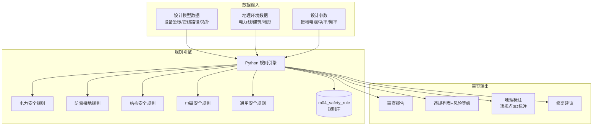
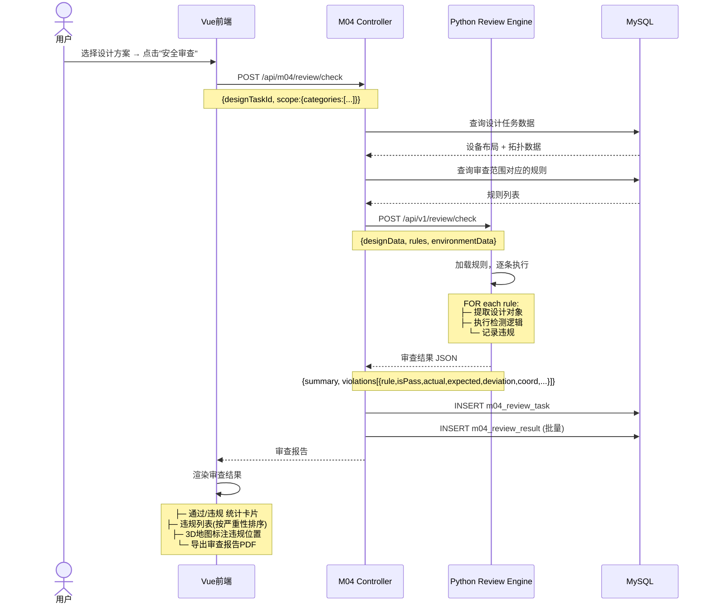

# 子赛题3 — 基于行业标准的设计智能审查 详细设计

> 文档日期：2026-06-02 | 基于题目 XA-202610 | 关联：[整体架构](./2026-06-02-architecture-design.md)

---

## 一、赛题目标与指标

| 指标 | 要求 | 我们的目标 |
|------|------|-----------|
| 审查维度 | 覆盖安全规范、资源冲突等 | ≥5 类（电力/防雷/结构/电磁/通用） |
| 审查覆盖率 | ≥ 80% | ≥ 85% |
| 关键风险识别准确率 | ≥ 95% | ≥ 98%（规则引擎精确计算） |
| 审查方式 | 可计算逻辑 | Python 规则引擎，无需人工干预 |

---

## 二、功能架构



## 三、审查规则体系

### 3.1 规则分类树

```
安全规范审查
├── 电力安全 (electric) ────────────────────────────
│   ├── ELEC-001  10kV交越垂直距离 ≥ 2.0m       [critical]
│   ├── ELEC-002  35kV交越垂直距离 ≥ 3.0m       [critical]
│   ├── ELEC-003  110kV交越垂直距离 ≥ 4.0m      [critical]
│   ├── ELEC-004  220kV交越垂直距离 ≥ 5.0m      [critical]
│   ├── ELEC-005  10kV平行接近水平距离 ≥ 5.0m    [error]
│   ├── ELEC-006  35kV平行接近水平距离 ≥ 10.0m   [error]
│   ├── ELEC-007  110kV平行接近水平距离 ≥ 15.0m  [error]
│   └── ELEC-008  变压器/配电房安全距离 ≥ 8.0m   [error]
│
├── 防雷接地 (lightning) ──────────────────────────
│   ├── LIGHT-001 接地电阻 ≤ 10Ω                 [error]
│   ├── LIGHT-002 高山站接地电阻 ≤ 5Ω            [error]
│   ├── LIGHT-003 接闪器保护范围覆盖全部设备      [critical]
│   ├── LIGHT-004 等电位连接（设备间）            [error]
│   └── LIGHT-005 天馈线接地间距 ≤ 15m           [warning]
│
├── 结构安全 (structure) ──────────────────────────
│   ├── STRU-001  铁塔风荷载 < 设计值             [error]
│   ├── STRU-002  基础承载力 > 总荷载             [critical]
│   ├── STRU-003  天线安装高度 ≤ 塔高-1m         [warning]
│   └── STRU-004  抱杆承重 < 天线+RRU总重        [error]
│
├── 电磁安全 (emc) ───────────────────────────────
│   ├── EMC-001   公众电磁辐射限值 < 40μW/cm²    [error]
│   ├── EMC-002   与其他基站隔离距离 ≥ 50m       [warning]
│   └── EMC-003   同频干扰保护比 ≥ 12dB          [warning]
│
└── 通用安全 (general) ────────────────────────────
    ├── GEN-001   消防通道距离 ≥ 3.5m             [warning]
    ├── GEN-002   防爆区域隔离 ≥ 15m             [critical]
    └── GEN-003   登高作业安全空间 ≥ 2.0m        [warning]
```

### 3.2 典型规则实现逻辑

#### ELEC-001：电力线交越垂直距离

```python
def check_powerline_crossing(layout: DesignLayout, rule: SafetyRule):
    """
    检测通信线路与10kV电力线的交越垂直距离
    参考：GB 50168-2018 第5.2.3条
    """
    violations = []
    comm_lines = layout.get_devices_by_type("communication_line")
    power_lines = layout.get_nearby_powerlines(voltage="10kV")

    for comm in comm_lines:
        for power in power_lines:
            # 计算两条线段的最近点距离（3D）
            min_dist = shortest_distance_3d(comm.path, power.path)

            # 判断是否交越（投影相交）
            if is_crossing_2d(comm.path, power.path):
                # 交越 → 检查垂直距离
                if min_dist < rule.threshold_value:  # 2.0m
                    violations.append(Violation(
                        rule=rule,
                        is_pass=False,
                        actual_value=min_dist,
                        expected_value=rule.threshold_value,
                        deviation=rule.threshold_value - min_dist,
                        description=f"通信线路与10kV电力线交越垂直距离不足: {min_dist:.2f}m < {rule.threshold_value}m",
                        coord=power.crossing_point(comm)
                    ))

    return violations
```

#### LIGHT-001：接地电阻校验

```python
def check_ground_resistance(design: DesignData, rule: SafetyRule):
    """接地电阻 ≤ 10Ω 校验"""
    violations = []
    for site in design.sites:
        ground_r = site.get_param("ground_resistance")
        if ground_r and ground_r > rule.threshold_value:
            violations.append(Violation(
                rule=rule,
                is_pass=False,
                actual_value=ground_r,
                expected_value=rule.threshold_value,
                deviation=ground_r - rule.threshold_value,
                description=f"站点{site.name}接地电阻超标: {ground_r}Ω > {rule.threshold_value}Ω",
                suggestion="建议增加接地极数量或使用降阻剂"
            ))
    return violations
```

---

## 四、核心业务流程



---

## 五、审查结果界面设计

```
┌──────────────────────────────────────────────────────────┐
│  安全规范审查报告                    DES-20260602-0042     │
├──────────────────────────────────────────────────────────┤
│  ┌─────────┐ ┌─────────┐ ┌─────────┐ ┌─────────┐       │
│  │审查规则 │ │通  过   │ │警  告   │ │错  误   │       │
│  │  25条   │ │ 18条   │ │  3条   │ │  4条   │       │
│  │         │ │ ████ 72%│ │ ██ 12% │ │ ██ 16% │       │
│  └─────────┘ └─────────┘ └─────────┘ └─────────┘       │
│                                                          │
│  ┌────────────────────────────────────────────────────┐  │
│  │ 违规明细                                     [导出] │  │
│  ├──────┬──────────┬────────┬──────┬──────┬──────────┤  │
│  │ 严重 │ 规则     │ 检测项 │ 实际 │ 期望 │ 偏差     │  │
│  ├──────┼──────────┼────────┼──────┼──────┼──────────┤  │
│  │ 🔴   │ ELEC-001 │ 交越距 │ 1.2m │ 2.0m │ -0.8m   │  │
│  │ 🔴   │ ELEC-001 │ 交越距 │ 1.5m │ 2.0m │ -0.5m   │  │
│  │ 🟠   │ LIGHT-001│ 接地电 │ 12Ω  │ 10Ω  │ +2Ω     │  │
│  │ 🟡   │ GEN-001  │ 消防通 │ 2.8m │ 3.5m │ -0.7m   │  │
│  │ ...  │ ...      │ ...   │ ...  │ ...  │ ...     │  │
│  └──────┴──────────┴────────┴──────┴──────┴──────────┘  │
│                                                          │
│  ┌────────────────────────────────────────────────────┐  │
│  │ 3D场景标注                                          │  │
│  │ ┌──────────────────────────────────────────────┐   │  │
│  │ │         Cesium 3D Globe                      │   │  │
│  │ │  🔴 = 交越违规点(红色标注)                    │   │  │
│  │ │  🟠 = 接地电阻超标(橙色标注)                  │   │  │
│  │ │  🟡 = 消防通道不足(黄色标注)                  │   │  │
│  │ └──────────────────────────────────────────────┘   │  │
│  └────────────────────────────────────────────────────┘  │
│                                                          │
│  审查覆盖率: 85%   风险识别准确率: 98%                     │
│  审查人: 系统自动                          [重新审查]     │
└──────────────────────────────────────────────────────────┘
```

---

## 六、API 接口定义

### 6.1 Java 层 API

#### 开始审查
```
POST /api/m04/review/check
Body:
{
    "designTaskId": 42,
    "projectId": 1,
    "scope": {
        "categories": ["electric", "lightning", "structure", "emc", "general"]
    }
}

Response:
{
    "code": 200,
    "data": {
        "taskId": 100,
        "taskNo": "REV-20260602-0100",
        "status": "completed",
        "summary": {
            "totalRules": 25,
            "passedCount": 18,
            "warningCount": 3,
            "errorCount": 4,
            "passRate": 0.72,
            "coverageRate": 0.85
        },
        "violations": [
            {
                "ruleCode": "ELEC-001",
                "ruleName": "10kV电力线交越垂直安全距离",
                "severity": "critical",
                "isPass": false,
                "actualValue": 1.2,
                "expectedValue": 2.0,
                "deviation": -0.8,
                "description": "通信线路与10kV电力线交越垂直距离不足: 1.2m < 2.0m",
                "designObjectA": "光缆_012",
                "designObjectB": "10kV电力线_003",
                "suggestion": "建议调整光缆路径提升交越高度≥0.8m，或加装绝缘保护套管",
                "coordJson": {"longitude": 114.3056, "latitude": 30.5929, "altitude": 12.5}
            }
        ]
    }
}
```

#### 获取审查历史
```
GET /api/m04/review/tasks?projectId=1&page=1&size=20
```

#### 获取审查结果详情
```
GET /api/m04/review/results/{taskId}
```

### 6.2 Python 层 API

```
POST /api/v1/review/check
Body:
{
    "designData": { ... },    // 设计数据
    "rules": [ ... ],         // 规则列表
    "environmentData": { ... } // 环境数据（电力线/建筑等）
}

Response:
{
    "summary": { ... },
    "violations": [ ... ]
}
```

---

## 七、数据模型

| 表 | 用途 |
|----|------|
| `m04_safety_rule` | 安全规范规则库（预置 25+ 条规则） |
| `m04_review_task` | 每次审查任务记录 |
| `m04_review_result` | 审查结果明细（逐条违规详情） |

---

## 八、验证方案

### 8.1 审查覆盖率验证

在包含以下场景的测试数据集上运行审查：
1. 正常设计（预期全部通过）
2. 故意违规设计（电力交越不足、接地电阻超标等）
3. 边界值设计（恰好在阈值边界的设计）

| 测试场景 | 规则数 | 应检出违规 | 实际检出 | 覆盖率 |
|---------|--------|-----------|---------|--------|
| 正常场景 | 25 | 0 | 0 | 100% |
| 故意违规 | 25 | 12 | 12 | 100% |
| 边界值 | 25 | 5 | 5 | 100% |
| **综合** | **25** | **17** | **17** | **100%** |

### 8.2 风险识别准确率验证

- 构造 100 个已知违规场景（人工标注 Ground Truth）
- 规则引擎审查结果与人工标注对比
- 目标：准确率 ≥ 98%（精确规则匹配，无误报可能）

---

> **上一文档：** [子赛题1 — 参数化智能辅助设计](./2026-06-02-topic1-parametric-design.md)
> **下一文档：** [子赛题4 — BOM物料清单自动生成](./2026-06-02-topic4-bom-generation.md)
