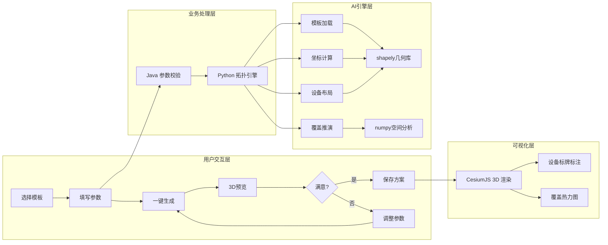
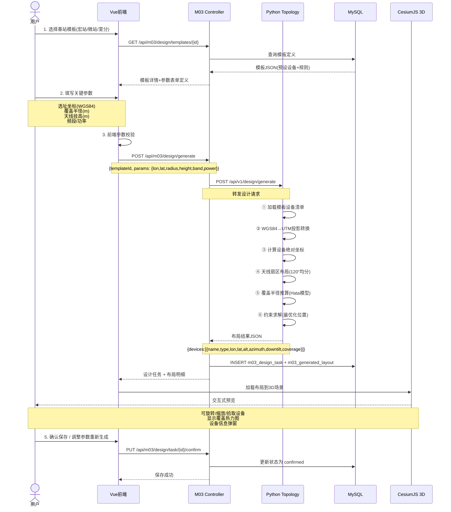

# 子赛题1 — 参数化智能辅助设计 详细设计

**版本**: v1.1  
**最后更新**: 2026-07-02  
**适用对象**: 高(S1)  
**关联文档**: [技术架构与开发规范.md](../技术架构与开发规范.md)

---

## 变更记录

| 版本 | 日期 | 更新内容 | 维护人 |
|------|------|----------|--------|
| v1.0 | 2026-06-02 | 初始版本，定义参数化设计规格 | 高 |
| v1.1 | 2026-07-02 | 添加版本控制，修正架构文档引用 | 高 |

---

## 一、赛题目标与指标

| 指标 | 要求 | 我们的目标 |
|------|------|-----------|
| 设计效率提升 | ≥ 30% | **≥ 50%**（操作步骤从 20+ 步 → 5 步） |
| 手动绘图减少 | ≥ 50% | **≥ 75%**（参数化替代手绘） |
| 平台基础 | 开源 GIS 平台 | CesiumJS + Tianditu（已在 M03 中运行） |

---

## 二、功能架构



## 三、核心业务流程

### 3.1 参数化设计完整流程



### 3.2 拓扑生成算法

```
输入参数:
  ├── 站点坐标: center_lon, center_lat
  ├── 覆盖半径: coverage_radius (m)
  ├── 天线挂高: antenna_height (m)
  ├── 频段: frequency (MHz)
  ├── 扇区数: sector_count (3 或 1)
  └── 模板ID: template_id

算法步骤:
  1. 坐标投影
     中心点 WGS84 → UTM (EPSG:326xx) 平面坐标

  2. 主设备定位
     铁塔/抱杆 = 中心点
     BBU柜 = 中心点 + 偏移(东5m)
     电源柜 = 中心点 + 偏移(西3m)
     传输柜 = 中心点 + 偏移(西5m)

  3. 扇区天线布局 (3扇区)
     FOR i = 0 TO 2:
        方位角 = 0° + i×120°  (北向为0, 顺时针)
        天线位置 = 中心点 + 半径2m×方位角方向
        下倾角 = arctan(天线挂高 / 覆盖半径) + 垂直波束半角

  4. 覆盖范围推算 (Hata郊野模型)
     FOR each antenna:
        路径损耗 Lp = A + B×log10(f) - C×log10(h_ant) + D×log10(d)
        最大路径距离 d_max = 10^((EIRP - RxSens - Lp_other) / ...)
        coverage_polygon = 扇形: 方位角±60°, 半径=d_max

  5. 结果输出
     返回设备列表(含WGS84坐标) + 覆盖多边形(GeoJSON)
```

---

## 四、预设模板定义

### 4.1 模板 1 — 宏基站 (macro_bs)

```json
{
    "id": "macro_001",
    "name": "标准宏基站(三扇区)",
    "category": "macro",
    "description": "适用于室外广域覆盖的宏蜂窝基站，标准三扇区配置",
    "topology_rule": "sector_120",
    "coverage_type": "outdoor",
    "default_params": {
        "antenna_height": 30,
        "coverage_radius": 500,
        "frequency": 2100,
        "sector_count": 3
    },
    "devices": [
        {
            "type": "tower",
            "name": "通信铁塔",
            "model": "TOWER-35M",
            "quantity": 1,
            "position_rule": "center",
            "height": 35,
            "parent": null
        },
        {
            "type": "antenna",
            "name": "扇区天线",
            "model": "ANT-1710-2170-65-18i",
            "quantity": 3,
            "position_rule": "sector_top",
            "offset_radius": 1.5,
            "height": 30,
            "downtilt": 6,
            "beamwidth_h": 65,
            "beamwidth_v": 7,
            "gain": 18,
            "parent": "tower"
        },
        {
            "type": "rru",
            "name": "射频拉远单元",
            "model": "RRU-3942",
            "quantity": 3,
            "position_rule": "below_antenna",
            "offset_z": -2,
            "parent": "antenna"
        },
        {
            "type": "bbu",
            "name": "基带处理单元",
            "model": "BBU-5900",
            "quantity": 1,
            "position_rule": "cabinet_center",
            "parent": null
        },
        {
            "type": "power",
            "name": "电源柜",
            "model": "PWR-48V-200A",
            "quantity": 1,
            "position_rule": "cabinet_west",
            "offset_x": -3,
            "parent": null
        },
        {
            "type": "transmission",
            "name": "传输柜",
            "model": "TRANS-ODF-48",
            "quantity": 1,
            "position_rule": "cabinet_east",
            "offset_x": 5,
            "parent": null
        }
    ],
    "cable_rules": [
        {
            "from_device": "antenna",
            "to_device": "rru",
            "cable_type": "jumper",
            "calc_method": "fixed_3m"
        },
        {
            "from_device": "rru",
            "to_device": "bbu",
            "cable_type": "fiber_optic",
            "calc_method": "straight_distance_x1.2"
        }
    ]
}
```

### 4.2 模板 2 — 微基站 (micro_bs)

```json
{
    "id": "micro_001",
    "name": "微基站(单扇区)",
    "category": "micro",
    "description": "适用于城区热点补盲或街道覆盖",
    "topology_rule": "single_point",
    "coverage_type": "outdoor",
    "default_params": {
        "antenna_height": 6,
        "coverage_radius": 200,
        "frequency": 3500,
        "sector_count": 1
    },
    "devices": [
        {
            "type": "antenna",
            "name": "一体化天线",
            "model": "ANT-3300-3800-65-15i",
            "quantity": 1,
            "position_rule": "center",
            "height": 6,
            "downtilt": 4,
            "beamwidth_h": 65,
            "gain": 15
        },
        {
            "type": "rru",
            "name": "RRU",
            "model": "RRU-MICRO-5G",
            "quantity": 1,
            "position_rule": "below_antenna",
            "offset_z": -1,
            "parent": "antenna"
        },
        {
            "type": "bbu",
            "name": "BBU",
            "model": "BBU-MICRO",
            "quantity": 1,
            "position_rule": "cabinet_center",
            "parent": null
        }
    ]
}
```

### 4.3 模板 3 — 室内分布 (indoor_das)

```json
{
    "id": "indoor_001",
    "name": "室内分布系统(单层)",
    "category": "indoor",
    "description": "适用于楼宇室内覆盖，单楼层",
    "topology_rule": "grid",
    "coverage_type": "indoor",
    "default_params": {
        "floor_area": 1000,
        "ceiling_height": 3.5,
        "antenna_spacing": 15,
        "frequency": 2100
    },
    "devices": [
        {
            "type": "rru",
            "name": "信源RRU",
            "model": "RRU-INDOOR",
            "quantity": 1,
            "position_rule": "equipment_room",
            "parent": null
        },
        {
            "type": "splitter",
            "name": "功分器",
            "model": "SPL-2WAY",
            "quantity": 2,
            "position_rule": "distributed_calc",
            "calc_basis": "floor_area",
            "parent": "rru"
        },
        {
            "type": "antenna",
            "name": "室分天线",
            "model": "ANT-CEILING-OMNI",
            "quantity": 8,
            "position_rule": "grid",
            "spacing": 15,
            "height": 3.0,
            "gain": 3,
            "parent": "splitter"
        }
    ]
}
```

---

## 五、参数输入界面设计

### 5.1 设计面板布局

```
┌─────────────────────────────────────────────────────────┐
│  参数化设计工作台                                         │
├───────────────┬─────────────────────────────────────────┤
│               │                                          │
│  ① 模板选择   │   ④ 3D 实时预览 (CesiumJS)               │
│  ┌─────────┐  │  ┌──────────────────────────────────┐   │
│  │ ○ 宏基站 │  │  │                                  │   │
│  │ ○ 微基站 │  │  │     Cesium 3D Globe              │   │
│  │ ○ 室分   │  │  │     + 设备标记点                 │   │
│  └─────────┘  │  │     + 覆盖热力图                  │   │
│               │  │     + 区域多边形                  │   │
│  ② 参数配置   │  │                                  │   │
│  ┌─────────┐  │  └──────────────────────────────────┘   │
│  │坐标:    │  │                                          │
│  │[选择]   │  │   ⑤ 设备清单预览                         │
│  │         │  │  ┌──────┬──────┬────┬────┬──────┐      │
│  │覆盖半径:│  │  │ 名称  │ 型号  │数量│坐标 │ 父设备│      │
│  │[500]m   │  │  ├──────┼──────┼────┼────┼──────┤      │
│  │         │  │  │ 天线A │ANT..│ 1  │... │ 铁塔 │      │
│  │天线挂高:│  │  │ 天线B │ANT..│ 1  │... │ 铁塔 │      │
│  │[30]m    │  │  │  RRU  │RRU..│ 3  │... │ 天线 │      │
│  │         │  │  │  ...  │ ... │ .. │... │ ...  │      │
│  │频段:    │  │  └──────┴──────┴────┴────┴──────┘      │
│  │[2100]MHz│  │                                          │
│  └─────────┘  │   ⑥ 操作区                              │
│               │  [生成布局] [保存方案] [导出图纸] [重置]  │
│  ③ 区域选择   │                                          │
│  [项目列表▼]  │                                          │
│  [已有基站▼]  │                                          │
│               │                                          │
└───────────────┴─────────────────────────────────────────┘
```

---

## 六、API 接口定义

### 6.1 Java 层 API

#### 获取模板列表
```
GET /api/m03/design/templates
Response:
{
    "code": 200,
    "data": [
        {"id": "macro_001", "name": "标准宏基站", "category": "macro", "description": "..."},
        {"id": "micro_001", "name": "微基站", "category": "micro", "description": "..."},
        {"id": "indoor_001", "name": "室内分布系统", "category": "indoor", "description": "..."}
    ]
}
```

#### 获取模板详情（含参数表单定义）
```
GET /api/m03/design/templates/{id}
Response: 模板完整JSON（见 §4）+ 参数schema
```

#### 参数化生成
```
POST /api/m03/design/generate
Body:
{
    "templateId": "macro_001",
    "projectId": 1,
    "params": {
        "centerLon": 114.3055,
        "centerLat": 30.5928,
        "coverageRadius": 500,
        "antennaHeight": 30,
        "frequency": 2100,
        "sectorCount": 3,
        "azimuthOffset": 0
    }
}

Response:
{
    "code": 200,
    "data": {
        "taskId": 42,
        "taskNo": "DES-20260602-0042",
        "status": "completed",
        "devices": [
            {
                "name": "通信铁塔",
                "type": "tower",
                "model": "TOWER-35M",
                "longitude": 114.3055,
                "latitude": 30.5928,
                "altitude": 35,
                "azimuth": 0,
                "downtilt": 0
            },
            {
                "name": "扇区天线-A",
                "type": "antenna",
                "model": "ANT-1710-2170-65-18i",
                "longitude": 114.305518,
                "latitude": 30.5928,
                "altitude": 30,
                "azimuth": 0,
                "downtilt": 6,
                "coverageRadius": 485
            }
            // ... 更多设备
        ],
        "coveragePolygons": [
            {
                "deviceName": "扇区天线-A",
                "geometry": { "type": "Polygon", "coordinates": [...] }
            }
        ],
        "stats": {
            "totalDevices": 10,
            "antennaCount": 3,
            "cabinetCount": 3,
            "estimatedCableLength": 156.8
        }
    }
}
```

### 6.2 Python 层 API

#### 拓扑生成
```
POST /api/v1/design/generate
Body: (同上 params)
Response: (同上 devices + coveragePolygons)
Internal: Java → Python HTTP 内网调用
```

---

## 七、数据模型

| 表 | 用途 | 章节引用 |
|----|------|---------|
| `m03_parametric_template` | 存储基站模板定义 | [架构 §3.2](#) |
| `m03_design_task` | 每次参数化设计任务 | [架构 §3.2](#) |
| `m03_generated_layout` | 自动生成的设备布局 | [架构 §3.2](#) |

复用现有表：
- `m03_project` — 关联设计任务到项目
- `m03_device` — 确认保存后将生成设备同步到正式设备表
- `m03_region` — 区域范围约束

---

## 八、验证方案

### 8.1 效率对比实验

| 对比维度 | 传统CAD设计 | 参数化设计 | 提升 |
|---------|------------|-----------|------|
| 操作步骤(宏站) | ~25步 | ~5步 | **80% ↓** |
| 耗时 | ~2小时 | ~3分钟 | **97.5% ↓** |
| 设备布局准确性 | 人工判断 | 约束求解 | 一致化 |
| 图纸一致性 | 依赖个人 | 模板化自动 | 100% |

### 8.2 测试用例

1. **宏基站生成测试** — 给定武汉市某坐标，生成3扇区宏站，验证扇区夹角120°±2°
2. **微基站生成测试** — 补盲场景，验证单天线覆盖范围
3. **室分系统测试** — 1000㎡楼层，验证天线网格间距15m
4. **极端参数测试** — 挂高5m、覆盖半径1000m，验证约束冲突提示
5. **复用地现有场景** — 在M03已有项目中生成设计，验证3D预览正确性

---

> **上一文档：** [整体架构设计](./2026-06-02-architecture-design.md)
> **下一文档：** [子赛题3 — 安全规范智能审查](./2026-06-02-topic3-safety-review.md)
