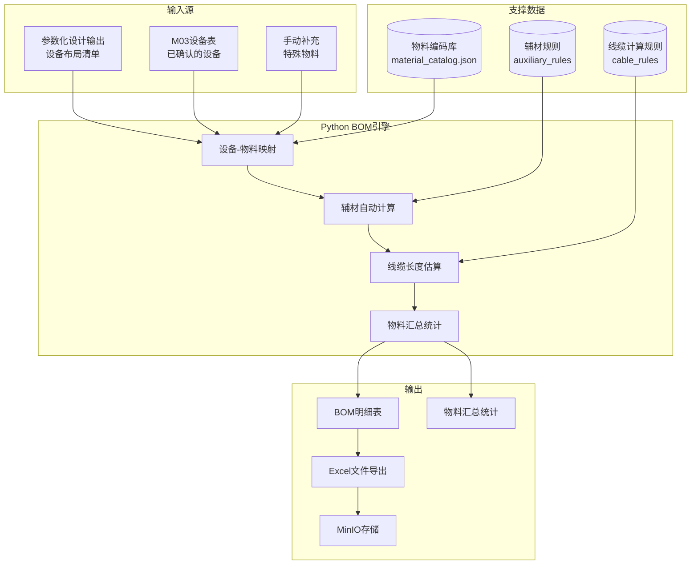
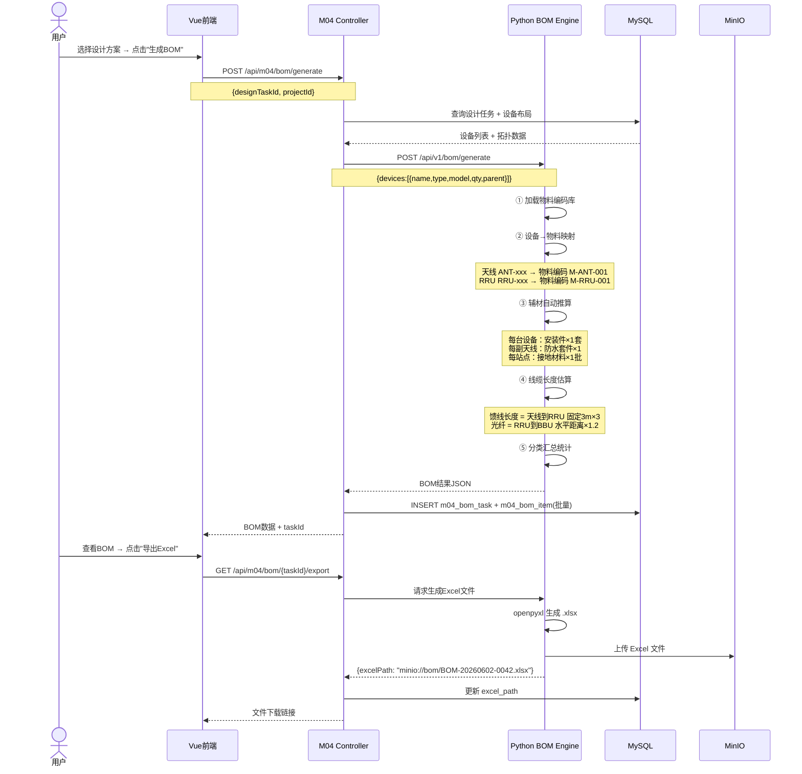

# 子赛题4 — 设计成果向施工指令自动转化（BOM） 详细设计

**版本**: v1.1  
**最后更新**: 2026-07-02  
**适用对象**: 庞(S4)  
**关联文档**: [技术架构与开发规范.md](../技术架构与开发规范.md)

---

## 变更记录

| 版本 | 日期 | 更新内容 | 维护人 |
|------|------|----------|--------|
| v1.0 | 2026-06-02 | 初始版本，定义BOM规格 | 庞 |
| v1.1 | 2026-07-02 | 添加版本控制，修正架构文档引用 | 庞 |

---

## 一、赛题目标与指标

| 指标 | 要求 | 我们的目标 |
|------|------|-----------|
| 产出物 | BOM、工艺要求等施工指令 | BOM物料清单（主设备+辅材+线缆） |
| 施工准备时间缩短 | ≥ 50% | ≥ 95%（从 2-4小时 → 1分钟内） |
| 设计-施工链路 | 打通 | 设计模型 → 物料映射 → BOM导出 全自动 |

---

## 二、功能架构



## 三、BOM生成核心流程



---

## 四、BOM引擎设计

### 4.1 设备-物料映射规则

```python
# material_catalog.json 物料编码库
{
    "antenna": {
        "ANT-1710-2170-65-18i": {
            "material_code": "M-ANT-001",
            "material_name": "双极化定向天线",
            "spec": "1710-2170MHz 65° 18dBi",
            "unit": "副",
            "category": "main_device",
            "system": "antenna"
        },
        "ANT-3300-3800-65-15i": {
            "material_code": "M-ANT-002",
            "material_name": "5G一体化天线",
            "spec": "3300-3800MHz 65° 15dBi",
            "unit": "副",
            "category": "main_device",
            "system": "antenna"
        }
    },
    "rru": {
        "RRU-3942": {
            "material_code": "M-RRU-001",
            "material_name": "射频拉远单元",
            "spec": "2T2R 40W",
            "unit": "台",
            "category": "main_device",
            "system": "rf"
        },
        "RRU-MICRO-5G": {
            "material_code": "M-RRU-002",
            "material_name": "5G微RRU",
            "spec": "4T4R 200mW",
            "unit": "台",
            "category": "main_device",
            "system": "rf"
        }
    },
    "bbu": {
        "BBU-5900": {
            "material_code": "M-BBU-001",
            "material_name": "基带处理单元",
            "spec": "LTE/NR双模",
            "unit": "台",
            "category": "main_device",
            "system": "baseband"
        }
    },
    "power": {
        "PWR-48V-200A": {
            "material_code": "M-PWR-001",
            "material_name": "通信电源柜",
            "spec": "-48V 200A",
            "unit": "台",
            "category": "main_device",
            "system": "power"
        }
    },
    "transmission": {
        "TRANS-ODF-48": {
            "material_code": "M-TRANS-001",
            "material_name": "光纤配线柜",
            "spec": "ODF 48芯",
            "unit": "台",
            "category": "main_device",
            "system": "transmission"
        }
    },
    "tower": {
        "TOWER-35M": {
            "material_code": "M-TOWER-001",
            "material_name": "通信铁塔",
            "spec": "35m三管塔",
            "unit": "座",
            "category": "main_device",
            "system": "structure"
        }
    }
}
```

### 4.2 辅材自动计算规则

```python
# 辅材推算逻辑
def calculate_auxiliary_materials(device_list):
    """
    根据主设备自动推算辅材用量
    """
    aux_items = []

    # 每副天线配安装件
    antenna_count = sum(1 for d in device_list if d['type'] == 'antenna')
    if antenna_count > 0:
        aux_items.append({
            "name": "天线安装套件",
            "spec": "含抱杆+U型卡箍+调节支架",
            "unit": "套",
            "qty": antenna_count
        })

    # 每台RRU配防水套件
    rru_count = sum(1 for d in device_list if d['type'] == 'rru')
    if rru_count > 0:
        aux_items.append({
            "name": "RRU防水套件",
            "spec": "IP67 含防水胶泥+胶带+热缩管",
            "unit": "套",
            "qty": rru_count
        })

    # 每站点配接地材料
    aux_items.append({
        "name": "接地材料",
        "spec": "接地扁钢40×4mm + 接地极Φ50×2500mm",
        "unit": "批",
        "qty": 1
    })

    # 每站点配标签耗材
    aux_items.append({
        "name": "标识标签",
        "spec": "耐候型电缆标签(100片/包)",
        "unit": "包",
        "qty": max(1, int(antenna_count / 2))
    })

    return aux_items
```

### 4.3 线缆长度估算

```python
def estimate_cable_length(devices, center_coord):
    """
    基于设备拓扑关系估算线缆长度
    """
    cables = []

    for device in devices:
        parent = device.get('parent')

        # 跳线：天线 → RRU (固定3m)
        if device['type'] == 'antenna' and parent:
            rru = find_child_of_antenna(devices, device)
            cables.append({
                "name": "射频跳线",
                "spec": "1/2\" 超柔 N型公头",
                "unit": "根",
                "qty": device.get('qty', 1),
                "length_per": 3.0,
                "total_length": device.get('qty', 1) * 3.0,
                "from": device['name'],
                "to": parent
            })

        # 光纤：RRU → BBU（水平距离 × 1.2 系数）
        if device['type'] == 'rru':
            bbu = find_bbu(devices)
            if bbu:
                horz_dist = haversine_distance(
                    device['lon'], device['lat'],
                    bbu['lon'], bbu['lat']
                )
                # 加上垂直距离
                total_dist = horz_dist + abs(device.get('alt', 0) - bbu.get('alt', 0))
                # ×1.2 布线余量系数
                length = total_dist * 1.2
                cables.append({
                    "name": "野战光纤",
                    "spec": "LC-LC 单模 G.652D",
                    "unit": "根",
                    "qty": 2,  # 主备双路由
                    "length_per": round(length, 1),
                    "total_length": round(2 * length, 1),
                    "from": device['name'],
                    "to": 'BBU'
                })

        # 电源线：电源柜 → 各设备
        # ...

    return cables
```

---

## 五、BOM展示界面设计

```
┌──────────────────────────────────────────────────────────┐
│  BOM物料清单                   DES-20260602-0042          │
├──────────────────────────────────────────────────────────┤
│  ┌────────────────────────────────────────────────────┐  │
│  │ 统计概览                                           │  │
│  │ 物料总类目: 23类    总数量: 156件                  │  │
│  │ 主设备: 10类/15件   辅材: 8类/45件                 │  │
│  │ 线缆: 5类/96根      估算总线缆长度: 288.5m         │  │
│  └────────────────────────────────────────────────────┘  │
│                                                          │
│  ┌────────────────────────────────────────────────────┐  │
│  │ 📦 主设备清单                                [收起] │  │
│  ├────┬──────────────┬──────────────┬────┬──────┬─────┤  │
│  │序号│ 物料名称     │ 规格型号     │单位│ 数量 │备注 │  │
│  ├────┼──────────────┼──────────────┼────┼──────┼─────┤  │
│  │ 1  │ 双极化天线   │ ANT-1710..  │ 副 │  3   │扇区 │  │
│  │ 2  │ 射频拉远单元 │ RRU-3942    │ 台 │  3   │     │  │
│  │ 3  │ 基带处理单元 │ BBU-5900    │ 台 │  1   │     │  │
│  │ 4  │ 通信电源柜   │ PWR-48V-.. │ 台 │  1   │     │  │
│  │ 5  │ 光纤配线柜   │ TRANS-ODF..│ 台 │  1   │     │  │
│  │ 6  │ 通信铁塔     │ TOWER-35M  │ 座 │  1   │     │  │
│  └────┴──────────────┴──────────────┴────┴──────┴─────┘  │
│                                                          │
│  ┌────────────────────────────────────────────────────┐  │
│  │ 🔧 辅材清单                                  [收起] │  │
│  ├────┬──────────────┬──────────────┬────┬──────┬─────┤  │
│  │ 7  │ 天线安装套件 │ 含抱杆+U型..│ 套 │  3   │     │  │
│  │ 8  │ RRU防水套件  │ IP67 含防.. │ 套 │  3   │     │  │
│  │ 9  │ 接地材料     │ 扁钢40×4..  │ 批 │  1   │     │  │
│  │10  │ 标识标签     │ 耐候型电缆..│ 包 │  2   │     │  │
│  └────┴──────────────┴──────────────┴────┴──────┴─────┘  │
│                                                          │
│  ┌────────────────────────────────────────────────────┐  │
│  │ 🔌 线缆清单                                  [收起] │  │
│  ├────┬──────────┬──────────┬────┬──────┬───────┬─────┤  │
│  │序号│ 名称     │ 规格     │单位│数量  │单根长 │总长 │  │
│  ├────┼──────────┼──────────┼────┼──────┼───────┼─────┤  │
│  │11  │ 射频跳线 │ 1/2\"超柔 │ 根 │  3   │ 3.0m  │9.0m │  │
│  │12  │ 野战光纤 │ LC-LC单模│ 根 │  6   │25.3m  │151.8│  │
│  │... │ ...      │ ...     │ .. │ ...  │ ...   │ ... │  │
│  └────┴──────────┴──────────┴────┴──────┴───────┴─────┘  │
│                                                          │
│  [导出 Excel]  [导出 PDF]  [打印]  [返回设计]             │
└──────────────────────────────────────────────────────────┘
```

---

## 六、API 接口定义

### 6.1 Java 层 API

#### 生成BOM
```
POST /api/m04/bom/generate
Body: { "designTaskId": 42, "projectId": 1 }
Response:
{
    "code": 200,
    "data": {
        "taskId": 200,
        "taskNo": "BOM-20260602-0200",
        "totalItems": 23,
        "totalQuantity": 156,
        "items": [
            {
                "seqNo": 1,
                "materialName": "双极化定向天线",
                "specModel": "ANT-1710-2170-65-18i",
                "unit": "副", "quantity": 3,
                "category": "main_device",
                "system": "antenna",
                "sourceDevice": "扇区天线"
            }
        ]
    }
}
```

#### 导出Excel
```
GET /api/m04/bom/{taskId}/export
Response: 文件流 (application/vnd.openxmlformats-officedocument.spreadsheetml.sheet)
```

#### BOM历史
```
GET /api/m04/bom/tasks?projectId=1&page=1&size=20
```

### 6.2 Python 层 API

```
POST /api/v1/bom/generate
Body: { "designData": {...}, "projectId": 1 }
Response: { bomItems: [...], summary: {...} }
```

---

## 七、数据模型

| 表 | 用途 |
|----|------|
| `m04_bom_task` | BOM生成任务记录 |
| `m04_bom_item` | BOM物料明细条目（23+ 条/任务） |

---

## 八、验证方案

### 8.1 效率对比

| 对比维度 | 人工编制 | BOM自动生成 | 提升 |
|---------|---------|-----------|------|
| 宏基站BOM时间 | 2-4小时 | <1分钟 | **99%+ ↓** |
| 准确率 | 85-90% | 98%+ | 物料映射规则保证 |
| 漏项率 | 5-15% | <2% | 辅材自动计算覆盖 |

### 8.2 测试用例

1. **宏基站BOM生成** — 输入3扇区宏站设计，验证23类物料完整性和数量准确性
2. **微基站BOM生成** — 单扇区配置，验证简化BOM的准确性
3. **室分BOM生成** — 验证功分器、耦合器、天线数量的自动推算
4. **Excel导出** — 验证导出格式、数据完整性、中文编码
5. **线缆长度合理性** — 多组数据对比估算值与实际布线值的误差（目标<15%）

---

> **上一文档：** [子赛题3 — 安全规范智能审查](./2026-06-02-topic3-safety-review.md)
> **下一文档：** [子赛题5 — 隐蔽工程影像验真](./2026-06-02-topic5-underground-verification.md)
