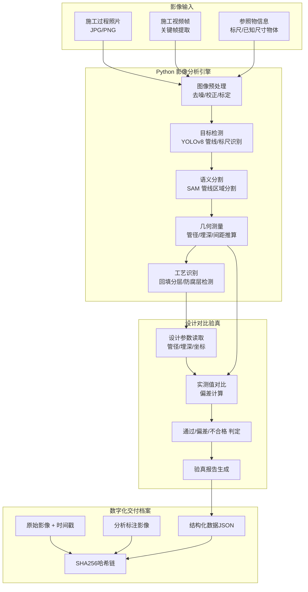
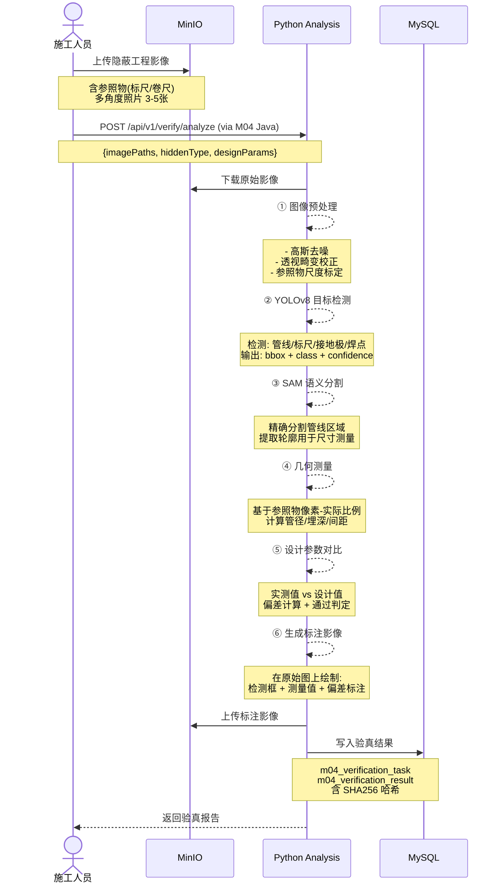

# 子赛题5 — 隐蔽工程影像分析与数字化验真 详细设计

**版本**: v1.1  
**最后更新**: 2026-07-02  
**适用对象**: 李(S5)  
**关联文档**: [技术架构与开发规范.md](../技术架构与开发规范.md)

---

## 变更记录

| 版本 | 日期 | 更新内容 | 维护人 |
|------|------|----------|--------|
| v1.0 | 2026-06-02 | 初始版本，定义CV规格 | 李 |
| v1.1 | 2026-07-02 | 添加版本控制，修正架构文档引用 | 李 |

---

## 一、赛题目标与指标

| 指标 | 要求 | 我们的目标 |
|------|------|-----------|
| 隐蔽工程影像结构化分析准确率 | ≥ 90% | ≥ 90% |
| 数字化交付档案 | 不可篡改 | SHA256 哈希链 + 时间戳 |
| 竣工数据与物理实景一致性 | 可追溯 | 设计-施工-检测 三方数据对齐 |

---

## 二、功能架构



## 三、隐蔽工程检测场景

### 3.1 检测场景矩阵

```
隐蔽工程类型          检测项                方法                   参照物
─────────────────────────────────────────────────────────────────────
地下通信管道          管径(mm)             边缘检测+参照物比例      标尺/卷尺
                      埋深(m)              参照物+透视校正         标尺杆
                      管间距(mm)           多管分割+像素测距       标尺
                      管道材质             图像分类                颜色/纹理

接地网                接地极数量            目标检测+计数           标记点
                      接地极间距(m)         像素测距                标尺
                      焊接质量              图像分类                焊点纹理
                      防腐处理              颜色检测                标准色卡

塔基/设备基础         基础尺寸(m)           参照物比例推算          标尺/人体
                      钢筋密度              目标检测+计数           网格标记
                      混凝土外观            图像分类                标准样张

电缆沟/线缆埋设       线缆数量              目标检测+计数           颜色标记
                      线缆间距(mm)          分割+测距              标尺
                      保护管完整性           缺陷检测                纹理分析
                      回填土分层            图像分类+颜色分析       标准层样
```

## 四、影像分析流程

### 4.1 完整处理管道



### 4.2 核心算法：管径测量

```python
def measure_pipe_diameter(image_path, reference_object):
    """
    基于参照物比例推算管径

    算法步骤:
    1. 检测参照物（标尺/卷尺），获取其像素长度
    2. 检测管线，提取边缘轮廓
    3. 计算参照物到管线的像素比例
    4. 推算管线实际直径
    """
    img = cv2.imread(image_path)
    img = preprocess(img)  # 去噪 + 透视校正

    # 检测参照物
    ref_bbox = detect_scale_ruler(img)
    ref_pixel_length = bbox_width(ref_bbox)  # 标尺像素长度 → 对应实际长度(如100mm)

    # 像素-实际比例
    scale_ratio = REFERENCE_ACTUAL_LENGTH / ref_pixel_length  # mm/pixel

    # 检测管线
    pipe_mask = segment_pipe(img)  # SAM 分割
    pipe_contour = extract_contour(pipe_mask)

    # 计算管径(像素)
    # 对轮廓做最小外接矩形，矩形宽度 ≈ 管径(像素)
    rect = cv2.minAreaRect(pipe_contour)
    pipe_diameter_px = rect[1][0]  # 宽度(像素)

    # 换算实际管径
    pipe_diameter_mm = pipe_diameter_px * scale_ratio

    # 置信度估算
    confidence = calculate_measurement_confidence(
        ref_detection_score=ref_bbox.confidence,
        pipe_seg_iou=pipe_mask.iou,
        angle_correction_factor=perspective_correction_quality(img)
    )

    return MeasurementResult(
        measured_value=pipe_diameter_mm,
        unit="mm",
        confidence=confidence,
        annotated_image=draw_measurements(img, pipe_diameter_mm, pipe_contour)
    )
```

### 4.3 设计-施工对比验真

```python
def compare_with_design(measured: dict, design: dict, tolerance: dict):
    """
    施工实测值 vs 设计值对比

    tolerance: 允许偏差 {"pipe_diameter": ±5%, "pipe_depth": ±10%, "pipe_spacing": ±15%}
    """
    results = []

    for check_item in ["pipe_diameter", "pipe_depth", "pipe_spacing"]:
        if check_item not in measured or check_item not in design:
            continue

        m = measured[check_item]
        d = design[check_item]
        tol = tolerance.get(check_item, 0.05)

        deviation = m - d
        deviation_pct = (deviation / d) * 100 if d != 0 else 0
        is_pass = abs(deviation_pct) <= (tol * 100)

        results.append(VerificationResult(
            check_item=check_item,
            design_value=d,
            measured_value=m,
            deviation=deviation,
            deviation_pct=round(deviation_pct, 2),
            is_pass=is_pass,
            confidence=measured.get(f"{check_item}_confidence", 0.0)
        ))

    return results
```

---

## 五、验真结果界面设计

```
┌──────────────────────────────────────────────────────────┐
│  隐蔽工程数字化验真报告                                     │
│  工程: XX基站项目    验真编号: VER-20260602-0050            │
│  隐蔽类型: 地下通信管道    验真时间: 2026-06-02 14:30      │
├──────────────────────────────────────────────────────────┤
│                                                          │
│  ┌────────────────────────────────────────────────────┐  │
│  │ 📊 验真概览                                         │  │
│  │ ┌─────────┐ ┌─────────┐ ┌─────────┐ ┌──────────┐   │  │
│  │ │ 检测项  │ │  通过   │ │  偏差   │ │ 不合格   │   │  │
│  │ │  8项    │ │  6项   │ │  1项   │ │  1项    │   │  │
│  │ │         │ │ ✅ 75%  │ │ ⚠️ 12.5%│ │ ❌ 12.5%│   │  │
│  │ └─────────┘ └─────────┘ └─────────┘ └──────────┘   │  │
│  │                                   综合判定: 偏差待改 │  │
│  └────────────────────────────────────────────────────┘  │
│                                                          │
│  ┌────────────────────────────────────────────────────┐  │
│  │ 检测明细                                    [展开]   │  │
│  ├──────────┬────────┬────────┬────────┬──────┬───────┤  │
│  │ 检测项   │ 设计值 │ 实测值 │ 偏差   │置信度│ 结果  │  │
│  ├──────────┼────────┼────────┼────────┼──────┼───────┤  │
│  │ 管径     │110mm   │108.5mm│ -1.5mm │95.2% │ ✅   │  │
│  │ 埋深     │1200mm  │1150mm  │ -50mm  │89.1% │ ⚠️   │  │
│  │ 管间距   │300mm   │305mm   │ +5mm   │92.3% │ ✅   │  │
│  │ 管道材质 │PVC-U   │PVC-U   │  匹配  │98.7% │ ✅   │  │
│  │ 管道数量 │4孔     │4孔     │  相符  │99.1% │ ✅   │  │
│  │ 回填分层 │3层     │3层     │  相符  │87.5% │ ✅   │  │
│  │ 保护盖板 │有      │无      │  缺失  │96.8% │ ❌   │  │
│  │ ...     │...     │...     │...    │...   │...   │  │
│  └──────────┴────────┴────────┴────────┴──────┴───────┘  │
│                                                          │
│  ┌──────────────────────┬──────────────────────────────┐ │
│  │ 原始影像             │ 分析标注影像                  │ │
│  │ ┌──────────────────┐ │ ┌──────────────────────────┐ │ │
│  │ │   (施工原图)     │ │ │   (AI标注后的图)         │ │ │
│  │ │                  │ │ │   管径: 108.5mm           │ │ │
│  │ │  [标尺可见]      │ │ │   埋深: 1150mm            │ │ │
│  │ │                  │ │ │   检测框+测量值标注       │ │ │
│  │ └──────────────────┘ │ └──────────────────────────┘ │ │
│  └──────────────────────┴──────────────────────────────┘ │
│                                                          │
│  ┌────────────────────────────────────────────────────┐  │
│  │ 🔐 防篡改信息                                      │  │
│  │ 任务哈希: SHA256(a1b2c3d4e5f6...)                  │  │
│  │ 结果哈希: SHA256(f6e5d4c3b2a1...)                  │  │
│  │ 验证: 哈希链完整 ✅  时间戳一致 ✅                  │  │
│  └────────────────────────────────────────────────────┘  │
│                                                          │
│  [生成交付档案]  [导出 PDF]  [查看历史]                    │
└──────────────────────────────────────────────────────────┘
```

---

## 六、API 接口定义

### 6.1 Java 层 API

#### 提交验真任务（异步）
```
POST /api/m04/verification/analyze
Body:
{
    "projectId": 1,
    "constructionId": 10,
    "hiddenType": "pipe",
    "designParams": {
        "pipeDiameter": 110,
        "pipeDepth": 1200,
        "pipeSpacing": 300,
        "pipeCount": 4,
        "pipeMaterial": "PVC-U"
    },
    "images": [
        {"path": "minio://hidden-works/IMG_001.jpg", "hasReference": true},
        {"path": "minio://hidden-works/IMG_002.jpg", "hasReference": true},
        {"path": "minio://hidden-works/IMG_003.jpg", "hasReference": false}
    ]
}

Response:
{
    "code": 200,
    "data": {
        "taskId": 300,
        "taskNo": "VER-20260602-0300",
        "status": "analyzing",
        "estimatedTime": 30
    }
}
```

#### 查询验真结果
```
GET /api/m04/verification/task/{taskId}

Response (完成时):
{
    "code": 200,
    "data": {
        "taskId": 300,
        "taskNo": "VER-20260602-0300",
        "status": "completed",
        "summary": {
            "totalItems": 8,
            "passedCount": 6,
            "deviationCount": 1,
            "failedCount": 1
        },
        "results": [
            {
                "checkItem": "pipeDiameter",
                "designValue": 110,
                "measuredValue": 108.5,
                "deviation": -1.5,
                "deviationPct": -1.36,
                "isPass": true,
                "confidence": 0.952,
                "annotatedImage": "minio://hidden-works/IMG_001_annotated.jpg"
            }
        ],
        "taskHash": "a1b2c3d4e5f6...",
        "verifiable": true
    }
}
```

#### 生成数字化交付档案
```
POST /api/m04/verification/{taskId}/archive
Response:
{
    "code": 200,
    "data": {
        "archiveId": "ARC-20260602-0001",
        "archivePath": "minio://archives/VER-20260602-0300/",
        "contentHash": "SHA256(f6e5d4c3b2a1...)",
        "timestamp": "2026-06-02T14:35:00Z"
    }
}
```

### 6.2 Python 层 API

#### 异步分析（立即返回taskId）
```
POST /api/v1/verify/analyze
Body: { "images": [...], "hiddenType": "pipe", "designParams": {...} }
Response: { "taskId": "uuid", "status": "processing" }
```

#### 查询任务状态
```
GET /api/v1/verify/task/{task_id}
Response: { "taskId": "...", "status": "completed", "results": [...] }
```

---

## 七、数据模型

| 表 | 用途 |
|----|------|
| `m04_verification_task` | 验真任务记录（含哈希链） |
| `m04_verification_result` | 逐项验真结果（含标注影像路径） |

复用现有表：
- `m04_project` — 项目关联
- `m04_construction_record` — 施工记录关联（已有 videoPath/photoPanorama 字段）

---

## 八、防篡改数字化交付档案

### 8.1 哈希链设计

```
档案结构:
{
    "archive_version": "1.0",
    "task": {
        "taskNo": "VER-20260602-0300",
        "hiddenType": "pipe",
        "designParams": {...},
        "imageList": [
            {"file": "IMG_001.jpg", "sha256": "hash_of_original_001"},
            {"file": "IMG_002.jpg", "sha256": "hash_of_original_002"}
        ],
        "submittedAt": "2026-06-02T14:30:00Z"
    },
    "taskHash": "SHA256(task_json_canonical)",

    "results": [
        {
            "checkItem": "pipeDiameter",
            "designValue": 110,
            "measuredValue": 108.5,
            "annotatedImageSha256": "hash_of_annotated_image"
        }
    ],
    "resultHash": "SHA256(taskHash + results_json_canonical)",

    "archive": {
        "generatedAt": "2026-06-02T14:35:00Z",
        "generatorVersion": "1.0",
        "archiveHash": "SHA256(resultHash + archive_json)"
    }
}

验证链:
archiveHash → resultHash → taskHash → 原始文件SHA256
三者必须一致，任一环节改动都会导致验证失败
```

### 8.2 验证脚本

```python
def verify_archive_integrity(archive_json, original_images_dir):
    """
    独立验证数字化交付档案的完整性
    可在任意环境运行，无需依赖本系统
    """
    # 1. 验证原始文件完整性
    for img in archive_json['task']['imageList']:
        actual_hash = sha256_file(os.path.join(original_images_dir, img['file']))
        assert actual_hash == img['sha256'], f"原始文件被篡改: {img['file']}"

    # 2. 验证哈希链
    task_hash = sha256_json(archive_json['task'])
    assert task_hash == archive_json['taskHash'], "任务哈希不匹配"

    result_hash = sha256_json(concat(task_hash, archive_json['results']))
    assert result_hash == archive_json['resultHash'], "结果哈希不匹配"

    archive_hash = sha256_json(concat(result_hash, archive_json['archive']))
    assert archive_hash == archive_json['archive']['archiveHash'], "档案哈希不匹配"

    return True  # 档案完整，未被篡改
```

---

## 九、验证方案

### 9.1 测试数据集

| 场景 | 影像数量 | 来源 |
|------|---------|------|
| 地下管道 | 50组 | 公开数据集 + 模拟拍摄 |
| 接地网 | 30组 | 模拟施工场景 |
| 设备基础 | 30组 | 模拟施工场景 |
| 电缆沟 | 20组 | 模拟施工场景 |

每组包含：3-5张多角度照片 + 参照物（标尺/卷尺）+ 设计参数 + 人工标注Ground Truth

### 9.2 准确率验证

| 检测项 | 目标准确率 | 验证方法 |
|--------|-----------|---------|
| 管径测量 | ≥90% | 与人工测量值对比，误差<±5% |
| 埋深估计 | ≥85% | 与人工测量值对比，误差<±10% |
| 管线计数 | ≥95% | 与人工计数对比 |
| 回填分层 | ≥85% | 与人工判断对比 |
| 材质识别 | ≥90% | 与人工标注对比 |
| **综合** | **≥90%** | 加权平均 |

### 9.3 防篡改验证

1. 生成完整档案
2. 尝试篡改原始影像 → 验证脚本应检测到 SHA256 不匹配
3. 尝试篡改测量值 → 验证脚本应检测到 哈希链断裂
4. 验证通过 → 确认防篡改机制有效

---

> **上一文档：** [子赛题4 — BOM物料清单自动生成](./2026-06-02-topic4-bom-generation.md)
> **下一文档：** [数据库设计与实施计划](./2026-06-02-implementation-plan.md)
