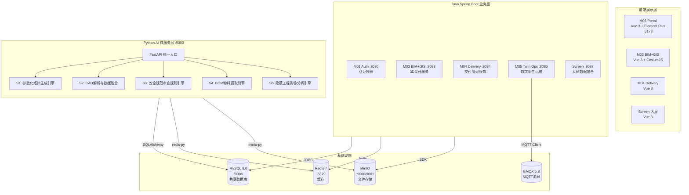

# 技术架构与开发规范

**版本**: v2.0  
**最后更新**: 2026-07-14  
**适用对象**: 全体开发人员  
**合并来源**: 架构设计规范、数据库设计、前端设计、开发规范、API接口文档、环境依赖版本

> 本文档是项目的**技术全景手册**——涵盖系统架构、数据库设计、前端架构、API 接口、开发规范和环境依赖。新成员读完本文档即可上手开发。

---

## 目录

1. [系统架构](#一系统架构)
2. [Python AI 微服务](#二python-ai-微服务)
3. [数据库设计](#三数据库设计)
4. [前端架构](#四前端架构)
5. [API 接口规范](#五api-接口规范) — 含跨赛题接口契约
6. [开发规范](#六开发规范) — 含错误码/日志/测试/DTO 规范
7. [环境依赖版本](#七环境依赖版本)
8. [部署架构](#八部署架构)

---

## 一、系统架构

### 1.1 系统全景

本系统在现有 `xind2` 微服务平台基础上，新增 **Python AI 微服务层**，通过 REST API 与 Java 后端集成，共享 MySQL 数据库和 MinIO 对象存储。



### 1.2 服务端口与职责

| 服务 | 端口 | 技术栈 | 职责 | 归属 |
|------|------|--------|------|------|
| M06 Portal | 5173 | Vue 3 + Element Plus | 前端门户，iframe 集成各子模块 | 共享 |
| M01 Auth | 8080 | Spring Boot 3.1 | 统一认证授权、JWT 签发 | 共享 |
| M03 BIM+GIS | 8083 | Spring Boot + MyBatis Plus | 3D设计、设备/项目管理 | S1-高 |
| M04 Delivery | 8084 | Spring Boot + MyBatis Plus | 交付管理、施工记录 | S3/S4-王/庞 |
| M05 Twin Ops | 8085 | Spring Boot + MQTT | 设备告警、实时监控 | S5-李 |
| Screen | 8087 | Spring Boot + JdbcTemplate | 大屏数据聚合 | 共享 |
| M07 CV Engine | 8088 | FastAPI + YOLOv8 | AI 视觉检测 | S5-李 |
| **Python AI** | **9000** | **FastAPI + SQLAlchemy** | **AI推理：拓扑/审查/BOM/影像** | 共享 |
| S2 CAD Fusion | 8082 | Java + Python | CAD/DWG 解析与融合 | S2-任 |
| S3 Review | 8089 | Java + Python | 规则引擎与审查 | S3-王 |
| S4 BOM | 8090 | Java + Python | BOM 生成与施工指令 | S4-庞 |
| S5 Monitor | 8091 | Java + Python | 施工监管 | S5-李 |

### 1.3 Java-Python 集成架构

```
[用户操作] → [Vue前端] → [Java Controller]
                               │
                 ┌─────────────┼─────────────┐
                 ▼             ▼             ▼
           [本地逻辑]   [Python AI]    [MinIO文件]
                 │             │             │
                 └─────────────┼─────────────┘
                               ▼
                         [MySQL 共享DB]
```

**关键设计原则：**
- Java 层对外暴露 REST API，对内调用 Python 或直接操作 DB
- Python 层不直接响应前端请求，由 Java 中转（安全/鉴权在 Java 层统一处理）
- 共享数据库：Java 和 Python 各自操作自己的业务表，但共享基础设施配置
- 长耗时任务（影像分析）采用异步模式：提交 → 轮询 → 获取结果

### 1.4 安全与鉴权

```
前端 → Java (JWT 认证)
Java → Python (内网调用，共享 Secret Key)

Python 不直接处理用户认证，由 Java 层统一鉴权后转发。
Java 调用 Python 时在 Header 携带:
  X-Internal-Token: sha256(secret + timestamp)
  X-Request-Id: uuid
```

隐蔽工程验真采用**哈希链**保证数据不可篡改：
```
Task_Hash = SHA256(design_params + image_hash_list + timestamp)
Result_Hash = SHA256(Task_Hash + check_items + measured_values + timestamp)
最终交付档案包含完整的哈希链，可独立验证
```

---

## 二、Python AI 微服务

### 2.1 项目结构

```
python-ai-service/
├── main.py                    # FastAPI 入口
├── config.py                  # 环境配置
├── requirements.txt           # Python 依赖
├── engines/
│   ├── design/                # S1: 参数化拓扑生成
│   │   ├── topology_generator.py
│   │   ├── layout_optimizer.py
│   │   ├── coverage_calculator.py
│   │   └── templates/         # 基站模板 JSON
│   ├── cad/                   # S2: CAD 解析与融合
│   │   ├── dwg_parser.py
│   │   ├── coordinate_transform.py
│   │   └── data_fusion.py
│   ├── review/                # S3: 安全规范审查
│   │   ├── rule_engine.py
│   │   ├── safety_rules.py
│   │   ├── violation_detector.py
│   │   └── standards/         # 行业标准 JSON
│   ├── bom/                   # S4: BOM 物料提取
│   │   ├── bom_extractor.py
│   │   ├── material_matcher.py
│   │   └── cable_calculator.py
│   └── verify/                # S5: 影像分析
│       ├── image_analyzer.py
│       ├── pipe_detector.py
│       ├── depth_estimator.py
│       ├── design_comparator.py
│       └── report_generator.py
├── shared/
│   ├── database.py            # SQLAlchemy 引擎
│   ├── models.py              # ORM 模型
│   ├── minio_client.py        # MinIO 操作
│   └── redis_client.py        # Redis 缓存
└── tests/
```

### 2.2 核心依赖

```txt
fastapi==0.115.0
uvicorn[standard]==0.30.0
sqlalchemy==2.0.35
pymysql==1.1.1
redis==5.0.8
minio==7.2.0
pydantic==2.9.0
pydantic-settings==2.5.0
shapely==2.0.6           # S1: 几何计算
numpy==1.26.4
scipy==1.14.1
openpyxl==3.1.5          # S4: Excel导出
jinja2==3.1.4            # S4: 模板渲染
opencv-python==4.10.0    # S5: 图像处理
ultralytics==8.2.0       # S5: YOLOv8
Pillow==10.4.0
ezdxf==1.3.0             # S2: CAD解析
pyproj==3.6.0            # S2: 坐标系转换
```

### 2.3 API 路由

```
POST   /api/v1/design/generate          # 参数化生成拓扑布局
GET    /api/v1/design/templates          # 获取可用模板列表
POST   /api/v1/cad/parse                # DWG/DXF 解析
POST   /api/v1/cad/transform            # 坐标系转换
POST   /api/v1/cad/fusion               # 多源数据融合
POST   /api/v1/review/check             # 执行安全规范审查
GET    /api/v1/review/rules             # 获取审查规则列表
POST   /api/v1/bom/generate             # 从设计模型生成BOM
GET    /api/v1/bom/catalog              # 获取物料编码库
POST   /api/v1/verify/analyze           # 提交影像分析任务（异步）
GET    /api/v1/verify/task/{task_id}    # 查询分析任务状态
POST   /api/v1/verify/compare           # 设计-施工对比验真
GET    /api/v1/health                   # 健康检查
```

### 2.4 统一响应格式

```json
{"code": 200, "message": "success", "data": {...}, "request_id": "uuid"}
```

---

## 三、数据库设计

本系统采用 **MySQL 8.0** + **MyBatis-Plus**，数据库名为 `comm_platform`。

### 3.1 表清单总览

| 前缀 | 核心表 | 所属 |
|------|--------|------|
| m01_ | user, role, user_role, menu, role_menu, operation_log | M01 认证 |
| shared_ | region, station | 共享 |
| m02_ | plan, station_plan, simulation_result | M02 网络规划 |
| m03_ | device, model, project, region, collision_record | M03 BIM+GIS |
| m03_ | parametric_template, design_task, generated_layout ✨ | S1 新增 |
| m04_ | work_order, inspection_record, delivery_package | M04 交付 |
| m04_ | safety_rule, review_task, review_result ✨ | S3 新增 |
| m04_ | bom_task, bom_item ✨ | S4 新增 |
| m04_ | verification_task, verification_result ✨ | S5 新增 |
| m05_ | device, alert, maintenance_plan, inspection_task | M05 运维 |
| s2_ | cad_upload, cad_layer, transform_log, fusion_result ✨ | S2 新增 |

> ✨ = 赛题新增表，详见子赛题规格文档

### 3.2 连接信息

| 模块 | 数据库用户 | 说明 |
|------|-----------|------|
| M01/M03/M04 | root | production 需改用专用账号 |
| M05 | appuser | 独立数据库用户 |
| Python AI | appuser | 通过 SQLAlchemy 连接 |

> ⚠️ 密码必须通过环境变量管理，禁止硬编码。

### 3.3 索引设计

```sql
-- 通用高频索引
CREATE INDEX idx_username ON m01_user(username);
CREATE INDEX idx_device_type ON m03_device(device_type);
CREATE INDEX idx_location ON m03_device(longitude, latitude);
CREATE INDEX idx_m05_station_code ON m05_device(station_code);
CREATE INDEX idx_m05_status ON m05_device(status);
CREATE INDEX idx_alert_status ON m05_alert(status);
CREATE INDEX idx_alert_level ON m05_alert(level);
CREATE INDEX idx_alert_device ON m05_alert(device_code);
```

### 3.4 注意事项

1. 所有表都应有 `create_time` 和 `update_time` 字段
2. 敏感数据（密码）必须加密存储（BCrypt）
3. **删除操作使用逻辑删除，禁止物理删除**
4. 禁止 `DROP TABLE`，必须 `CREATE TABLE IF NOT EXISTS`
5. 跨模块数据通过 REST API 调用，**禁止直查其他模块的数据库**
6. 表命名带模块前缀（`m03_`, `m04_`, `s2_` 等）

---

## 四、前端架构

### 4.1 技术栈

| 技术 | 版本 | 用途 |
|------|------|------|
| Vue | 3.4+ | 前端框架 |
| Vite | 5.x | 构建工具 |
| Vue Router | 4.x | 路由管理 |
| Pinia | 2.x | 状态管理 |
| Element Plus | 2.5+ | UI 组件库 |
| Cesium | ^1.141.0 | 3D 地图 |
| Axios | ^1.6.8 | HTTP 客户端 |
| ECharts | ^6.1.0 | 图表展示 |

### 4.2 项目结构（M06 Portal）

```
m06-portal/
├── src/
│   ├── components/          # CesiumStationScene, CesiumViewer, CoverageReport
│   ├── layout/              # MainLayout.vue
│   ├── router/              # index.js
│   ├── stores/              # user.js (Pinia)
│   ├── utils/               # request.js (Axios封装)
│   ├── views/               # Login, m03/, m05/, m06/
│   ├── App.vue
│   └── main.js
├── vite.config.js
└── package.json
```

### 4.3 API 封装

```javascript
// utils/request.js
import axios from 'axios'
const service = axios.create({ baseURL: '/api', timeout: 5000 })

service.interceptors.request.use(config => {
  const token = localStorage.getItem('token')
  if (token) config.headers['Authorization'] = `Bearer ${token}`
  return config
})

service.interceptors.response.use(
  response => response.data,
  error => {
    if (error.response?.status === 401) router.push('/login')
    return Promise.reject(error)
  }
)
```

### 4.4 样式规范

- 组件名：PascalCase (`UserProfile.vue`)
- CSS 类名：kebab-case (`.user-profile`)
- 变量名：camelCase (`userName`)
- 使用 `scoped` 样式避免污染

### 4.5 组件销毁规则（强制）

> ⚠️ **所有 Cesium/ECharts 实例必须在 `onUnmounted` 中 `dispose()`**，否则造成内存泄漏。

---

## 五、API 接口规范

### 5.1 M03 核心接口

| 方法 | 路径 | 说明 |
|------|------|------|
| POST | `/api/m03/design/upload` | 上传设计方案 |
| GET | `/api/m03/design/{projectId}` | 获取设计方案 |
| GET | `/api/m03/design/{schemeId}/sites` | 获取站点数据 |
| POST | `/api/m03/design/{schemeId}/sites` | 上传站点数据 |
| GET | `/api/m03/design/{projectId}/geojson` | 获取 GeoJSON |
| DELETE | `/api/m03/design/{schemeId}` | 删除设计方案 |

### 5.2 统一响应格式

```json
{"code": 200, "message": "success", "data": {...}}
```

### 5.3 错误码

| 错误码 | 说明 |
|--------|------|
| 200 | 成功 |
| 400 | 请求参数错误 |
| 401 | 未授权 |
| 403 | 禁止访问 |
| 404 | 资源不存在 |
| 500 | 服务器内部错误 |

### 5.4 RESTful 设计规范

| 方法 | 路径 | 说明 |
|------|------|------|
| GET | `/resource` | 列表 |
| GET | `/resource/{id}` | 详情 |
| POST | `/resource` | 创建 |
| PUT | `/resource/{id}` | 更新 |
| DELETE | `/resource/{id}` | 删除 |

### 5.5 跨赛题接口契约

> 以下接口是赛题间的数据交互通道，**所有赛题必须在开发前对齐请求/响应格式**。

#### S1 设计数据 → S3 审查引擎

```
POST /api/v1/s3/review/submit
Content-Type: application/json
Authorization: Bearer <jwt>

请求体:
{
  "designId": "uuid",
  "projectId": "uuid",
  "designType": "STATION | PIPELINE",
  "designData": {
    "sites": [...],       // 基站列表
    "pipelines": [...],   // 管线列表
    "coverage": {...}     // 覆盖分析结果
  },
  "metadata": {
    "designer": "string",
    "createdAt": "ISO8601"
  }
}

响应:
{
  "code": 200,
  "message": "success",
  "data": {
    "reviewTaskId": "uuid",
    "status": "PENDING"
  }
}
```

#### S1 设计成果 → S4 BOM 引擎

```
POST /api/v1/s4/bom/from-design
Content-Type: application/json
Authorization: Bearer <jwt>

请求体:
{
  "designId": "uuid",
  "projectId": "uuid",
  "sites": [
    {
      "siteId": "uuid",
      "type": "MACRO | MICRO | INDOOR",
      "devices": ["deviceId1", "deviceId2"],
      "location": {"lng": 111.0, "lat": 35.0}
    }
  ],
  "pipelineRoutes": [...]
}

响应:
{
  "code": 200,
  "message": "success",
  "data": {
    "bomTaskId": "uuid",
    "status": "PROCESSING"
  }
}
```

#### S4 施工指令 → S5 施工监管

```
POST /api/v1/s5/monitor/plan
Content-Type: application/json
Authorization: Bearer <jwt>

请求体:
{
  "projectId": "uuid",
  "bomTaskId": "uuid",
  "workOrders": [
    {
      "workOrderId": "uuid",
      "type": "FOUNDATION | EQUIPMENT | PIPELINE",
      "checklist": [
        {"item": "安全帽佩戴", "standard": "100%佩戴"},
        {"item": "围挡规范", "standard": "GB-xxx"}
      ]
    }
  ]
}

响应:
{
  "code": 200,
  "message": "success",
  "data": {
    "monitorPlanId": "uuid"
  }
}
```

#### S5 检测结果 → S3 验收审查

```
POST /api/v1/s3/acceptance/verify
Content-Type: application/json
Authorization: Bearer <jwt>

请求体:
{
  "workOrderId": "uuid",
  "monitorPlanId": "uuid",
  "checkResults": [
    {
      "checkItem": "安全帽佩戴",
      "result": "PASS | FAIL",
      "evidence": {"imageUrl": "minio://...", "timestamp": "ISO8601"},
      "hash": "SHA256"
    }
  ],
  "hash_chain": ["hash1", "hash2", "hash3"]
}

响应:
{
  "code": 200,
  "message": "success",
  "data": {
    "acceptanceId": "uuid",
    "verdict": "PASS | CONDITIONAL_PASS | FAIL",
    "issues": ["问题描述1", "问题描述2"]
  }
}
```

> ⚠️ 接口字段变更需提前 1 周通知消费方，并在 PR 中标注 breaking change。

---

## 六、开发规范

### 6.1 Java 规范

**命名规范**:

| 类型 | 规范 | 示例 |
|------|------|------|
| 类名 | PascalCase | `UserController` |
| 方法名 | camelCase | `getUserById` |
| 变量名 | camelCase | `userName` |
| 常量 | UPPER_SNAKE | `MAX_COUNT` |
| 包名 | 全小写 | `com.comm.m05` |

**强制规则**:
- 禁止 `throw new RuntimeException()`，必须用 `BusinessException(code, msg)`
- Controller 禁止 try-catch 包裹，交给 `GlobalExceptionHandler`
- 禁止 `System.out`，必须用 SLF4J `log.warn/info/error`
- 禁止 `anyRequest().permitAll()`，必须明确列出公开接口
- 禁止硬编码密码/密钥，必须用 `${ENV_VAR:default}` 占位
- 各模块禁止自建 SecurityConfig，用 shared 的 `SecurityAutoConfiguration`

### 6.2 Vue 规范

- 使用 Composition API (`<script setup>`)
- 组件 PascalCase / 文件 kebab-case / 变量 camelCase
- 状态管理用 Pinia store，禁止全局变量
- `postMessage` 禁止 `targetOrigin: '*'`，必须提取具体域名
- axios 统一封装，baseURL 从 `.env` 读取

### 6.3 Python 规范

- PEP 8，函数/变量 snake_case，类 PascalCase
- 所有公共函数必须有中文 docstring
- QGIS 图层用 `"memory"` provider，渲染器优先 `GraduatedSymbolRenderer`

### 6.4 Git 提交规范

```
<type>(<scope>): <subject>

类型: feat | fix | docs | style | refactor | test | chore
范围: m01 | m03 | m04 | m05 | m06 | m07 | qgis | s2 | s3 | s4 | s5 | shared | screen | docs
```

### 6.5 安全规范

| 禁止 | 正确做法 |
|------|----------|
| 硬编码密码 `Admin@123` | `${MYSQL_PASSWORD:root123}` |
| `anyRequest().permitAll()` | 明确列出公开接口 |
| `postMessage(data, '*')` | 提取具体 targetOrigin |
| SQL 字符串拼接 | MyBatis `#{}` 参数化查询 |
| `System.out` 打日志 | SLF4J `log.warn/info/error` |

### 6.6 错误码体系

> 所有模块使用统一的 `BusinessException(code, msg)` 抛出异常，`GlobalExceptionHandler` 统一捕获。

**错误码段分配**:

| 码段 | 归属 | 说明 |
|------|------|------|
| 1000-1999 | M01 认证 | 认证/授权/用户管理 |
| 2000-2999 | S2 CAD融合 | CAD解析/坐标系/融合 |
| 3000-3999 | M03 / S3 | 设计/审查（S3 使用 3500-3999） |
| 4000-4999 | M04 / S4 | 交付/BOM（S4 使用 4500-4999） |
| 5000-5999 | M05 / S5 | 孪生/CV/监管（S5 使用 5500-5999） |
| 6000-6999 | M06 门户 | 前端聚合 |
| 7000-7999 | Screen 大屏 | 大屏数据 |
| 9000-9999 | shared 共享 | 通用异常（参数校验/权限/系统） |

**通用错误码（shared，9000-9999）**:

| 错误码 | 常量 | 说明 |
|--------|------|------|
| 9000 | SUCCESS | 操作成功 |
| 9001 | PARAM_ERROR | 参数校验失败 |
| 9002 | UNAUTHORIZED | 未认证 |
| 9003 | FORBIDDEN | 无权限 |
| 9004 | NOT_FOUND | 资源不存在 |
| 9005 | BUSINESS_ERROR | 通用业务异常 |
| 9999 | INTERNAL_ERROR | 系统内部错误 |

**示例**:
```java
// 模块内部使用
throw new BusinessException(3001, "设计参数不完整: 缺少天线高度");

// 通用异常使用 shared 中的常量
throw new BusinessException(ErrorCode.NOT_FOUND.getCode(), "基站不存在");
```

### 6.7 日志规范

| 级别 | 使用场景 | 示例 |
|------|----------|------|
| **ERROR** | 系统异常、数据丢失、需人工介入 | `log.error("数据库连接失败", e)` |
| **WARN** | 业务异常、降级、重试成功 | `log.warn("Redis 不可用，降级为本地缓存")` |
| **INFO** | 关键业务流程、接口调用、服务启停 | `log.info("审查任务提交成功 taskId={}", taskId)` |
| **DEBUG** | 调试信息、SQL 输出（仅 dev 环境） | `log.debug("查询参数: {}", params)` |

**强制规则**:
- 使用 SLF4J 占位符 `{}`，禁止字符串拼接
- **禁止在日志中打印密码/Token/身份证号等敏感信息**
- 关键业务日志必须包含业务标识（`projectId`、`taskId`、`workOrderId`）
- 生产环境日志级别设为 INFO，dev 环境可设 DEBUG
- 日志输出位置: `application.yml` 中各模块的 `logging.level` 通过 `${LOG_LEVEL:INFO}` 环境变量控制

### 6.8 测试规范

| 层级 | 框架 | 范围 | 最低覆盖率 |
|------|------|------|-----------|
| 单元测试 | JUnit 5 + Mockito | Service 层核心逻辑 | ≥60% 行覆盖 |
| 集成测试 | Spring Boot Test | Controller + Repository 联调 | 核心 API 全路径覆盖 |
| 端到端测试 | 手动 / Playwright | 关键用户流程 | 核心流程 3 个 |

**命名规范**:
```
src/test/java/com/comm/mXX/
├── service/
│   └── XxxServiceTest.java      # 单元测试
├── controller/
│   └── XxxControllerTest.java   # 集成测试
└── util/
    └── XxxUtilTest.java
```

**提交要求**:
- 新增 Service 方法必须带对应的单元测试
- PR 合并前必须通过本模块的测试
- 跨赛题接口契约变更必须更新相关模块的集成测试

### 6.9 DTO 规范

| 类型 | 命名 | 注解 | 用途 |
|------|------|------|------|
| 请求体 | `XxxRequest` | `@Valid` + JSR303 | 接收前端/外部请求 |
| 响应体 | `XxxResponse` | 不含敏感字段 | 返回前端 |
| 内部传输 | `XxxDTO` | — | Service 间传递 |
| 数据库实体 | `Xxx` | `@TableName` | MyBatis-Plus 映射 |

**强制规则**:
- Entity **禁止**直接返回给前端，必须转为 Response/VO
- Request/Response 放在 `dto/` 子包，不放在 `entity/`
- 所有 `XxxRequest` 必须加 `@Valid` 校验注解（`@NotNull`/`@NotBlank`/`@Size`）
- 跨模块传输使用 DTO，不直接暴露 Entity

---

## 七、环境依赖版本

### 7.1 基础运行环境

| 组件 | 最低版本 | **推荐版本** | 备注 |
|------|---------|-------------|------|
| **JDK** | 17 | **21** | pom.xml `java.version=17`（编译目标；运行时 21） |
| **Maven** | 3.6.3 | **3.9.16+** | 阿里云镜像加速 |
| **Node.js** | 18.0 | **22.22 LTS** | Vue 3 & Vite 要求 |
| **MySQL** | 8.0.28 | **8.0.46+** | |
| **Redis** | 6.2 | **7.2.14** | |
| **Docker** | 20.10 | **24.x+** | MinIO/EMQX |
| **Git** | 2.20 | **2.40+** | |

### 7.2 后端框架版本（Maven 管理）

| 框架 | 版本 |
|------|------|
| Spring Boot | 3.1.10 |
| Spring Security | 6.1.x |
| MyBatis Plus | 3.5.5 |
| JJWT | 0.11.5 |
| MinIO Java SDK | 8.5.3 |
| Eclipse Paho MQTT | 1.2.5 |
| MySQL Connector | 8.0.33 |
| Lombok | 1.18.30（支持 Java 21） |

### 7.3 前端框架版本

| 框架 | 版本 |
|------|------|
| Vue | ^3.4.21 |
| Vite | ^5.2.8 |
| Element Plus | ^2.6.3 |
| Pinia | ^2.1.7 |
| Vue Router | ^4.3.2 |
| Axios | ^1.6.8 |
| Cesium | ^1.141.0 |
| ECharts | ^6.1.0 |

### 7.4 容器化依赖

| 服务 | 镜像 |
|------|------|
| MySQL | `mysql:8.0` |
| Redis | `redis:7.2-alpine` |
| MinIO | `minio/minio:latest` |
| EMQX | `emqx:5.8` |

---

## 八、部署架构

### 8.1 Nginx 路由

```
Nginx :80
  /api/auth/*    → M01 :8080
  /api/design/*  → M03 :8083
  /api/delivery/*→ M04 :8084
  /api/twin/*    → M05 :8085
  /api/screen/*  → Screen :8087
  /api/cad/*     → S2 :8082
  /api/review/*  → S3 :8089
  /api/bom/*     → S4 :8090
  /api/monitor/* → S5 :8091
  /               → M06 静态文件

Python AI :9000 不走 Nginx 对外暴露，仅被 Java 后端内网调用
```

### 8.2 环境分离

| 环境 | 数据库 | 配置 |
|------|--------|------|
| dev | `comm_platform_dev` | `application-dev.yml` |
| prod | `comm_platform` | `application-prod.yml` |

### 8.3 快速验证（Windows PowerShell）

```powershell
Write-Host "Java: " -NoNewline; java -version 2>&1 | Select-String "version"
Write-Host "Maven: " -NoNewline; mvn -v | Select-String "Apache Maven"
Write-Host "Node: " -NoNewline; node -v
Write-Host "MySQL: " -NoNewline; mysql --version
Write-Host "Redis: " -NoNewline; redis-cli --version
```

---

> **相关文档**: [五人分工方案](./五人分工方案-按子赛题重组.md) | [子赛题规格设计](./子赛题规格设计/) | [本地部署指南](./本地部署指南.md)
