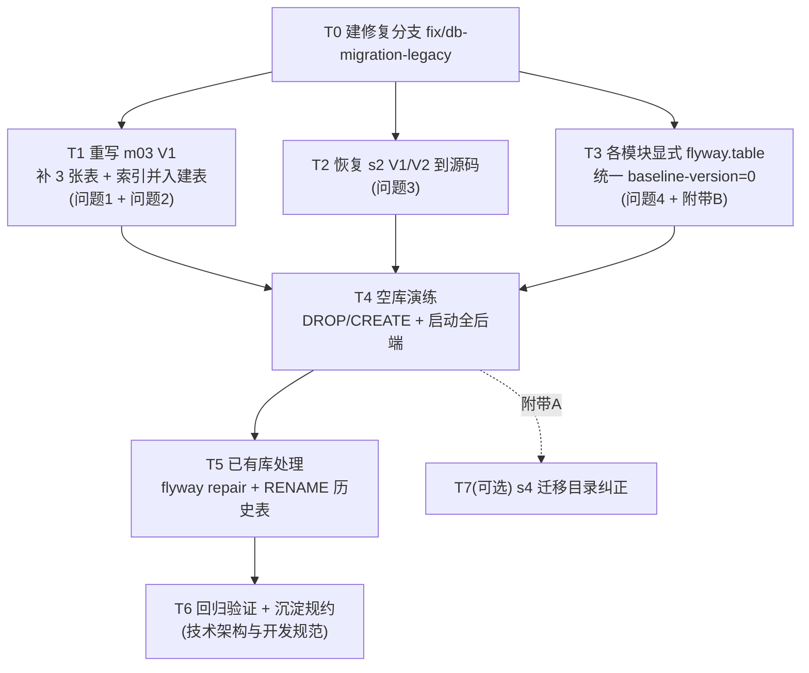

# 数据库迁移遗留问题 — 修复方案

> 文档性质：架构评审 + 修复方案（**不修改任何代码/迁移文件**，改动实施由后续提交落地）
> 适用仓库：`D:\homework\xind2\xind2`（分支 HEAD = `fix/sample-location-generic`，`a40985e`）
> 部署形态：多模块（Java）**共用同一个 MySQL 库** `comm_platform`，各模块用 Flyway 管理各自表；Java 后端起在 `127.0.0.1`
> 触发场景：全新服务器 / 全新空库首次启动时，`m03-bim-gis`、`s2-cad-fusion` 起不来
> 证据基线：所有结论均来自本次仓库实测（文件行号、git 历史、构建产物 diff），未经验证的推断均标注 **【待确认】**
> 撰写人：架构师（高见远）

---

## 摘要（TL;DR）

本次全新库启动踩到 4 个问题，根因**不是"少了一张表"，而是"迁移链不完整 + 迁移文件未入库 + 历史表边界不清"三条治理缺陷叠加**：

1. **m03**：`m03_design_task`、`m03_parametric_template`、`m03_generated_layout` 三张表只存在于**仓库根目录的手工脚本** `m03-fix-tables.sql`，从未进入 Flyway 迁移链 → 全新库执行到 V5 必炸（`Table 'comm_platform.m03_design_task' doesn't exist`）。
2. **m03**：`V1` 的 `CREATE INDEX` 非幂等，MySQL 8 又不支持 `CREATE INDEX IF NOT EXISTS` → 一旦重跑/半成功即陷入 `Duplicate key name` 死循环。
3. **s2**：`V1/V2` 迁移文件**不在 HEAD 源码里**（源码目录只有 `.gitkeep`），只残留在 `target/classes/`（被 `.gitignore` 屏蔽的构建产物）。实质是**分支未合并**导致源码缺失，构建残留掩盖了真相。
4. **多模块共用库**：`m01/s4/screen` 未显式指定 `spring.flyway.table`，共用默认历史表 `flyway_schema_history`；配合各自 `baseline-on-migrate: true`，产生"库非空 → 跳过 V1"的连锁故障。

**推荐主方案**：
- 问题 1 + 问题 2 **合并处理**：重写 `m03 V1`，补齐缺失表的三段 `CREATE TABLE IF NOT EXISTS`，并把 V1 末尾 7 条独立 `CREATE INDEX` **并入建表语句**（一并解决幂等）。已有库用一次性 `flyway repair` 对齐 checksum。
- 问题 3：从分支 `feat/s1-design-dock-refactor`(@`ae9b193`) **恢复 s2 的 V1/V2 到源码并纳入 git**（内容已比对一致）。
- 问题 4：**统一规约**——每个模块显式配 `spring.flyway.table: flyway_schema_history_<module>`，并统一 `baseline-on-migrate: true` + `baseline-version: 0`。
- 临时 `--spring.flyway.baseline-version=0` 作为过渡保留，但**不能替代**上述修复（见 §2.5）。

---

## 一、问题清单

### 问题 1：m03 有两张表（实为三张）根本不在迁移链里

| 项 | 内容 |
|---|---|
| **现象** | 全新库启动 m03 时 Flyway 执行 `V5` 报 `Table 'comm_platform.m03_design_task' doesn't exist`，m03 起不来 |
| **证据** | 见下方"证据链" |
| **影响面** | **全新库**：m03 完全无法建表启动（阻塞级）。**已有库**：因表已被手工脚本建出，表现为"能跑但迁移链与真实 schema 脱节"，隐患是换机器/删库即复发 |

**证据链（均已实测）**：
- m03 源码迁移目录仅 `V1~V7`（7 个文件，无遗漏文件）：
  `packages/m03-bim-gis/backend/src/main/resources/db/migration/`
- `V1__init_m03_schema.sql` 只建 **6 张表**（均为 `CREATE TABLE IF NOT EXISTS`）：
  `m03_project`(L6)、`m03_device`(L19)、`m03_model`(L39)、`m03_region`(L54)、`m03_design_scheme`(L69)、`m03_site`(L85)。
- `V5__add_idempotency_key_tasks_templates_sites.sql` 对**已被假设存在**的两张表做 ALTER：
  - `ALTER TABLE m03_design_task ... ADD COLUMN idempotency_key ... AFTER updated_at;`（L5–L8）+ `CREATE UNIQUE INDEX uk_task_idempotency`（L10）
  - `ALTER TABLE m03_parametric_template ... ADD COLUMN idempotency_key ... AFTER updated_at;`（L12–L15）+ `CREATE UNIQUE INDEX uk_template_idempotency`（L17）
  - `ALTER TABLE m03_site ... ADD COLUMN idempotency_key ... AFTER invalid_reason;`（L19–L22）+ `CREATE UNIQUE INDEX uk_site_idempotency`（L24）
- `V7__add_local_data_json_to_task.sql` 同样假设 `m03_design_task` 存在：
  `ALTER TABLE m03_design_task ADD COLUMN local_data_json LONGTEXT NULL ... AFTER result_json;`（L2–L3）
- 两张表（连同第三张）**只存在于仓库根目录**的手工脚本 `m03-fix-tables.sql`（git **已跟踪**）：
  - 建 `m03_parametric_template`（L4–L16）
  - 建 `m03_design_task`（L18–L29，含 `task_no VARCHAR(50) NOT NULL UNIQUE`、`params_json`、`result_json`、`status`、`created_at`、`updated_at`）
  - 建 `m03_generated_layout`（L31–L49，含外键 `FOREIGN KEY (task_id) REFERENCES m03_design_task(id)`）
  - 建 4 个索引（L51–L54）：`idx_m03_template_category`、`idx_m03_task_status`、`idx_m03_task_project`、`idx_m03_layout_task`
  - 插入 3 条模板种子数据（L58–L61，**先 `DELETE FROM m03_parametric_template` 再 INSERT**）
- **交叉验证（关键）**：`m03-fix-tables.sql` 的列定义与 V5/V7 的 `AFTER updated_at` / `AFTER result_json` 完全对得上（`m03_design_task` 有 `updated_at`/`result_json`；`m03_site` 有 `invalid_reason`），证明它**就是这两张表"遗失的建表迁移"的事实来源**。

**为什么"新增一个 V8"无法解决**：Flyway 严格按版本号升序执行，V5 排在 V8 之前，全新库在跑到 V5 时这两张表仍未创建。要让全新库通过，建表 DDL 的**版本号必须严格小于 5**（落在 V1 或 V1 与 V2 之间的中间版本）。详见 §2.1 方案对比。

---

### 问题 2：m03 的 V1 不是完全幂等

| 项 | 内容 |
|---|---|
| **现象** | `V1` 内部 `CREATE TABLE IF NOT EXISTS` 幂等，但 7 条 `CREATE INDEX`（L103–L109）**非幂等**，重跑报 `Duplicate key name 'idx_m03_device_project_id'` |
| **证据** | `packages/m03-bim-gis/backend/src/main/resources/db/migration/V1__init_m03_schema.sql` L102–L109 |
| **影响面** | **全新库**：正常单次执行不触发；但在"库非空 + 新建历史表 + `baseline-version=0`"路径下，若 V1 中 `CREATE INDEX` 中途失败，V1 不会被记为成功，**下次启动重跑 V1 即 `Duplicate key name` 永久卡死**。**已有库**：正常不触发，但埋雷 |

**证据链**：
- V1 建表全用 `IF NOT EXISTS`（L6/19/39/54/69/85），但索引是裸 `CREATE INDEX`（L103–L109）：
  `idx_m03_device_project_id`、`idx_m03_device_station_code`、`idx_m03_device_type`、`idx_m03_model_type`、`idx_m03_region_parent`、`idx_m03_design_scheme_project`、`idx_m03_site_scheme`。
- 同类非幂等点还有：`V4`（L8 `CREATE UNIQUE INDEX uk_scheme_idempotency`）、`V6`（L5 `CREATE INDEX idx_m03_design_scheme_taskno`）、以及 V2/V3/V4/V5/V7 的 `ALTER TABLE ... ADD COLUMN`（MySQL 8 **不支持** `ADD COLUMN IF NOT EXISTS`，见 §2.2）。

**已知 MySQL 8 限制（事实）**：MySQL 8 **不支持** `CREATE INDEX IF NOT EXISTS`，也**不支持** `ALTER TABLE ... ADD COLUMN IF NOT EXISTS`（这两个 `IF NOT EXISTS` 是 **MariaDB** 语法）。因此幂等必须靠"并入建表"或 `information_schema` 判断。

---

### 问题 3：s2 的迁移文件只存在于构建产物里

| 项 | 内容 |
|---|---|
| **现象** | HEAD 源码里 s2 没有任何迁移文件，但 `target/classes/` 里却有 V1/V2；一旦 `mvn clean`，s2 将无法建表 |
| **证据** | 见下方（含 git 历史追溯） |
| **影响面** | **全新库**：s2 jar 若非在"带残留"的机器上构建，则**根本不含迁移**，s2 表不会被创建。**已有库**：已建过表故暂时无感 |

**证据链（实测，含 git 追溯，结论比"构建残留"更严重）**：
- HEAD 源码目录只有占位文件：
  `packages/s2-cad-fusion/backend/src/main/resources/db/migration/` → 仅 `.gitkeep`（0 字节，**git 已跟踪**）。
- 构建产物里却有迁移（`target/` 被 `.gitignore` L18 `target/` 屏蔽，**从未被 git 跟踪**）：
  - `packages/s2-cad-fusion/backend/target/classes/db/migration/V1__init_s2_schema.sql`（5729 字节）
  - `packages/s2-cad-fusion/backend/target/classes/db/migration/V2__widen_coordinate_columns.sql`（545 字节）
- **git 历史追溯（关键校正）**：这两个文件**曾经提交过**，位于分支 `feat/s1-design-dock-refactor` 的提交 `ae9b193`（`feat(modules): 提交 S2 融合 / S5 施工监测 / QGIS 设计坞 全模块代码`）。`git ls-files` 确认 HEAD **未跟踪**这两个文件；`git merge-base --is-ancestor ae9b193 HEAD` 结果为 **NO**（该提交不在 HEAD 祖先链上）。→ 真因是**分支未合并**，而非单纯 `.gitignore`。
- **内容一致性比对（决定"能否安全恢复"）**：
  - `V2`：`git show ae9b193:.../V2__widen_coordinate_columns.sql` 与 `target/classes/.../V2` **逐字节相同**。
  - `V1`：两者仅**行尾（CRLF/LF）**不同，去 CR 后 MD5 一致（`f44836b5a6019dc3ff927e3944e78fe3`）→ **内容相同**。
  - 结论：**可直接从该分支恢复，内容可信**。
- `V1`/`V2` 内容要点：`V1` 建 `s2_cad_file`、`s2_coordinate_system`、`s2_fusion_task`、`s2_gis_feature`（`coordinate_x/y/z` 为 `DECIMAL(12,8)`）并插入 7 条预置坐标系；`V2` 把 `s2_gis_feature` 三个坐标列由 `DECIMAL(12,8)` 改为 `DOUBLE`（原宽度放不下 Web Mercator ~1.2e7 的投影值）。

**为什么会被漏掉**：
1. 主因是分支/合并卫生问题：迁移文件在 `feat/s1-design-dock-refactor` 分支，未被合并进当前开发主线；`target/` 又是 `gitignore`，导致"源码丢了但本机还能跑"，长期不可见。
2. 源码目录里的 `.gitkeep` **反向误导**：它让评审者以为"该目录本来就该是空的（占位）"，掩盖了"迁移文件丢失"这一事实。

---

### 问题 4：多模块共用库 + Flyway 历史表边界不清

| 项 | 内容 |
|---|---|
| **现象** | 各模块 `spring.flyway.baseline-on-migrate: true`，但历史表名不统一；`m01/s4/screen` 用默认名 `flyway_schema_history` |
| **证据** | 见下方模块—历史表映射 |
| **影响面** | **全新库**：默认表被多模块共用 → 版本号互相覆盖/checksum 冲突/互相跳过 V1，正是本次"后续模块跳过 V1"故障的土壤。**已有库**：同一默认表内混入多模块记录，`validate`/`clean`/`repair` 的作用域无法隔离 |

**各模块 `spring.flyway.table` 实测映射**：

| 模块 | `spring.flyway.table` | 证据 |
|---|---|---|
| m01-auth | **未配置 → 默认 `flyway_schema_history`** | `packages/m01-auth/backend/src/main/resources/application.yml`（无 `flyway` 段） |
| m03-bim-gis | `flyway_schema_history_m03` | `.../m03-bim-gis/backend/src/main/resources/application.yml` |
| m04-delivery | `flyway_schema_history_m04` | `.../m04-delivery/.../application.yml` |
| m05-twin-ops | `flyway_schema_history_m05` | `.../m05-twin-ops/.../application.yml` |
| s2-cad-fusion | `flyway_schema_history_s2` | `.../s2-cad-fusion/.../application.yml` |
| s3-review-engine | `flyway_schema_history_s3`（**且显式 `baseline-version: 0`**） | `.../s3-review-engine/.../application.yml` |
| s4-bom-transform | **未配置 → 默认 `flyway_schema_history`**（`baseline-version: 1`） | `.../s4-bom-transform/.../application.yml` |
| s5-construction-monitor | `flyway_schema_history_s5` | 仅见于 `packages/s5-construction-monitor/backend/target/classes/application.yml`（**源码无 src，见附带发现 C**） |
| screen | **未配置 → 默认 `flyway_schema_history`** | `.../screen/.../application.yml`（无 `flyway` 段） |

**全新库实测观察到的 4 张历史表**：`flyway_schema_history`（默认）、`flyway_schema_history_m04`、`flyway_schema_history_m05`、`flyway_schema_history_s3`。
- 与上表对照：`_m03`、`_s2`、`_s5` **未出现**。最可能原因：**m03 在 V5 失败、s2 因无迁移文件未正常执行**，故未生成各自历史表；**但确切原因需在空库逐模块启动复现确认**，见 §5【待确认】#6。
- 默认表 `flyway_schema_history` 的创建者**推测为 m01 或 screen**：二者未配 `table`，而 `packages/shared/backend/pom.xml` 传递引入了 `flyway-core` + `flyway-mysql`（L54–L59），Spring Boot 会以默认位置 `classpath:db/migration`（空）与默认表名自动配置 Flyway，于是**建出默认历史表但不建任何业务表**。**【待确认】**

**共用默认历史表的规则性风险**：
- **版本号冲突**：模块 A 与模块 B 都以 `V1` 起步，写入同一历史表后版本号相同但 checksum 不同 → 后启动的模块要么 `Migration checksum mismatch` 校验失败，要么被判定"V1 已应用"而**静默跳过 V1 不建表**。
- **baseline 语义污染**：首个模块使库变非空，后续模块在**同一个历史表**上再触发 `baseline-on-migrate` → baseline 位置漂移（正是本次事故的机理）。
- **运维不可隔离**：`repair`/`clean` 无法按模块作用域执行，牵一发动全身。

**结论**：**"每模块显式独立历史表名"应当作为硬性规约**，理由：多模块共用库是既定部署形态，历史表是 Flyway 的"身份基准"，共用即等于多模块共享同一份"已应用清单"，语义上必然冲突。

---

### 附带发现（超出 4 个问题，但同源，建议一并处理/记录）

**发现 A：s4 的迁移文件放错目录，Flyway 实际不执行任何迁移**
- `packages/s4-bom-transform/backend/src/main/resources/db/migration/` 只有 `.gitkeep`；
- 真正的迁移在 `packages/s4-bom-transform/backend/src/main/resources/db/V1__s4_init.sql`（**少了 `migration/` 一级**）；
- 而 s4 的 `application.yml` 配置 `locations: classpath:db/migration` → **扫不到该文件** → s4 建出默认历史表但**不建任何业务表**。
- 归类：与问题 1/3 同源（迁移文件与配置不对齐）。建议纳入本次修复范围。

**发现 B：s4 显式写了与全局不一致的 `baseline-version: 1`**
- s4 的 `application.yml` 中 `baseline-on-migrate: true` + `baseline-version: 1`；s3 为 `baseline-version: 0`；其余模块用默认（1）。基线值不统一会放大"跳过 V1"的偶发性。建议随 §问题 4 规约统一为 `0`。

**发现 C：s5 只有 `target/classes`、无源码**（`packages/s5-construction-monitor/backend/` 下无 `src/`）→ 与问题 3 同类的"源码缺失/仅构建产物"风险，建议核实是否应恢复。

---

## 二、逐问题修复选项

> 每个方案均给出：**做法 / 对【全新库】影响 / 对【已有库】影响 / 风险 / 回退方式**。
> 前提说明：本次约束"已有库已把 V1 标记为已应用"，任何**修改已发布迁移文件**（V1~V7）的动作都会改变其 checksum，触发 `Validate failed: Migration checksum mismatch`。

### 2.1 问题 1 修复选项

**共同前置事实**：Flyway 要求"建缺失表"的版本号 **< 5**；已有库若要重跑该迁移，需要 `flyway repair`（对齐 checksum）或 `outOfOrder=true`（允许乱序补跑）。

#### 选项 1-A（推荐）：把缺失建表并回 `V1`
- **做法**：重写 `V1__init_m03_schema.sql`，在现有 6 张表之后，追加三张表的 `CREATE TABLE IF NOT EXISTS`（内容取自 `m03-fix-tables.sql` L4–L49，去掉被后续迁移负责的列，见下），并把 4 条索引并入建表语句或与 V1 索引一起幂等化。
  - `m03_design_task` 建表**不包含** `idempotency_key`（留给 V5）、**不包含** `local_data_json`（留给 V7）——保持"V1 建基表 → V5/V7 加列"的既有语义不被破坏。
  - 建表顺序：`m03_design_task` 在 `m03_generated_layout` 之前（后者有外键依赖前者）。
- **对全新库**：✅ 完全解决。V1 建表 → V5 的 `ALTER ... AFTER updated_at`、V7 的 `ALTER ... AFTER result_json` 均满足前置条件。
- **对已有库**：V1 checksum 变化 → 启动 `validate` 失败。**必须**执行一次性 `flyway repair`（按模块历史表 `flyway_schema_history_m03`）对齐 checksum；表已存在，故 repair 后**不会重跑 V1、无副作用**。
  - `repair` 可用 Flyway CLI：`flyway -url=... -table=flyway_schema_history_m03 repair`，或用 Maven 插件，或**受控地**直接改历史表该行 checksum（不推荐手算 CRC32）。
- **风险**：需要一次性运维动作；V1 是最"敏感"的文件，改动需评审。
- **回退**：`git revert` 该提交；若已 repair，需再 repair 回旧 checksum（或用 `git` 旧版脚本重算）。

#### 选项 1-B：新增中间版本迁移（不改 V1）
- **做法**：新增 `V1_1__init_m03_task_and_template.sql`（Flyway 支持下划线分隔版本号，解析为 **1.1**，排序 `1 < 1.1 < 2`），内含三张表 `CREATE TABLE IF NOT EXISTS` + 幂等建索引。
- **对全新库**：✅ 解决（1.1 在 5 之前执行）。
- **对已有库**：❗V1..V7 已应用（最大版本 7），而 1.1 < 7 → 属于 **out-of-order**，默认 `outOfOrder=false` 下 `migrate` 会**报错**，必须开 `spring.flyway.out-of-order=true`（或手工标记该迁移已应用）。表已存在故幂等执行无副作用。
- **风险**：引入乱序迁移语义，与"迁移追加式"直觉相悖；需在规约里额外说明。
- **回退**：删除该文件 + 从历史表删除对应行即可（对已有库最干净）。

#### 选项 1-C：让 `V5`、`V7` 自愈（在 ALTER 前自行补建表）
- **做法**：在 `V5`、`V7` 的 `ALTER` 之前，各加一段被依赖表的 `CREATE TABLE IF NOT EXISTS`。
- **对全新库**：✅ 解决。
- **对已有库**：V5/V7 checksum 变化 → 同样需要 `flyway repair`（与 1-A 成本相同）。
- **风险**：把"建表"语义塞进"加列"迁移，可读性/职责最差；且 DDL 在两处重复。
- **回退**：`git revert`。

> **对比结论**：1-A 与 1-C 对已有库成本相同（都要 repair），但 1-A 语义正确（建表就该在 init）；且**问题 2 已经要求改 V1**（见 §2.2），所以选 1-A 时"改 V1"的 checksum 代价是**被复用的、零额外成本**。1-B 虽不碰 V1，却引入乱序语义。→ **推荐 1-A**。

### 2.2 问题 2 修复选项

#### 选项 2-A（推荐）：把 `CREATE INDEX` 并入 `CREATE TABLE`
- **做法**：删除 V1 末尾 7 条独立 `CREATE INDEX`（L103–L109），改为在各自建表的括号内加 `KEY`（如 `m03_device` 内加 `KEY idx_m03_device_project_id (project_id), KEY idx_m03_device_station_code (station_code), KEY idx_m03_device_type (device_type)`）。这样整条语句仍是 `CREATE TABLE IF NOT EXISTS`，**整体幂等**。
- **对全新库**：✅ 索引随建表一次性建成，重跑安全。
- **对已有库**：与 §2.1（选 1-A）**同一次 V1 改动**，共用同一次 `flyway repair`，**无额外成本**。
- **风险**：低。注意索引名/列与 `m03-fix-tables.sql` L51–L54 保持不冲突（同名索引只建一次）。
- **回退**：`git revert` + repair。

#### 选项 2-B：用 `information_schema` 守护的动态 SQL
- **做法**（每条索引 3 行）：
  ```sql
  SET @c := (SELECT COUNT(*) FROM information_schema.statistics
             WHERE table_schema = DATABASE() AND table_name = 'm03_device'
               AND index_name = 'idx_m03_device_project_id');
  SET @s := IF(@c = 0,
               'CREATE INDEX idx_m03_device_project_id ON m03_device(project_id)',
               'SELECT 1');
  PREPARE st FROM @s; EXECUTE st; DEALLOCATE PREPARE st;
  ```
- **对全新库 / 已有库**：功能上可行且幂等。
- **风险**：7 条索引 × 3 行 = 21 行样板，冗长易错；对 `sql_mode`（`PREPARE` 与 `ONLY_FULL_GROUP_BY` 无关，安全）无影响。**不推荐**，除非需要为 V2~V7 的 `ADD COLUMN` 统一兜底（见下）。

#### 选项 2-C：`DROP INDEX` 再 `CREATE`
- **做法**：先 `DROP INDEX IF EXISTS`（MySQL 同样**不支持** `DROP INDEX IF EXISTS`）→ 需先判存在。
- **结论**：**不推荐**。既不能直接成立（MySQL 8 无 `IF EXISTS`），又会无谓重建索引，收益为负。

**配套建议（P1，防御性）**：V2/V3/V4/V5/V6/V7 的 `ALTER TABLE ... ADD COLUMN` 同样非幂等（MySQL 8 不支持 `ADD COLUMN IF NOT EXISTS`）。**是否一并加 `information_schema` 守护**，建议作为**可选加固**：正常单次执行无需，但可彻底消除"半成功重跑"死锁。见 §5【待确认】#5 的权衡。

### 2.3 问题 3 修复选项

#### 选项 3-A（推荐）：从分支恢复 V1/V2 到源码并纳入 git
- **做法**：
  ```
  git show ae9b193:packages/s2-cad-fusion/backend/src/main/resources/db/migration/V1__init_s2_schema.sql \
    > packages/s2-cad-fusion/backend/src/main/resources/db/migration/V1__init_s2_schema.sql
  git show ae9b193:.../V2__widen_coordinate_columns.sql > .../V2__widen_coordinate_columns.sql
  ```
  （内容已比对一致；保留两段式版本以兼容任何可能已应用的 s2 库。）
- **对全新库**：✅ s2 jar 重新构建后将**自带**迁移，建出 4 张 S2 表。
- **对已有库**：checksum/版本与历史一致（因为内容就是历史版本），**无需 repair**；若已有库已应用 V1/V2，则 Flyway 视为已应用、跳过，**无副作用**。
- **风险**：需确认 V1/V2 是否与**当前** s2 实体/Mapper 完全一致（是否还有后续列未纳入）——见 §5【待确认】#4。
- **回退**：删除复原的文件 / `git revert`。

#### 选项 3-B：合并重写为单份 `V1__init_s2_schema.sql`（最终形态=DOUBLE）
- **做法**：把 V2 的效果直接并入 V1，使 V1 一步到位（坐标即 `DOUBLE`），不再有 V2。
- **对全新库**：✅ 更简洁。
- **对已有库**：❌**危险**。若已有 s2 库已应用旧 V1+V2，合并后 V1 checksum 变化、且历史表中会出现"V2 保留位/被删"错位，需 `repair` + 人工处置。
- **适用前提**：**仅当确认 s2 尚无任何真实库**（无历史表数据）时才可用。
- **回退**：较麻烦。→ **不推荐**（除非 §5#2 确认无 s2 存量库）。

#### 选项 3-C：不恢复，仅"禁止 `mvn clean`"
- **结论**：**不可取**。治标不治本，且依赖人肉纪律；一旦 CI/新机器构建即复发。

**根因治理建议（应与 3-A 一起做）**：
1. **清理由 `.gitkeep` 造成的误导**：要么让目录真正有迁移（3-A 后即满足），要么在文档/CI 明确该模块"无迁移"是有意为之。
2. **CI 门禁**：在构建流水线加一条检查——凡启用 Flyway 的模块，其 `src/main/resources/db/migration/` 必须存在 ≥1 个 `V*.sql`，否则 fail；或在模块 `README` 显式声明"本模块无迁移"。防止"源码丢失但构建残留掩盖"再次发生。
3. **禁止产物当源码**：`target/` 已在 `.gitignore`（L18）中，方向正确；但需在规约中强调**迁移文件的唯一真相源是 `src/main/resources`**，任何 `target/classes` 内的迁移一律不得作为依据。

### 2.4 问题 4 修复选项

#### 选项 4-A（推荐，作为规约）：每模块显式独立历史表名
- **做法**：为**所有**启用 Flyway 的模块补/统一 `spring.flyway.table`：
  - `m01-auth` → `flyway_schema_history_m01`
  - `s4-bom-transform` → `flyway_schema_history_s4`
  - `screen` → `flyway_schema_history_screen`
  - 已有独立名的 m03/m04/m05/s2/s3/s5 **保持不变**。
- **对全新库**：✅ 各模块历史表隔离，彻底消除版本/checksum/baseline 互相污染。
- **对已有库**：⚠️ 关键——原本写进默认表 `flyway_schema_history` 的 m01/s4/screen 记录，会在改名后"看不到"，导致 Flyway **按新历史表重跑 V1..Vn**。因 m01/s4/screen **当前实际不建业务表**（m01/screen 无迁移文件；s4 迁移放错目录，见附带发现 A），重跑风险低；但**必须在变更前确认**这三模块历史表内是否已有需要保留的记录，必要时**先重命名历史表**（`RENAME TABLE flyway_schema_history TO flyway_schema_history_<module>`）或以 `baseline-on-migrate` 将其标记为已基线。
- **风险**：已存在数据行的默认表迁移需谨慎（见上）。
- **回退**：改回 yml。

#### 选项 4-B：维持默认命名，靠"每模块库/每模块 schema"隔离
- **做法**：不同模块连不同 database 或不同 schema。
- **结论**：与当前"共用 `comm_platform` 库"的既定部署形态冲突，**不采用**。

#### 选项 4-C：维持现状（仅靠 `baseline-version=0` 兜底）
- **结论**：❌ 见 §2.5，`baseline-version=0` 只能缓解"跳过 V1"，**无法解决**版本号/checksum 冲突与运维不可隔离。

> **规约建议（对团队拍板）**：**是**，应把下列固化为 Flyway 规范（写入 `docs/技术架构与开发规范.md` 或 `deploy/`）：
> 1. 每模块**必须**显式 `spring.flyway.table: flyway_schema_history_<module>`（唯一）。
> 2. 统一 `spring.flyway.baseline-on-migrate: true` + `baseline-version: 0`。
> 3. `locations` 必须指向本模块实际存在迁移的 `classpath:db/migration`（或模块专属子路径），且 `src` 中确有文件。
> 4. `V1` 必须**完全幂等**（`CREATE TABLE IF NOT EXISTS` + 索引并入建表）。
> 5. 迁移文件**只能**存在于 `src/main/resources`，禁止以 `target/` 为真相源。
> 6. 迁移脚本内**禁止** `DELETE FROM` 全表（种子数据用幂等 upsert）。

### 2.5 临时修法评估：`--spring.flyway.baseline-version=0`

**现状**：`deploy/scripts/start-backends.sh` 的 `start_java()` 对所有 Java 后端追加 `--spring.flyway.baseline-version=0`（对应提交 `d4b88f3`）。

**机理（正确）**：当某模块的历史表**首次创建**且库**非空**时，Flyway 会插入一条 baseline 记录。默认 `baselineVersion=1` 会让 `V1` 被视为"已随 baseline 应用"而**跳过建表**；设为 `0` 后 baseline 落在 0，`V1..Vn`（均 > 0）**全部照常执行**。由于 `V1` 用 `CREATE TABLE IF NOT EXISTS`，重复执行无副作用——**前提是 V1 幂等，而这正是问题 2 尚未满足的地方**。

**副作用评估**：
- **对全新库**：✅ 有益且必需（避免跳过 V1）。**但**：若某模块 `V1` 非幂等（m03 索引），一旦半成功即触发"重跑 → `Duplicate key name`"死循环（问题 2）。
- **对已有库**：⚠️**需实测确认**。`baseline-version` 只在**新建历史表**时插入 baseline 行；对**已存在**历史表（V1..Vn 已应用或已含 baseline 行），改该属性一般**不会重跑**历史迁移。但存在一种风险情形：已有库的历史表当初是在 `baselineVersion=1` 下、于非空 schema 上创建的（含一条版本=1 的 `BASELINE` 行），此后改为 `0`，可能触发基线语义冲突/校验告警。**该情形的确切行为需在已有库副本上做受控实验**（见 §5【待确认】#5）。
- **全局放大的风险**：该参数被**无差别**应用到所有模块（含用默认历史表、location 配错、无迁移的模块），在这些"历史表边界不清"的模块上，baseline 行为更不可预测。

**结论**：
- 可**作为过渡态保留**（解决眼下"跳过 V1"），但**不能替代**问题 1/2/3/4 的修复。
- 建议在完成 §三 的修复后，**回归标准**：可靠的做法是"每模块独立历史表 + 幂等 V1"，此时 `baseline-version=0` 可继续保留（作为非空库首次建表的正确基线），但不再是"兜底所有问题的创可贴"。

---

## 三、明确推荐方案

| 问题 | 推荐方案 | 一句话理由 |
|---|---|---|
| 1. m03 缺失表 | **1-A**：并入 `V1` 建表（`m03_design_task` / `m03_parametric_template` / `m03_generated_layout`） | 建表就该在 init；且与问题 2 共用同一次 V1 改动，已有库 repair 成本被复用 |
| 2. V1 非幂等 | **2-A**：V1 末尾 7 条 `CREATE INDEX` 并入建表 | 整体幂等、无 `IF NOT EXISTS` 依赖、最简单 |
| 3. s2 迁移缺失 | **3-A**：从 `ae9b193` 恢复 V1/V2 到源码并纳入 git | 内容已比对一致；对已有库无副作用；治本 |
| 4. 历史表边界 | **4-A**：每模块显式 `table: flyway_schema_history_<module>`，并统一 `baseline-version: 0` | 多模块共用库下，历史表必须隔离；否则冲突不可控 |
| 附带 A/B/C | 纳入同一分支一并修：s4 迁移目录纠正、`baseline-version` 统一、s5 源码核实 | 同源缺陷，一次治理 |
| 临时修法 | `baseline-version=0` **保留为过渡**，不当兜底 | 缓解"跳过 V1"，但不解决幂等/隔离 |

**一次 V1 改动同时满足问题 1 与问题 2**，这是推荐 1-A + 2-A 的核心理由：修改 V1 的 checksum 代价是**必然要付的（问题 2 已触发）**，因此把问题 1 的建表一并放进去是**零增量成本**。

---

## 四、建议的实施顺序与验证方法

> 实施原则：**一律在新分支上做**（建议 `fix/db-migration-legacy`），**不直接改主线**；先"空库演练"证明自洽，再处理已有库。

### 4.1 实施顺序

```
1) 拉修复分支
2) 修 m03 V1  —— 补三张表(不含先迁移负责的列) + 索引并入建表            [问题1+2]
3) 恢复 s2 源码迁移 —— 从 ae9b193 取 V1/V2                             [问题3]
4) 修 yml   —— m01/s4/screen 补 flyway.table；统一 baseline-version:0   [问题4]
   (可选加固) s4 迁移文件从 db/ 移到 db/migration/                       [附带A]
5) 空库演练（见 4.2）→ 全绿
6) 已有库处理（见 4.3）→ flyway repair 等一次性动作
7) 由主理人统一提交（本次不 commit）
```

### 4.2 空库演练（验收关键路径）

```bash
# 1) 彻底重建空库
mysql -uroot -p -e "DROP DATABASE IF EXISTS comm_platform; CREATE DATABASE comm_platform
  CHARACTER SET utf8mb4 COLLATE utf8mb4_unicode_ci;"

# 2) 用 start-backends.sh 启动全部后端，观察日志无迁移错误
#    （在"每模块独立历史表 + 幂等 V1"落地后，V1..Vn 应自洽跑通）
grep -iE "flyway|migrat|doesn't exist|Duplicate key" logs/*.out
```

**验收清单（期望结果）**：
| 检查 | SQL | 期望 |
|---|---|---|
| m03 三张表存在 | `SHOW TABLES LIKE 'm03_design_task';` / `...m03_parametric_template;` / `...m03_generated_layout;` | 3 张均存在 |
| s2 四张表存在 | `SHOW TABLES LIKE 's2_%';` | `s2_cad_file`/`s2_coordinate_system`/`s2_fusion_task`/`s2_gis_feature` |
| m03 历史完整 | `SELECT version,success FROM flyway_schema_history_m03 ORDER BY installed_rank;` | `1..7` 且 `success=1` |
| s2 历史完整 | `SELECT version,success FROM flyway_schema_history_s2;` | `1,2` 且 `success=1` |
| 历史表隔离 | `SHOW TABLES LIKE 'flyway_schema_history%';` | 每启用 Flyway 的模块各一张 `_<module>`（仅当所有模块都显式命名后，默认表不再出现） |
| V1 幂等（关键） | 对 m03 删历史并重跑一次 V1，或直接对已建库再执行一次 V1 | **不报** `Duplicate key name` |
| V5/V7 前置满足 | 启动日志 | 无 `Table 'comm_platform.m03_design_task' doesn't exist` |

### 4.3 已有库处理（一次性运维动作）

1. **先备份**：`mysqldump -uroot -p comm_platform flyway_schema_history_m03 > backup_m03_history.sql`（及其它受影响模块历史表）。
2. **对齐 m03 checksum**：`flyway -url=jdbc:mysql://.../comm_platform -table=flyway_schema_history_m03 repair`（表已存在，repair 只改 checksum、不重跑）。
3. **补 m01/s4/screen 历史表边界**：确认默认表 `flyway_schema_history` 内的记录归属后，`RENAME TABLE flyway_schema_history TO flyway_schema_history_<owner>`，或对无迁移模块直接让其按新名重建（其内无业务迁移，风险低）。
4. **回归验证**：逐模块重启，确认 `validate` 通过、无重复建表、无 `Table doesn't exist`。

### 4.4 回退方式

- 代码/迁移/yml 改动：`git revert <commit>`（全部改动集中在 1 个分支提交内，便于整体回退）。
- 已有库若已 `repair`：回退后用旧版脚本重算 checksum 再次 `repair`；历史表重命名用 `RENAME TABLE` 反向操作。
- `m03-fix-tables.sql`：**保留但标注 deprecated**（不再作为启动前置步骤），避免误用。

---

## 五、待确认事项（需主理人/团队拍板）

1. **已有库的范围**：仓库"已有库"具体指哪些？（本地开发库 / 其他同学机器 / 是否有生产库）——决定 `repair`/`RENAME TABLE` 的执行范围，以及是否允许修改已发布的 `V1`。**【阻塞 §2.1 方案定档】**
2. **s2 是否存在真实存量库**：若确认 s2 尚无任何已应用的库，则可选 §2.3 选项 3-B（合并重写）以更简洁；否则坚持 3-A。**【待确认】**
3. **`m03_generated_layout` 是否仍被代码引用**：是否需要在 V1 一并建出（本方案按"与 `m03-fix-tables.sql` 完全对齐"处理为"保留"）。**【待确认】**
4. **s2 的 V1/V2 是否仍是当前 schema 真相**：需比对 s2 的实体/Mapper（是否存在 V1/V2 未覆盖的列/表）。**【待确认】**
5. **`baseline-version=0` 在"已有 `_mXX` 历史表且原 baseline 行在 V1"上的确切行为**：建议在**已有库副本**上做受控实验后定档；同时权衡是否要给 V2~V7 的 `ADD COLUMN` 也加 `information_schema` 幂等守护（P1 加固）。**【待确认】**
6. **默认历史表 `flyway_schema_history` 的真实创建者**：推测为 m01 或 screen（经 `shared` 传递引入 `flyway-core`），需在空库上逐模块启动复现确认，以决定 §4.3 第 3 步的 `RENAME` 目标模块。**【待确认】**
7. **三张缺失表的种子数据（3 条模板）是否必须由迁移初始化**：若必须，迁移内应改用**幂等 upsert**（`INSERT ... ON DUPLICATE KEY UPDATE` / `INSERT IGNORE`），而**不能**沿用 `m03-fix-tables.sql` 的 `DELETE FROM ... ` 破坏性写法；这需要一个唯一键（现表结构里 `name` 非唯一）——是否需要为 `m03_parametric_template.name` 加唯一约束。**【待确认】**
8. **附带发现 A（s4 迁移目录 `db/` → `db/migration/`）是否纳入本次修复**：涉及移动文件（非新增），需确认 s4 是否已有存量库受影响。**【待确认】**
9. **附带发现 C（s5 无源码、仅 `target/classes`）**：是否应像 s2 一样从分支恢复源码。**【待确认】**

---

## 附：修复依赖关系（Mermaid）



---

*本文档仅为分析与方案，未修改任何代码/迁移文件。所有"证据"均来自本仓库实测（文件行号 / git 历史 / 构建产物比对）；标注【待确认】者需团队实验或拍板后定档。*
