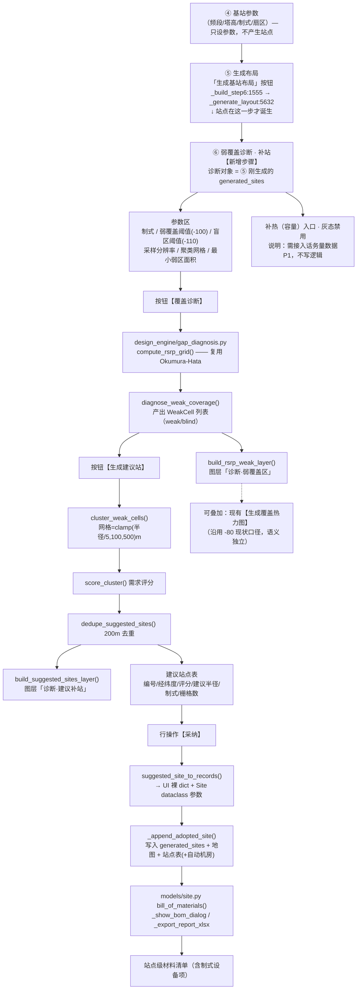
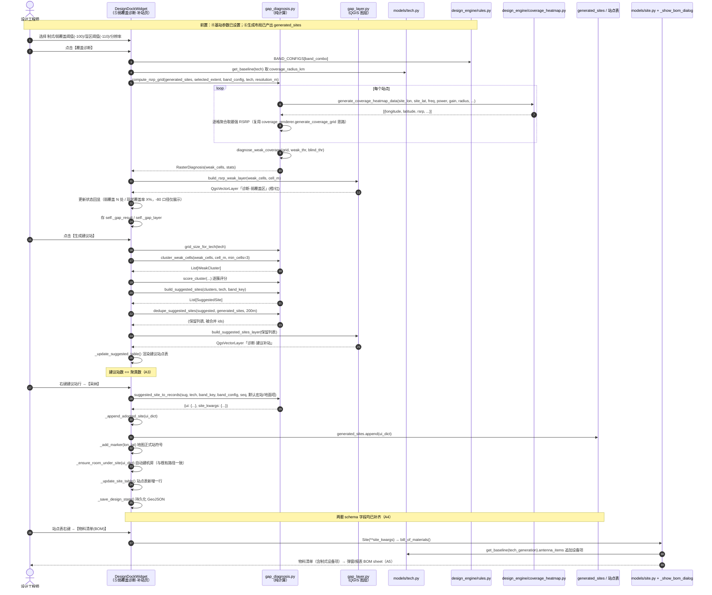
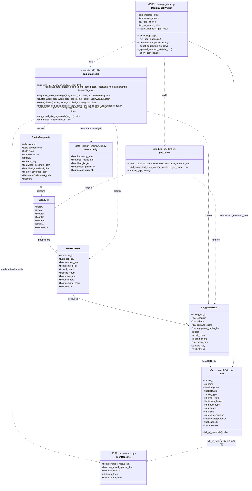

# 架构设计与任务清单 — S1 补盲补热（QGIS 插件）

> 文档类型：系统架构设计 + 任务分解
> 版本：**v1.7**（2026-09-19 修订；v1.1 初版 → v1.2 数值勘误 → v1.3 热力图约束 → v1.4 T09 报告 → v1.5 聚类口径 → v1.6 RSRP 口径 → **v1.7 扇区数来源 + 可用覆盖率口径 + 扇区数上限护栏（R-18）+ 拆出 T03a 最小接线（R-19）+ score_cluster 回填勘误（R-20）**）
> 模块：S1 — QGIS 插件（`qgis-plugin`）
> 上游输入：`docs/补盲补热/01-PRD-补盲补热.md`（v1.0）
> 撰写：架构师 高见远 ｜ 修订：team-lead

> ⚠️ **v1.1 修订记录（重要，改动 D3 与三项默认值）**
>
> | # | v1.0 原写法 | v1.1 修正 | 依据 |
> |---|---|---|---|
> | **R-1** | 新步骤插在**④基站参数与⑤生成布局之间** | 改插在**⑤生成布局之后**（新⑥），原⑥⑦顺延为⑦⑧ | **站点的产生点是第⑤步**（`_build_step6:1555` 的「生成基站布局」按钮 → `_generate_layout:5632`）。插在④⑤之间时 `generated_sites` 为空 → RSRP 栅格全是 `-200` 哨兵值 → 图上显示"整片盲区"，诊断无对象。详见 §0 D3 |
> | **R-2** | 聚类网格 `clamp(制式半径/5, 100m, 500m)` | 公式保留，但**须知它与实际布站间距不同源**（见 §0 参数表新增说明） | 布站间距取 `BAND_CONFIGS[band].ideal_isr_km`（**按频段**），不是 `TECH_BASELINE`（按制式）。两套值差 **1.2~2.5 倍**（实测配对见 §0 参数表下方） |
> | **R-3** | 聚类最小栅格数 ≥ **3** | 提到**按面积折算**（弱区面积 ≥ 聚类网格面积 × 20） | 100m 采样 + 100m 网格 + ≥3 格 = "三个格子凑一块就算一片"，5G 场景下会碎成一片，与"弱覆盖区 2~4 个"的演示预期差一个数量级 |
> | **R-4** | 建议站去重距离**写死 200 m** | 改为 `min(实际布站 ISR ÷ 2, 200 m)` | mmWave 的 TECH_BASELINE 站间距 120 m **小于** 200 m 去重线 → 网格站会被全判为"重复"；5G Sub-6 的 300 m 也偏紧 |
> | **R-5** | 建议站 = 弱区质心，**未做避让检查** | **新增避让过滤**（复用 `AvoidanceChecker.filter_valid_sites`） | 第⑤步生成站点时**有**避让过滤（`_generate_hex_grid:2405-2413`，过滤水面/保护区/建筑/电力线），新路径没有 → 质心可能落在水面或禁区内，同一插件两套标准 |
> | **R-6** | 未提采纳后的界面刷新 | **新增**：采纳后弱覆盖面需标记为"已过期/自动重算" | 站补上了但图上还标着弱区 → 看着像"补了没用" |
> | **R-7** | 未提建议站采纳后的去留 | **新增**：采纳后该行需标记为"已采纳"或移除 | 否则可重复采纳，同一位置出两个站 |
> | **R-8** | 布线列为 P1 任务 | **删除该 P1 任务**，改为"由第⑦步「生成管线」自动覆盖，0 行新增代码" | `_generate_pipelines:3662` 首句即 `if not self.generated_sites:` → 它遍历站点池；补的站只要先进池，点该按钮即自动拉线 |
> | **R-9** | 把 `BAND_CONFIGS[band].ideal_isr_km`（布站间距）写成 `max_radius_km`（最大半径）的值 | **勘误**（v1.2）：实际 `ideal_isr_km` = 700MHz **2.5** / 2.6GHz **1.0** / 3.5GHz **0.5** / 4.9GHz **0.3** km；"两表差 1.5~4 倍"更正为 **1.2~2.5 倍** | `design_engine/rules.py:5-22` 逐字段核对 —— `BandConfig` 同时有 `max_radius_km` 与 `ideal_isr_km` 两个字段，v1.1 误取了前者。详见 §0 勘误表 |
> | **R-10** | 未发现第④步「场景」参数漏传 | **新增**（见 §7.3 末尾）：`_generate_hex_grid:2417-2423` 调 `generate_sites_from_grid` 时**缺 `scenario=` 实参** → 算法站场景恒为 `URBAN` | `hex_grid.py:77` 签名默认值 + `:124-125` 命名；手点路径 `:2493` 反而读面板值，两条路径第三次不一致 |
> | **R-11** | 聚类网格尺寸取**制式**基线推导：`clamp(TECH_BASELINE[tech].coverage_radius_km / 5, 100m, 500m)` | **改按频段取实际布站 ISR**：`clamp(BAND_CONFIGS[band].ideal_isr_km × 1000, 100, 2000)` 米 | ① 语义正确 —— 网格应等于"一个站点的覆盖单元"尺度；用制式半径÷5 得到的 80~400m 与站点实际密度脱节（R-2 已指出双源）；② 4G 下 `clamp(400,100,500)=400m` 会让"网格"比站间距小 2.5 倍，一个覆盖单元被切成好几片 |
> | **R-12** | 最小弱区面积等价实现写成 `min_cells = max(20, round(cell_m² / resolution_m²))` | **改为 `min_cells = max(1, round(0.2 × (cell_m / resolution_m)²))`**（= 网格面积的 **20%**） | ⚠️ **v1.1 的公式在 4G 场景恒不成立**：`cell_m²/res²` 就是"桶容量"，取 `max(20, 容量)` 意味着要求**桶内弱栅格数 ≥ 20 且 ≥ 容量**。4G 若 cell_m=400m → 容量 16 → 要求 ≥20 > 16 → **永远无聚类，诊断结果恒为空**。改为"桶容量的 20%"后与桶容量恒自洽 |
> | **R-13** | RSRP 按**全向满增益**算（复用 `coverage_heatmap.generate_coverage_heatmap_data`），只预留 8dB 阴影衰落 | **改为扇区化 + 链路余量**：`path_loss_with_directivity`（3 扇区 / 65° 波束）+ `link_margin_db`（默认 20dB） | 🔴 **功能不可演示级缺陷**：实测演示场景三频段弱格/聚类**恒为 0**，"补盲"无对象可找。详见 §0 勘误块 R-13 与 §10.2 F-7/F-8 |
>
> | **R-14** | 诊断覆盖率沿用第⑦步热力图的 `≥-80dBm` 达标线 | **改为「可用覆盖率」= RSRP ≥ 弱覆盖阈值（默认 −100 dBm）**；新增 `stats["coverage_caliber"]`（口径描述）与 `stats["coverage_caliber_label"]`（中文标签）两个键供下游组合 | 🔴 新口径下 `≥-80dBm` 仅 **11.3%**，而第⑦步热力图同区 **100%** → 同屏差 **8.85 倍**。改用 −100 后 **86.1%**，与"弱/盲"分级同一刻度、严格互补（`可用 + 弱 + 盲 = 100%`），差距收敛到 1.16 倍 |
> | **R-15** | 扇区数**硬编码** 3 扇区（`SECTOR_AZIMUTHS_DEG`） | **改读站点 dict 的 `num_sectors`**：缺键 → 回退 `SECTOR_AZIMUTHS_DEG`；`≤0`（含 0=全向）→ 不施加方向图损失、改走 `okumura_hata_path_loss`；`N>0` → `(i×360/N)`。新增辅助函数 `_azimuths_for_site()` | 面板 `sector_spin:1457-1460` 为 `QSpinBox(0~6)`、默认 3，且该值**确已写入站点 dict**（`:2434`/`:2492`/`:5790`）。硬编码 = "看得见的参数不起作用"。⚠️ 实现须**先判键存在再取值**，避免 `0` 被 falsy 误当缺省 |
> | **R-18** | `_azimuths_for_site` 的 `N>0` 分支**无上限**：`num_sectors` 填超大值（如 999999）会生成等量方位角 → 逐站 × 逐扇区 × 逐格遍历直接跑死 | **clamp ≤ 64**：新增常量 `MAX_SECTORS = 64`，`N > 64` 时**静默截断到 64**（不抛错 —— 抛错会让整个诊断动作失败，比截断更糟）；`N == 64` 不截断、`N == 65` → 64。缺键回退 / `≤0` 全向两条分支一字不动 | 档 2 要把 `num_sectors` 接到面板数字输入框，超大值是用户可输入的（QA software-qa-engineer-6 R1）。实测 6 扇区以上诊断已饱和（6/8/12/36 逐格一致），故 64 上限对**合法取值不产生任何结果差异**，纯防跑死护栏 |
> | **R-19** | 任务清单把"档 1（T01+T07+T02）"当作"能看见"的交付单元（§6.0 三档表原话："QGIS 里看到弱区着色 + 建议站列表"） | **拆出 T03a 最小接线并入档 1**；原 T03 更名 **T03b**（内容不变，前置依赖加 T03a）。判据从"文件存在 + 单测全绿"升级为"**真机点按钮出图层**" | **用户真机截图实测**：T01+T02 交付后插件界面上什么都没有。硬证据三条 —— ① `grep -rn "from.*gap_layer\|gap_layer\." --include=*.py`（排除 tests）**退码 1、零命中**；② `grep -rn gap ui/`（排除 .pyc）**零命中**；③ `_STEP_TITLES:1173` 仍是老 7 步。**根因**：T02 只是"生产图层"的函数，没有调用者就没有入口，图层永远不会出现。**教训：判断"能不能看见"要 grep 调用链，不能信文档档位表。** |
> | **R-20** | T03a 接线把 `score_cluster` 写成了**不赋值**的语句调用（`gd.score_cluster(c, ...)`），且该错误同时存在于 §6 的 T03a 派单规格中 | 改为**回填**：`c.demand_score = score_cluster(c, ...)`；§4.1 的 `score_cluster` docstring 补上"**纯函数，调用方必须回填**"的显式警告 | **独立 QA（software-qa-engineer-1-35ce）发现**，主理人实测复现：`score_cluster` 是纯函数（`gap_diagnosis.py:577-611` 只 `return`，docstring 第 583 行自称"纯函数"），不赋值 → 7 条建议站 `demand_score` 全为 **0.0**；赋值后 → `[49.6, 50.4, 50.0, 54.8, 46.8, 46.8, 73.2]`。**后果是静默的**：建议站图层（`gap_layer.py:156`）全部落进 `(0,40] 低需求` 灰色档，分级完全失效，且日志只显示"评分=0.0"不报错。**根因**：§4.1 已在函数规格里写了"纯函数"，但派单规格与该节调用链把最关键的回填丢了 —— 说明"§4.1 写对了"不等于"调用方能写对"。**教训：凡纯函数（只 return 不落对象），规格里必须把赋值写成调用点的一部分，不能只写在被调方。** |
>
> ⚠️ **v1.6 同时更正 3 处残留旧口径**：§4.1 `grid_size_for_tech` 的 `clamp(半径/5,100,500)` → 委托 `grid_size_for_band`；T01 判据 2/5 的旧公式；T03 判据 1 的"新第⑤步夹在④与⑥之间"（应为第⑥步夹在⑤与⑦之间，与 §0 D3、§2.3 矛盾，属 v1.0 遗留）。
>
> 另有两条**非阻塞备注**（不进任务清单）：
> - **操作纪律**：第⑤步「生成基站布局」收尾是 `self.generated_sites = sites`（**直接赋值替换**）。补站后若回头重跑第⑤步，补站会被静默清空。此行为是**既有的**（非本次引入），且主流程（线性 ④→⑤→⑥→⑦→⑧）不触发，故不列任务，仅在文档中注明。
> - **演示制式限制**：**本次演示禁用 mmWave**。`TECH_DEFAULT_BAND` 把 mmWave 映射到 `4.9GHz`，而 `BAND_CONFIGS` 中并无 26/28GHz 配置 → mmWave 在插件内实际是残缺制式（频段不匹配、覆盖半径 150 m 而实际布站间距 300 m → 间距是半径的 2 倍）。主演示用 **4G LTE**：默认频段 2.6GHz（⚠️ **v1.6 更正**：v1.1 曾推测"重叠充分 → 弱区只会出现在选区边缘，数量可控"，该推测基于旧全向口径的乐观模型，**实测证伪** —— 旧口径下弱区恒为 0；新口径下实得 7 片，见 §0 R-13 与 §10.2 F-2）。**5G NR(Sub-6) 实测 0 片，不可用于演示**（§10.2 F-7）。

---

## 0. 决策基线（本次设计不可更改的前置）

| # | 决策 | 对本设计的影响 |
|---|---|---|
| D1 | **只做「补盲」（覆盖弱），不做「补热」（容量）** | 面板保留"补热"入口位与灰态说明（"需接入话务量数据"），不写任何容量判定逻辑；补热列 P1 |
| D2 | **阈值分两档：弱覆盖 < -100 dBm、盲区 < -110 dBm，面板可调** | 与既有 `_show_coverage_stats:4203` 的"覆盖率 ≥ -80 dBm"**并存但语义分离**（详见 §8.2） |
| D3 | **恢复独立步骤「弱覆盖诊断 · 补站」**，插在**⑤生成布局之后**（成为新⑥），原⑥管线·场景 → ⑦、原⑦出图·交付 → ⑧，7 步 → 8 步 | ⚠️ **v1.1 修正**（原定插在④⑤之间是错的）。三个理由：<br>① **诊断对象在第⑤步才存在** —— 「生成基站布局」按钮在 `_build_step6:1555` → `_generate_layout:5632`，插在④⑤之间时 `generated_sites` 为空，栅格全 `-200`；<br>② **叙事更真实** —— "设参数 → 生成初版布局 → 发现还漏 → 补站 → 拉线 → 出图"，这才是真实工程设计流程；<br>③ **布线零成本** —— 补的站先于第⑦步「生成管线」进池，即被自动拉线（`_generate_pipelines:3662` 遍历站点池）。详见上方 v1.1 修订记录 R-8 |
| D4 | **演示数据 = 摩洛哥 JAD-MARJANE 范围**，蜂窝站点用第⑤步 hex grid 在该区域生成 | 增设"演示数据体检"任务（T04） |

其余参数默认值（凡涉及处均标"默认值，可调"）：

| 项 | 默认值 | 依据 |
|---|---|---|
| 采样栅格分辨率 | 100 m（沿用现有热力图口径） | `design_dock.py:3998` |
| 聚类网格尺寸 | **（v1.5 修正）`clamp(BAND_CONFIGS[band].ideal_isr_km × 1000, 100, 2000)` 米** —— 按**频段**取实际布站间距 | 语义 = "**一个站点的覆盖单元**尺度"，桶 = 该站本应覆盖、却覆盖不佳的一块地。实测值：700MHz→**2000m**（clamp 上限）／2.6GHz→**1000m**／3.5GHz→**500m**／4.9GHz→**300m**。⚠️ v1.1 曾用 `TECH_BASELINE[tech].coverage_radius_km / 5`，与站点实际密度脱节（双源），见 R-2、R-11 |
| 聚类最小栅格数 | **（v1.5 修正）弱区面积 ≥ 聚类网格面积的 20%**，等价实现 = `min_cells = max(1, round(0.2 × (cell_m / resolution_m) ** 2))` | v1.0 的 "≥3 个栅格" 过松（碎片成片）；v1.1 的 `max(20, 桶容量)` **过严到恒不成立**（4G 桶容量仅 16 < 20 → 永远无聚类）。改为"桶容量的 20%"后与桶容量恒自洽：700MHz→80 格／2.6GHz→20 格／3.5GHz→5 格／4.9GHz→2 格。见 R-12 |
| 建议站去重 | **（v1.1 修正）`DEDUPE_DISTANCE_M = min(实际布站 ISR ÷ 2, 200)`**；与既有正式站/建议站距离小于该值即合并，保留评分更高者 | team-lead 锁定。v1.0 写死 200 m 会把 mmWave（站间距 120 m）的网格站全判为重复 |
| 采纳默认属性 | 宏站(MACRO) / 单管塔(MONOPOLE) / 地面(GROUND) / 当前面板制式 / `coverage_radius` 取制式基线 | team-lead 锁定 |
| 诊断输入站点范围 | `generated_sites` 全部（不含 `_load_engine_result` 引擎候选站） | team-lead 锁定 |
| 参数变更行为 | **手动**点「覆盖诊断」重算，不自动刷新 | team-lead 锁定 |
| **RSRP 计算口径** | **（v1.6 新增）扇区化**：逐站 × 逐扇区取最强，启用既有 `coverage.py:78 path_loss_with_directivity()`；波束宽度 `SECTOR_BEAMWIDTH_DEG=65°` | ⚠️ 该函数与本文件的 `calculate_rsrp_sector():117` **此前全仓库零调用**（写了没装）。原全向满增益口径下演示场景三频段弱格恒为 0 → 功能无对象可找，见 R-13 |
| **扇区数来源** | **（v1.7 新增）读站点 dict 的 `num_sectors`**；缺键回退 `SECTOR_AZIMUTHS_DEG=(0,120,240)`；`0`=全向（不施加方向图损失，改走 `okumura_hata_path_loss`）；`N>0`=`(i×360/N)` | 见 R-15。实测敏感性：3 扇区 **348 弱格 / 7 片**；6 扇区 **39 弱格 / 0 片**；8/12/36 扇区与 6 **完全相同**（65° 波束配 3 扇区留 3 个约 25° 角向缺口，扇区加密即饱和） |
| **诊断覆盖率口径** | **（v1.7 新增）「可用覆盖率」= RSRP ≥ 弱覆盖阈值（默认 −100 dBm）**；随 `stats["coverage_caliber"]` + `stats["coverage_caliber_label"]` 一并产出 | 见 R-14。实测与"弱/盲"严格互补：`86.1% + 13.6% + 0.3% = 100%`。**不再使用 −80dBm 达标线**（那 11.3% 与热力图 100% 差 8.85 倍） |
| **链路余量** | **（v1.6 新增）`DEFAULT_LINK_MARGIN_DB = 20.0` dB**，`compute_rsrp_grid()` 的**显式参数**（不得写死在函数体内，**T03a** 会把它接到面板输入框 `self.link_margin_spin` 上） | 覆盖"干扰抬升 3~6 + 穿透损耗 6~20 + 边缘可靠性"三项；与 `coverage.py:75` 已有的 `shadow_fade_db=8.0` **叠加**（故等效总余量 28 dB）。依据：3GPP/链路预算通用口径 |
| **诊断 vs 热力图口径** | **有意不一致**：第⑥步诊断含扇区化 + 20dB 余量；第⑦步热力图**保持原全向口径不动** | 用户 2026-09-19 拍板（原为"对齐参数 + 不复用其数据"，本次对"对齐"作了限定修正）。**面板必须显示"链路余量(dB)"、T09 报告必须写明口径差异**，避免被当成 bug |

> **⚠️ 2026-09-19 勘误 + 双源配对实测表（v1.2）**
>
> 本文件 v1.1 曾把 `BAND_CONFIGS[band].ideal_isr_km` 的数值写成 `700M→5.0 / 2.6G→2.0 / 3.5G→1.0 / 4.9G→0.5` km。
> **该组数值实为 `max_radius_km`（最大覆盖半径），不是 `ideal_isr_km`（理想站间距）**。正确值见下表。结论方向不变（仍以实际布站 ISR 为准推导聚类/去重），但绝对数值与"倍数"说法全部按此表更正。
>
> | 制式 | 默认频段<br>`TECH_DEFAULT_BAND` | 实际布站间距<br>`BAND_CONFIGS[band].ideal_isr_km` | 制式基线半径<br>`TECH_BASELINE.coverage_radius_km` | 制式基线间距<br>`suggested_spacing_km` | **间距÷半径** | 双源差异 |
> |---|---|---|---|---|---|---|
> | 4G LTE | 2.6GHz | **1.0 km** | 2.0 km | 1.2 km | **0.5**（重叠充分） | 1.2× |
> | 5G NR(Sub-6) | 3.5GHz | **0.5 km** | 0.4 km | 0.3 km | **1.25**（有格状缝隙） | 1.67× |
> | 5G NR(mmWave) | 4.9GHz（残缺，非毫米波） | **0.3 km** | 0.15 km | 0.12 km | **2.0**（大片空白） | 2.5× |
> | 4G+5G协同（**面板默认**） | 3.5GHz | **0.5 km** | 0.5 km | 0.4 km | **1.0**（刚好咬合） | 1.25× |
>
> 参考：`BAND_CONFIGS[band].max_radius_km` = 700MHz 5.0 / 2.6GHz 2.0 / 3.5GHz 1.0 / 4.9GHz 0.5 km（**这是半径，不是间距**）。

> **🔴 R-13（v1.6）：原 RSRP 口径导致「弱覆盖区恒为空」，功能不可演示**
>
> **现象**（实测，摩洛哥 5×5km / URBAN / 塔高 35m / 100m 采样 / 阈值 -100/-110）：
>
> | 频段 | 站数 | RSRP 最低 | 弱格 | 盲格 | 聚类 |
> |---|---|---|---|---|---|
> | 2.6GHz | 12 | −80.4 | 0 | 0 | **0** |
> | 3.5GHz | 42 | −65.9 | 0 | 0 | **0** |
> | 700MHz | 3 | −82.5 | 0 | 0 | **0** |
>
> 三频段全部 0 片 → T04 设定的"2~4 片弱区"预期落空，功能等于不存在。
>
> **根因三条叠加**：
> ① **无链路余量** —— `coverage.py:75 calculate_rsrp()` 只预留 `shadow_fade_db=8.0` 一项，干扰抬升 / 穿透损耗 / 天线方向图损失全无（教科书中这些合计 20~35 dB）；
> ② **全向满增益假设** —— 逐站取 `antenna_gain_dbi` 全量计入，但每站实为 3 扇区 / 65° 波束，偏离主瓣方向实际损失 3~15 dB；
> ③ **布局构造上无洞** —— 站点由 `hex_grid` 按 ISR 均匀生成 + 计算半径 `max_radius_km` 大于实际站距 → 处处重叠。
>
> **修正**（经用户逐条拍板）：`compute_rsrp_grid()` 改为 RSRP = `power_w_to_dbm(default_power_w) + default_gain_dbi − path_loss_with_directivity(...) − SHADOW_FADE_DB(8) − link_margin_db(默认20)`；`link_margin_db` 为显式参数。**只改诊断链**，第⑦步热力图与 `coverage_heatmap.py` / `coverage.py` 零改动。
>
> **修正后实测**（同场景，默认余量 20 dB，3 扇区）：2.6GHz → **weak 340 / blind 8 / 聚类 7 片 / 可用覆盖率 86.1%**（等效总余量 28 dB）；700MHz → weak 683 / blind 73 / **聚类 5 片**；**3.5GHz 仍 0 片**（42 站过密，28 dB 不够）→ 见 §10.2 F-7。
>
> **余量敏感性实测（2.6GHz）**：余量 0/10/12/15/18/20 → 弱+盲 0/8/10/23/193/348，聚类 0/0/0/0/0/6（全向口径则需 25 dB 才出 2 片）。即"扇区化"这一项在物理上顶掉了约 5~8 dB 的凑数。
>
> **扇区数敏感性实测（v1.7 补充，同场景）**：3 扇区 → 348 弱格 / 86.1% / **7 片**；6 扇区 → 39 / 98.4% / **0 片**；8 / 12 / 36 扇区与 6 **逐格完全一致**；全向(0) → 1 / 100.0% / 0 片。→ **演示必须保持面板扇区数 = 3**
>
> **（v1.7）覆盖率口径三数对照**：同一块地，`≥-80dBm` = **11.3%**（已废弃）｜`≥-100dBm` = **86.1%**（现行「可用覆盖率」）｜第⑦步热力图（旧口径）显示 **100%**。这是 R-14 的决策依据。

---

## 1. 实现方案总览

### 1.1 一段话方案

本次在**不重构**现有单类面板（`DesignDockWidget`，`ui/design_dock.py:227`）的前提下，以"**新增一个纯计算模块 + 一个新增图层模块 + 一个新增面板步骤 + 少量挂接**"的方式，把已被删除的「覆盖缺口识别」以**蜂窝 RSRP 栅格弱覆盖诊断**的形态加回流程：新步骤「⑤ 弱覆盖诊断 · 补站」复用现有 Okumura-Hata + RSRP 算力（`design_engine/coverage.py`）在**设计区域 bbox** 上铺一张采样栅格，逐格取最强 RSRP；按两档阈值（-100 / -110 dBm）提取弱覆盖与盲区栅格，再按**随制式缩放的网格**聚类成片，每片产出一条**建议站记录**（坐标 = 聚类质心、需求评分、建议半径 = 制式基线）；建议站可**一键采纳**写入现有 `generated_sites`（同步补齐 `models/site.py` dataclass 侧与 UI 裸 dict 侧两套 schema 字段），随后直接复用既有 BOM 链路（`Site.bill_of_materials()` / `_show_bom_dialog`）产出站点级材料清单。全程不依赖后端、不落库、不做多制式并行仿真。

### 1.2 数据流 / 流程示意

**（a）ASCII 数据流图（主链）**

```
 站点集合             RSRP 栅格             阈值判弱              网格聚类
generated_sites ──► compute_rsrp_grid ──► diagnose_weak ──► cluster_weak_cells
 (裸 dict 列表)      (Okumura-Hata         coverage          (cell_m =
                      复用 coverage.py)      (-100/-110 dBm)   clamp(半径/5,100,500)m)
                                                                   │
                                                                   ▼
 采纳（写入站点表） ◄── 建议站 ◄─────────────── WeakCluster ──► score_cluster
_append_adopted_site   SuggestedSite           demand_score
 (两套 schema 补齐)    (质心/评分/半径/制式)                       │
       │                                                          ▼
       ▼                                              dedupe(200m) + build_layer
 models/site.py bill_of_materials()  ──►  站点级 BOM「诊断·建议补站」图层
 _show_bom_dialog / _export_report_xlsx
```

**（b）本节与 team-lead 10 节要求的内容对照**

| team-lead 要求的节 | 本文档对应位置 |
|---|---|
| §1 架构总览 + ASCII 数据流图 | §1.1 一段话方案、**§1.2(a) ASCII 数据流图**、§1.2(b) Mermaid 流程图 |
| §2 新增/修改文件清单（路径 + 行号锚点） | **§2.1 修改文件（含行号）**、**§2.2 新增文件**、§2.3 页映射 |
| §3 数据模型与字段映射表（最大坑） | §3.1 栅格结构、§3.2 聚类/建议站结构、**§3.3 字段映射表 + 覆盖半径口径** |
| §4 核心算法设计（粒度缩放/评分/去重/复用算力） | §3.2（评分公式、去重）+ §4.1（复用 `coverage.py` 的程序化签名）+ §1.3 表 |
| §5 UI 集成设计（挂载点/参数区/结果表/回调/引导与页映射） | §2.1(1)（挂载点与行号）、§2.3、§4.3、**§5 调用流程**、附录 B 线框 |
| §6 图层设计（新建独立图层，不复活弃用引用） | §4.2（`gap_layer.py` 接口）、§8.3（图层命名）、§10.1 R6 |
| §7 制式基线使用（`TECH_BASELINE`，示意值标待校准） | §0 决策基线表、§3.3、§7 依赖/基线说明、§8.5 |
| §8 任务拆解清单 | **§6 任务列表**（每条含 涉及文件 / 验收项 A1~A7 / 工作量 S-M-L / 依赖） |
| §9 风险与回归防护（A7） | **§10 风险与回归** |
| §10 待用户拍板项 | **§9 待明确事项** |

**（c）Mermaid 流程图**



**新增文件 vs 改动文件一览**：新增 3 个（`design_engine/gap_diagnosis.py`、`layers/gap_layer.py`、`tests/test_gap_diagnosis.py`）；修改 2 个（`ui/design_dock.py`、`ui/design_constants.py`）；另同步 3~4 个文档（`qgis-plugin/docs/*.md`、`qgis-plugin/README.md`）。

### 1.3 关键架构取舍

| 取舍点 | 结论 | 理由 |
|---|---|---|
| 诊断算力 | **复用** `design_engine/coverage.py`（Okumura-Hata + `calculate_rsrp`），不自研 | PRD §4 P0-1 指定；保证 A1"栅格随频段/站距变化" |
| 栅格装配 | **复用** `design_engine/coverage_heatmap.py:generate_coverage_heatmap_data`（逐站）| 已含"随频段衰减""环境修正"，零新增物理模型 |
| 聚类算法骨架 | **参考** `ftth/coverage_gap.py:_cluster_gap_sites:166` 的"按米制网格分桶 + 评分 + 质心"骨架，**判定逻辑整体换为 RSRP 栅格** | PRD §5.4 明令不可照搬（FTTH 场景）；需求评分权重 w1/w2/w3（缺口 0.5/投诉 0.3/路测 0.2）**因为不接路测/投诉数据而废弃**，改用 RSRP 侧可解释评分（§3.2） |
| 界面挂点 | **新增方法 + 少量挂接**，不重构 `DesignDockWidget` | 单类 6805 行，重构风险高；A7 要求零回归 |
| 图层对象 | **新建独立图层对象**（`诊断·弱覆盖区` / `诊断·建议补站`） | `_suggested_sites_layer` 已标"已弃用"（`:258, :4989`），**禁止复活该引用** |
| 纯计算 / QGIS 渲染分层 | 纯逻辑进 `design_engine/gap_diagnosis.py`（无 Qt/QGIS import，可 pytest），图层构建进 `layers/gap_layer.py` | 沿用 `coverage_heatmap.py` 的"纯计算层 / QGIS 渲染层"惯例 + `ui/design_logic.py` 的可测试化惯例 |
| 制式角色 | 制式是 **P0 输入**（驱动聚类粒度 + 建议半径 + BOM 设备项），非 P2 | PRD §9 |

---

## 2. 文件列表

### 2.1 修改文件

#### （1）`qgis-plugin/ui/design_dock.py` — 主面板（主要改动承载）

| 位置（行号，基于当前文件） | 改动性质 | 具体改动 |
|---|---|---|
| `:272` `self._step_states = ["pending"] * 7` | 改数值 | `7` → `8` |
| `:233-259` `__init__` 状态区 | 新增属性 | 新增诊断状态：`_gap_result=None`、`_gap_weak_cells=[]`、`_gap_clusters=[]`、`_suggested_sites=[]`、`_gap_layer=None`、`_suggested_layer=None`、`_gap_raster_meta={}` |
| `:783-784` 注释 | 改注释 | 更新"已删除「覆盖缺口识别」第③步"的说明，补"该能力已以「⑤ 弱覆盖诊断·补站」形态回归" |
| `:786-787` `steps = [...]` | 插入元素 | 在 **`"生成布局"` 之后**插入 `"弱覆盖诊断·补站"`（7 项 → 8 项）。⚠️ v1.1 修正：不是在 `"基站参数"` 之后 |
| `:844-852` `step_pages = {...}` | 重排映射 | 新映射见 §2.3；新增 `5: self._build_step_gap()`，原 5/6 → 6/7 |
| `:1173-1176` `_STEP_TITLES = [...]` | 插入元素 | 在 **`"生成布局"` 之后**插入 `"弱覆盖诊断·补站"`（7 项 → 8 项） |
| `:1125-1155` `_update_guidance` | 改字典 | `tips_brownfield` / `tips_greenfield` 增加键 **`5`**（新步骤引导），原键 5/6 → 6/7；文案同步调整 |
| `:1555-1616` `_build_step6`（⑤生成布局） | **不改索引** | 仍为 idx `4`（`:1560` header / `:1614` nav_row）。⚠️ v1.1 修正后此步索引恰好不变 —— **比 v1.0 少改一处** |
| `:1621-1828` `_build_step7`（⑦管线·场景） | 改索引 | `_step_header(layout, 5, ...)` → `6`；`:1826` `_nav_row(layout, 5)` → `6` |
| `:1833-2045` `_build_step9`（⑧出图·交付） | 改索引 | `_step_header(layout, 6, ...)` → `7`；`:2043` `_nav_row(layout, 6)` → `7` |
| **`:1621` 前**（紧接 `_build_step6` 之后） | **新增方法** | `_build_step_gap(self)` — 新步骤页面（参数区 + 按钮 + 建议站表 + 补热灰态入口 + 阈值口径说明）。⚠️ v1.1 修正：插在 `_build_step6` 之后，**不是** `_build_step5` 之后 |
| 同上区块 | **新增方法** | `_run_gap_diagnosis(self)`、`_generate_suggested_sites(self)`、`_update_suggested_table(self)`、`_on_suggested_context_menu(self, point)`、`_adopt_suggested_site(self, row)`、`_adopt_all_suggested_sites(self)`、`_locate_suggested_site(self, row)`、`_delete_suggested_site(self, row)`、`_clear_gap_diagnosis(self)`、`_append_adopted_site(self, site_dict)` |

> **不做**：不改 `_update_site_table` 既有 13 列表结构与 `:6498` 的 `cov_radius = isr_km * 1.5` 公式（口径决策见 §3.3，A7 零回归优先）。不改 `_on_station_clicked:2477`（采纳复用通过新增方法 `_append_adopted_site` 实现，见 §9 待确认 #3）。

#### （2）`qgis-plugin/ui/design_constants.py` — 面板文案/常量

| 位置 | 改动性质 | 具体改动 |
|---|---|---|
| 文件末尾 | 新增常量 | `GAP_STEP_NAME = "弱覆盖诊断 · 补站"`；`GAP_HEAT_PLACEHOLDER_NOTE = "补热（容量）需接入话务量数据（话务量/PRB/用户密度），当前插件无该输入源，暂不实现。"`；`GAP_THRESHOLD_NOTE = "弱覆盖/盲区阈值仅用于补盲分级判定；站点表与覆盖分析弹窗的『覆盖率 ≥ -80 dBm』为现状达标口径，两者语义不同，请勿混用。"` |

> 设计意图：把 D1/D2 的两处"口径隔离"文案集中到常量文件，避免散落在 `design_dock.py` 内被误改，也便于答辩话术统一引用。

#### （3）文档同步（D3 要求，必做）

| 文件 | 位置 | 改动性质 |
|---|---|---|
| `qgis-plugin/docs/usage-guide.md` | `:8`、`:33`、`:48`、`:11-30` 面板 ASCII 图、`:51-74` 主流程与对照表 | 校正步骤数与步骤名（现文档仍写"9 步"且含已废弃的"③ 覆盖缺口识别 / ⑧ 自检·联动"），改为与代码 `_STEP_TITLES` 一致的 **8 步**，并把新步骤写入流程串 |
| `qgis-plugin/docs/connection-blueprint.md` | `:132`、`:136`、`:140`、`:142`、`:148` | 更新步骤号引用（"第③步找缺口"→"第⑤步弱覆盖诊断"等）与"9 步"表述 |
| `qgis-plugin/README.md` | 含步骤数/步骤名处 | 若有步骤号引用则同步 |
| `qgis-plugin/docs/S1功能增强路线图.md`、`S1-#5实现Spec.md` | 引用步骤号处 | 同步（若确无引用则跳过并在任务完成判据中记录） |

> 校验方式：全仓 `grep -rn "第[①-⑧1-8]\s*步\|[7-9] 步"` 人工核对，确保无指向已不存在步骤或错误步数的残留。

### 2.2 新增文件

| 文件（相对 `qgis-plugin/`） | 作用 | 是否依赖 QGIS |
|---|---|---|
| `design_engine/gap_diagnosis.py` | **诊断内核（纯计算）**：RSRP 栅格装配、弱覆盖/盲区提取、聚类、需求评分、去重、schema 映射 | ❌ 纯 Python（numpy 可选），可 pytest |
| `layers/gap_layer.py` | **诊断图层**：弱覆盖区图层 + 建议补站图层 + 分类样式 | ✅ 需要 QGIS |
| `design_engine/gap_report.py` | **报告渲染（纯计算）**：吃一个指标 dict，产出完整 Markdown 字符串。**不 import qgis / PyQt**，可 pytest | ❌ |
| `tests/test_gap_report.py` | 报告渲染单元测试（五段结构齐全、数值格式、三种降级路径不抛异常） | ❌ |
| `tests/test_gap_diagnosis.py` | 诊断内核单元测试（阈值单调性、聚类数=建议站数、去重、映射字段齐全） | ❌ |

**相对仓库根目录的文件清单**：
```
qgis-plugin/design_engine/gap_diagnosis.py   （新增）
qgis-plugin/layers/gap_layer.py              （新增）
qgis-plugin/design_engine/gap_report.py      （新增）
qgis-plugin/tests/test_gap_report.py         （新增）
qgis-plugin/tests/test_gap_diagnosis.py      （新增）
qgis-plugin/ui/design_dock.py                （修改）
qgis-plugin/ui/design_constants.py           （修改）
qgis-plugin/docs/usage-guide.md              （修改 · 文档同步）
qgis-plugin/docs/connection-blueprint.md     （修改 · 文档同步）
qgis-plugin/README.md                        （修改 · 文档同步，若含步骤号）
```

### 2.3 步骤页映射（改后）

```python
self.step_pages = {
    0: self._build_step1(),      # ① 环境·底图
    1: self._build_step2(),      # ② FTTH 现网
    2: self._build_step4(),      # ③ 设计区域
    3: self._build_step5(),      # ④ 基站参数
    4: self._build_step6(),      # ⑤ 生成布局          （v1.1：索引 4 不变）
    5: self._build_step_gap(),   # ⑥ 弱覆盖诊断·补站    ← 新增（插在生成布局之后）
    6: self._build_step7(),      # ⑦ 管线·场景         （原 5 → 6）
    7: self._build_step9(),      # ⑧ 出图·交付         （原 6 → 7）
}
```

> 注意：`page_stack_layout` 按 `self.step_pages.values()` 顺序添加子页（`:860-861`），因此**必须保持 dict 插入顺序与页序一致**（Python 3.7+ dict 保序）。

---

## 3. 数据结构设计

### 3.1 弱覆盖栅格结果结构

**函数产出**：`design_engine/gap_diagnosis.py`

```python
@dataclass
class WeakCell:
    """一个被判为弱覆盖/盲区的采样栅格单元。"""
    row: int            # 栅格行号（自 bbox 北边界向下）
    col: int            # 栅格列号（自 bbox 西边界向右）
    lon: float          # 栅格中心经度（EPSG:4326，度）
    lat: float          # 栅格中心纬度（EPSG:4326，度）
    rsrp: float         # 该栅格最强 RSRP（dBm）
    level: str         # "weak"（< 弱覆盖阈值）| "blind"（< 盲区阈值）
    cell_m: float       # 栅格边长（米），用于建面与面积统计
```

```python
@dataclass
class RasterDiagnosis:
    """一次覆盖诊断的完整栅格结果（供图层渲染 + 聚类 + 统计）。"""
    grid: "np.ndarray"              # shape=(rows, cols) float32，值=dBm，无覆盖=-200.0
    geotransform: Tuple[float, ...] # GDAL 风格 (lon_min, dx, 0, lat_max, 0, -dy)
    bbox: Tuple[float, float, float, float]  # (min_lon, min_lat, max_lon, max_lat)
    resolution_m: int               # 采样分辨率（米）
    tech: str                       # 制式（TechGeneration.value）
    band_key: str                   # 频段键（与 rules.BAND_CONFIGS 对齐）
    weak_threshold_dbm: float       # 默认 -100.0（默认值，可调）
    blind_threshold_dbm: float      # 默认 -110.0（默认值，可调）
    no_coverage_dbm: float          # 无覆盖哨兵值，默认 -200.0
    weak_cells: List[WeakCell]      # 弱覆盖栅格（含盲区）
    stats: dict                     # 见下
```

`stats` 字段（用于状态回显，**不编造提升幅度**）：

| 键 | 单位 | 含义 |
|---|---|---|
| `total_cells` | 个 | 采样栅格总数 |
| `weak_count` | 个 | 弱覆盖栅格数（`level=="weak"`） |
| `blind_count` | 个 | 盲区栅格数（`level=="blind"`） |
| `weak_area_km2` | km² | 弱覆盖（含盲区）面积 = 栅格数 × (分辨率/1000)² |
| `coverage_rate_pct` | % | 现状覆盖率（复用 `calculate_coverage_rate` 口径，**仅展示**） |
| `site_count` | 个 | 参与诊断的站点数 |
| `no_coverage_count` | 个 | 无任何站点覆盖的栅格数（计入盲区） |

**阈值单调性约定**（A2）：设 `blind_threshold ≤ weak_threshold`。栅格 `rsrp < blind_threshold` → `blind`；`blind_threshold ≤ rsrp < weak_threshold` → `weak`；`rsrp ≥ weak_threshold` → 不弱。**调高 weak_threshold → 弱覆盖面积单调不减**。

### 3.2 弱覆盖聚类 / 建议站结构

```python
@dataclass
class WeakCluster:
    """一个弱覆盖聚类（网格分桶后 ≥ min_cells 的片）。"""
    cluster_id: str          # "CLU-001"
    cell_key: Tuple[int, int]  # 网格桶键 (round(lon/cell_deg), round(lat/cell_deg))
    centroid_lon: float      # 需求加权质心经度（度）
    centroid_lat: float      # 需求加权质心纬度（度）
    cell_count: int          # 聚类内弱覆盖栅格数
    blind_count: int         # 其中盲区栅格数
    mean_rsrp: float         # 聚类内平均 RSRP（dBm）
    min_rsrp: float          # 聚类内最低 RSRP（dBm）
    demand_score: float      # 需求评分 0~100（见下）
    cell_m: float            # 本次聚类网格尺寸（米）
```

```python
@dataclass
class SuggestedSite:
    """一条建议站记录（聚类 → 一位建议站）。"""
    suggest_id: str            # "SUG-001"（UI 展示用；采纳时才生成正式 site_id）
    longitude: float           # 建议站经度（= 聚类质心，EPSG:4326，度）
    latitude: float            # 建议站纬度（度）
    demand_score: float        # 需求评分 0~100
    suggested_radius_km: float # 建议覆盖半径（km）= TECH_BASELINE[tech].coverage_radius_km
    tech: str                  # 制式（TechGeneration.value）
    cell_count: int            # 聚类栅格数
    blind_count: int           # 聚类内盲区栅格数
    mean_rsrp: float           # 聚类平均 RSRP（dBm）
    band_key: str              # 频段键（默认取面板 band_combo，默认值，可调）
    cluster_id: str            # 溯源到 WeakCluster
```

**需求评分（可解释，替代 FTTH 的 w1/w2/w3）**：FTTH 原评分依赖"投诉点/路测面"（`coverage_gap.py:175-282`），**本功能不接路测/投诉数据**，故改用 RSRP 侧三项（权重为**示意值，待校准**）：

```
demand_score = 100 × clamp(
      0.4 × min(cell_count / MAX_CELLS_REF, 1.0)          # 面积项（覆盖广度）
    + 0.4 × clamp((weak_thr - mean_rsrp) / (weak_thr - blind_thr), 0, 1)   # 缺口深度项
    + 0.2 × (blind_count / max(cell_count, 1))            # 盲区占比项
    , 0, 1)
```
- `MAX_CELLS_REF` 默认 `20`（示意值，待校准）：单聚类弱覆盖栅格数达到 20 即面积项满值。
- 深度项含义：聚类平均 RSRP 越接近盲区阈值，评分越高（越"黑"越优先）。
- 权重 `(0.4, 0.4, 0.2)` 为**示意值，待校准**；集中定义为 `score_cluster(..., weights=None)` 的默认参数，便于单点校准。

**去重规则**（默认值，可调）：与既有 `generated_sites` 各站、以及本轮已保留建议站的距离 `< 200 m` 视为重复；合并时**保留 `demand_score` 更高者**，被合并者的 `cell_count/blind_count` 累加到保留者，并记入 `merged_ids`。

### 3.3 字段映射表（⚠️ 两套 schema 并行）

**背景**：`models/site.py:8 @dataclass Site` 与 `design_dock.py` UI 实际使用的**裸 dict**（`:2427-2444` 生成路径、`:2485-2499` 手点路径）字段不一致；转换点在 `_show_bom_dialog:6541` 与 `_export_report_xlsx:4422`。采纳建议站时**必须两侧同时补齐**，否则 BOM/导出缺项（A4/A5）。

**映射表（建议站 → Site dataclass → UI 裸 dict）**：

| 语义 | 建议站来源 | `Site` dataclass 字段 | UI 裸 dict 键 | 取值来源 | 备注 |
|---|---|---|---|---|---|
| 站点编码 | `suggest_id` 派生 | `site_id` | `site_id` | **采纳时生成**：`BTS-{SCENARIO[:4]}-{序号:03d}`（沿用 `hex_grid.py:124` 命名法） | 避免与既有站 id 冲突 |
| 站点名称 | `suggest_id` | `name` | `name` | 采纳时生成，如 `SUG-补站-001` | — |
| 经度 | `longitude` | `longitude` | `longitude` | **聚类结果**（质心） | 保留 7 位小数 |
| 纬度 | `latitude` | `latitude` | `latitude` | **聚类结果**（质心） | 保留 7 位小数 |
| 站型 | 常量 | `site_type` | `site_type` | **常量默认** `"MACRO"`（默认值，可调） | D2 锁定 |
| 塔型 | 常量 | `tower_type` | `tower_type`（**新增键**） | **常量默认** `"MONOPOLE"` | UI 侧原无此键，`_show_bom_dialog:6545` 用 `.get(...,'MONOPOLE')` 兜底；显式补键更稳 |
| 塔高 | 面板 | `tower_height` | `tower_height` | **面板** `height_spin` 当前值 | — |
| 安装方式 | 常量 | `mount_type` | `mount_type`（**新增键**） | **常量默认** `"GROUND"`（地面塔） | D2 锁定；`Site.bill_of_materials()` 依此走"地面塔"分支 |
| 场景 | 面板 | `scenario` | `scenario` | **面板** `scenario_combo` | 取 `URBAN/SUBURBAN/RURAL` |
| 状态 | 常量 | `status` | （不写；UI 不用） | 默认 `"PLANNED"` | dataclass 默认 |
| 制式 | `tech` | `tech_generation` | `tech_generation` | **面板** `tech_combo`（默认值，可调） | 驱动 BOM 设备项（A5） |
| 覆盖半径 | `suggested_radius_km` | `coverage_radius` | `coverage_radius` | **制式基线** `TECH_BASELINE[tech].coverage_radius_km` | 口径对齐见下方"口径说明" |
| 单站容量 | — | `capacity` | `capacity` | **制式基线** `TECH_BASELINE[tech].capacity_ref` | 与 `hex_grid` 路径同源（`:2441`） |
| 频段 | `band_key` | （无对应字段，入 `properties`） | `band` | **面板** `band_combo` | dataclass 无 band，走 `properties` |
| 频率(MHz) | — | （入 `properties`） | `frequency` | **频段表** `BAND_CONFIGS[band].frequency_mhz` | — |
| 功率(W) | — | （入 `properties`） | `power` | **频段表** `BAND_CONFIGS[band].default_power_w` | — |
| 增益(dBi) | — | （入 `properties`） | `gain` | **频段表** `BAND_CONFIGS[band].default_gain_dbi` | — |
| 扇区数 | — | （入 `properties`） | `num_sectors` | **面板** `sector_spin` | — |
| 有效标记 | — | — | `is_valid` | 常量 `True` | — |
| 天线 | — | `antennas`（默认空） | （由 Site 侧生成） | 空列表（与手点路径 `:2485-2499` 一致） | 若 P1 需要，可复用 `hex_grid` 天线装配 |
| 需求评分 | `demand_score` | （建议入 `properties["demand_score"]`） | `demand_score`（**新增键，仅诊断溯源用**） | **聚类结果** | 不参与 BOM，仅留痕 |

> **两处"新增键"说明**：`tower_type` / `mount_type` / `demand_score` 是给 UI 裸 dict **追加**的键。所有既有消费方均用 `s.get(k, default)`（`:6545-6547`、`:4426-4428`），追加键**不改变既有行为**，属安全增量。

**覆盖半径列口径（D 决策点二）**：
- 既有「覆盖半径(km)」列（`_build_site_table:2057` 表头、`_update_site_table:6515` 写值）现值 **= 站间距 × 1.5**（`:6498-6499`），对全部站点是**同一个数**。
- 本次**推荐方案（零回归优先）**：**不改**既有列公式与列结构；采纳建议站时把**制式基线半径**写入该站的 `coverage_radius` 字段（供持久化/导出/后续 P1 使用），而在**新步骤「建议站点表」里新增「建议半径(km)」列**展示建议半径。
- **与 `TECH_BASELINE.coverage_radius_km` 的对齐**：`coverage_radius` 字段值 = `TECH_BASELINE[tech].coverage_radius_km`；该字段**与既有表格列公式（ISR×1.5）本就不同源**（hex grid 路径已在 dict 写入该字段 `:2442` 但表格不读它），属**既有既存的不一致**，本次不扩大、不修正。
- **不建议**把表格列改为"优先读 `coverage_radius`"：一旦改读，既有 hex grid 站的显示值会从 `ISR×1.5`（如 3.5GHz=0.75）变为制式基线（如 MULTI=0.5），构成**对 A7 的可见回归**。是否接受该可见变化 → 见 §9 待确认 #1。

---

## 4. 接口与函数签名

### 4.1 `design_engine/gap_diagnosis.py`（纯计算，无 QGIS 依赖）

```python
# ── 模块常量（示意值，待校准）──
DEFAULT_WEAK_THRESHOLD_DBM = -100.0     # 弱覆盖阈值默认值（可调）
DEFAULT_BLIND_THRESHOLD_DBM = -110.0    # 盲区阈值默认值（可调）
DEFAULT_RESOLUTION_M = 100              # 采样分辨率默认值（可调，沿用现有热力图口径）
MIN_WEAK_AREA_RATIO = 0.2               # 【v1.5】最小弱区面积占"聚类网格面积"的比例
                                        #   等价：min_cells = max(1, round(RATIO × (cell_m/resolution_m)**2))
                                        #   替代 v1.0 的"≥3 栅格"（过松）与 v1.1 的 max(20,桶容量)（过严到恒不成立，见 R-12）
DEDUPE_DISTANCE_MAX_M = 200.0           # 【v1.5】去重距离**上限**；实际取 min(实际布站 ISR(m) ÷ 2, 本值)
                                        #   ⚠️ 不得写死 200：4.9GHz 布站 ISR 仅 300m 时会把网格站全判为重复
NO_COVERAGE_DBM = -200.0                # 无覆盖哨兵值
MAX_CELLS_REF = 20                      # 面积项归一参考（示意值，待校准）

# ── 【v1.6 新增】RSRP 口径常量（仅诊断链用；第⑦步热力图不用）──
DEFAULT_LINK_MARGIN_DB = 20.0           # 链路余量默认值；compute_rsrp_grid 的显式参数，可被面板覆盖
SHADOW_FADE_DB = 8.0                    # 阴影衰落余量，与 coverage.calculate_rsrp 默认值一致
SECTOR_AZIMUTHS_DEG = (0.0, 120.0, 240.0)  # 【v1.7 语义收窄】站点 dict 缺 num_sectors 时的**回退值**，不是"固定 3 扇区"
SECTOR_BEAMWIDTH_DEG = 65.0             # 水平波束宽度（代入 path_loss_with_directivity）
MAX_SECTORS = 64                        # 【v1.7 补】num_sectors 上限护栏；N>64 静默截断到 64（不抛错），见 R-18

# 【v1.7 删除】_COVERAGE_OK_DBM = -80.0 — 覆盖率口径改为 RSRP ≥ 弱覆盖阈值，见 R-14


def _azimuths_for_site(site: dict) -> Tuple[float, ...]:
    """【v1.7 新增】按站点 dict 的 num_sectors 推导扇区方位角。
    - 站点 dict **不含** 'num_sectors' 键 → 回退 SECTOR_AZIMUTHS_DEG（向后兼容）
    - num_sectors <= 0（含 0=全向）→ 返回 ()，调用方**不得**施加方向图损失
    - num_sectors = N > 0 → tuple(i * 360.0 / N for i in range(N))，起始 0°
      · N 上限 MAX_SECTORS = 64：N > 64 时**静默截断到 64**（不抛错 —— 抛错会让整个诊断失败，
        比截断更糟）；N == 64 不截断。实测 6 扇区以上结果已饱和，故该上限对合法取值无结果差异，纯防跑死。
    ⚠️ 必须先判键存在再取值 —— 直接 site.get("num_sectors", 3) 会把真正的 0（全向）误当缺省。
    """


def grid_size_for_band(band_key: str) -> float:
    """【v1.5 新增 · 主入口】聚类网格尺寸（米）= clamp(BAND_CONFIGS[band].ideal_isr_km × 1000, 100, 2000)。
    语义 = 一个站点的**覆盖单元**尺度（按频段，与实际布站密度同源）。
    实测：700MHz→2000 / 2.6GHz→1000 / 3.5GHz→500 / 4.9GHz→300 米；未知 band_key 回退 100。
    """


def grid_size_for_tech(tech: str, coverage_radius_km: float | None = None) -> float:
    """【v1.5 语义变更】兼容 §4.1 旧签名的入口：解析 tech → 默认频段后**委托给**
    grid_size_for_band()。coverage_radius_km 仅为契约兼容保留，**不再参与计算**
    （R-11：网格应等于站点实际覆盖单元尺度，与制式半径脱钩）。
    ⚠️ v1.0 曾定义为 clamp(半径/5,100,500)，与站点实际密度脱节（双源），已作废。
    """


def compute_rsrp_grid(
    sites: List[dict],
    bbox: Tuple[float, float, float, float],
    band_config,                      # design_engine.rules.BandConfig
    tech: str,
    resolution_m: int = DEFAULT_RESOLUTION_M,
    environment: str = "URBAN",
    link_margin_db: float = DEFAULT_LINK_MARGIN_DB,   # 【v1.6】显式参数，档2 接面板
) -> RasterDiagnosis
    """在 bbox 上铺 RSRP 采样栅格，逐站 × 逐扇区取最强 RSRP。
    sites: generated_sites 的裸 dict 列表（读 longitude/latitude/tower_height）。

    【v1.6 口径】RSRP = power_w_to_dbm(default_power_w) + default_gain_dbi
                       − path_loss_with_directivity(freq, d_km, height, azimuth, 65, env, rx_angle)
                       − SHADOW_FADE_DB(8) − link_margin_db
    逐站 × SECTOR_AZIMUTHS_DEG(0/120/240) 遍历半径内采样点，逐格取最大；偏离主瓣方向由
    path_loss_with_directivity 施加 -3 / -3~-15 / -15 dB（主瓣 / 过渡 / 旁瓣）。

    ⚠️ 与第⑦步热力图**有意不同口径**：热力图用 coverage_heatmap.generate_coverage_heatmap_data()
    （全向满增益、仅 8dB 阴影、且内部 `if rsrp >= rsrp_threshold_dbm:` 会丢弃盲区点）。
    诊断**不再调用该函数**，因为：
      · 它不接受方向图参数 → 无法扇区化；
      · 它的 -110 默认过滤会整片丢弃盲区点（R12）；
      · 它把阴影衰落固定死为 8dB 且无余量入口。
    未覆盖格保持 NO_COVERAGE_DBM(-200)，按盲区计；stats 记 link_margin_db 供 T09 参数快照。

    采样点经纬度换算沿用 coverage_heatmap.py:46-47 口径（`lon_per_km = 1/(111·cos(site_lat))`），
    行列映射才用 bbox 的 dx_deg/dy_deg —— 两者不可互换。

    Raises: ValueError 当 bbox 非法 / sites 为空 / resolution_m ≤ 0 / link_margin_db < 0。
    """


def diagnose_weak_coverage(
    diag: RasterDiagnosis,
    weak_threshold_dbm: float = DEFAULT_WEAK_THRESHOLD_DBM,
    blind_threshold_dbm: float = DEFAULT_BLIND_THRESHOLD_DBM,
) -> RasterDiagnosis
    """就地回填 diag.weak_cells 与 diag.stats（阈值单调性见 §3.1）。返回同一对象。

    分级：v < blind → 'blind'（weak_count **不含** blind）；blind ≤ v < weak → 'weak'。
    无覆盖哨兵 -200 恒计入 blind。

    【v1.7 覆盖率口径】`covered` 的判定由 `_COVERAGE_OK_DBM(-80)` 改为
    **`v >= weak_threshold_dbm`**，即「可用覆盖率」与弱/盲分级**同一刻度**，
    满足 `可用覆盖率 + 弱覆盖占比 + 盲区占比 = 100%`。stats 产出：
      · coverage_rate_pct   —— 可用覆盖率（%）
      · coverage_caliber    —— 口径描述，如 "RSRP >= -100.0 dBm"（**不含**中文标签）
      · coverage_caliber_label —— 中文标签 "可用覆盖率"
    下游要拼完整口径串时用 `f"{label}（{caliber}）"`，**不要**各自硬拼（防止标签重复与括号嵌套）。

    Raises: ValueError 当 blind_threshold_dbm > weak_threshold_dbm。
    """


def cluster_weak_cells(
    weak_cells: List[WeakCell],
    cell_m: float,
    min_cells: int | None = None,      # None → 按 MIN_WEAK_AREA_RATIO 折算（见常量区）
    resolution_m: int = DEFAULT_RESOLUTION_M,
) -> List[WeakCluster]
    """按 cell_m 米网格分桶聚类，丢弃面积不足的桶。空输入返回 []。
    min_cells 为 None 时 = max(1, round(MIN_WEAK_AREA_RATIO × (cell_m/resolution_m)**2))。
    说明：本实现为"单桶成聚类"（一个桶 = 一个覆盖单元）；跨桶的弱区会被切成多片、
    因此可能产出多条建议站 —— 这是**有意为之**（一个覆盖单元配一个补站）。
    """


def score_cluster(
    cluster: WeakCluster,
    weak_threshold_dbm: float,
    blind_threshold_dbm: float,
    weights: dict | None = None,      # {"area":0.4,"depth":0.4,"blind":0.2} 示意值
) -> float
    """计算需求评分 0~100（公式见 §3.2）。**纯函数：只 return，不写 cluster.demand_score。**

    ⚠️ 调用方必须显式回填：``c.demand_score = score_cluster(c, weak_thr, blind_thr)``
    —— 漏掉赋值会让 demand_score 保持默认 0.0，建议站全部落进「低需求」档，
    且**不抛异常**（被面板的 except 吞成正常流程）。正确用法见
    ``tests/test_gap_diagnosis.py:242``。见 R-20。
    """


def build_suggested_sites(
    clusters: List[WeakCluster],
    tech: str,
    band_key: str,
    suggested_radius_km: float | None = None,
) -> List[SuggestedSite]
    """每个聚类产出恰好一条建议站（A3：聚类数 == 建议站条数）。
    suggested_radius_km 为 None 时取 TECH_BASELINE[tech].coverage_radius_km。
    """


def dedupe_suggested_sites(
    suggested: List[SuggestedSite],
    existing_sites: List[dict],
    min_dist_m: float | None = None,    # None → min(layout_isr_m / 2, DEDUPE_DISTANCE_MAX_M)
    layout_isr_m: float | None = None,  # 实际布站间距（米）= BAND_CONFIGS[band].ideal_isr_km × 1000
) -> Tuple[List[SuggestedSite], List[str]]
    """与既有站/本轮已保留建议站去重（< min_dist_m 合并，保留高分者）。
    返回 (保留列表, 被合并的 suggest_id 列表)。

    ⚠️ 距离口径必须用**实际布站 ISR**（按频段 `BAND_CONFIGS[band].ideal_isr_km`），
       不是 `TECH_BASELINE` 的 `suggested_spacing_km` —— 两表不同源，见 §0 勘误表。
    """


def suggested_site_to_records(
    sug: SuggestedSite,
    *,
    tech: str,
    band_key: str,
    band_config,                       # BandConfig
    site_seq: int,
    site_type: str = "MACRO",
    tower_type: str = "MONOPOLE",
    tower_height: float = 35.0,
    mount_type: str = "GROUND",
    scenario: str = "URBAN",
    num_sectors: int = 3,
) -> dict
    """把一条建议站映射为两套 schema 的完整字段（§3.3 映射表）。
    返回 {"ui": {...UI 裸 dict...}, "site_kwargs": {...Site dataclass 构造参数...}}
    保证 ui 含 site_id/name/longitude/latitude/site_type/tower_type/tower_height/
    mount_type/scenario/tech_generation/coverage_radius/capacity/band/frequency/
    power/gain/num_sectors/is_valid/demand_score，
    且 site_kwargs 含 site_id/name/longitude/latitude/site_type/tower_type/
    tower_height/mount_type/scenario/tech_generation/coverage_radius/capacity。
    """


def summarize_diagnosis(diag: RasterDiagnosis) -> str
    """生成状态回显文案：'弱覆盖区 N 处 / 建议站 M 个 / 现状覆盖率 X%（≥-80dBm 口径，仅展示）'。纯函数。"""
```

### 4.2 `layers/gap_layer.py`（QGIS 渲染）

```python
def build_rsrp_weak_layer(
    weak_cells: List[WeakCell],
    cell_m: float,
    layer_name: str = "诊断·弱覆盖区",
    crs: str = "EPSG:4326",
):
    """弱覆盖区图层：每格一个正方形面，按 level 分类着色
    （weak=橙 #FFA500，blind=红 #DC143C），半透明。已存在同名图层先移除。返回 QgsVectorLayer。
    """

def build_suggested_sites_layer(
    suggested: List[SuggestedSite],
    layer_name: str = "诊断·建议补站",
    crs: str = "EPSG:4326",
):
    """建议补站图层：点几何 + 字段
    id/lon/lat/demand_score/radius_km/tech/cell_count/blind_count；
    符号按 demand_score 分级（低→高：灰→黄→红），标注 demand_score。返回 QgsVectorLayer。
    """

def remove_gap_layers() -> None:
    """移除「诊断·弱覆盖区」「诊断·建议补站」两个图层（重跑/清空时先调用）。"""
```

> **禁止**：不得引用 `design_dock._suggested_sites_layer`（已弃用 `:258, :4989`）；不得复用 `ftth/coverage_gap.py` 的 `analyze_coverage_gap` 判定逻辑；图层 CRS 固定 `EPSG:4326` 与 `generated_sites` 一致。

### 4.3 `ui/design_dock.py` 新增方法签名

```python
def _build_step_gap(self) -> QWidget
def _run_gap_diagnosis(self) -> None          # 【覆盖诊断】按钮
def _generate_suggested_sites(self) -> None   # 【生成建议站】按钮
def _update_suggested_table(self) -> None
def _on_suggested_context_menu(self, point) -> None
def _adopt_suggested_site(self, row: int) -> None
def _adopt_all_suggested_sites(self) -> None
def _locate_suggested_site(self, row: int) -> None
def _delete_suggested_site(self, row: int) -> None
def _clear_gap_diagnosis(self) -> None
def _append_adopted_site(self, site_dict: dict) -> None   # 采纳共同尾（写站+标记+机房+表+持久化）
```

---

## 5. 调用流程（时序图）

### 5.1 全链路：点「覆盖诊断」→ 采纳 → BOM



### 5.2 分步序列（文字版，便于工程师对照实现）

| # | 触发 | 调用链 | 更新图层 | 改动的数据结构 |
|---|---|---|---|---|
| 1 | 点【覆盖诊断】 | `_run_gap_diagnosis` → `compute_rsrp_grid` → `diagnose_weak_coverage` | 建/替换 `诊断·弱覆盖区` | `self._gap_result`、`self._gap_weak_cells` |
| 2 | 点【生成建议站】 | `_generate_suggested_sites` → `grid_size_for_tech` → `cluster_weak_cells` → `score_cluster` → `build_suggested_sites` → `dedupe_suggested_sites` | 建/替换 `诊断·建议补站` | `self._gap_clusters`、`self._suggested_sites` |
| 3 | 建议站右键【采纳】 | `_on_suggested_context_menu` → `_adopt_suggested_site` → `suggested_site_to_records` → `_append_adopted_site` | 追加到 `基站设计` 图层标记 | `generated_sites`（append）、`machine_rooms`（自动机房）、建议表移除该行 |
| 4 | 建议站右键【定位】 | `_locate_suggested_site` → `canvas.setCenter` | 不变 | 无 |
| 5 | 建议站右键【删除】 | `_delete_suggested_site` | 不变 | 建议表移除该行（不删图层要素，重跑诊断可恢复） |
| 6 | 站点表右键【物料清单】 | `_show_bom_dialog` → `Site(**kwargs).bill_of_materials()` | 不变 | 无（只读） |
| 7 | 点【清空诊断】 | `_clear_gap_diagnosis` → `gap_layer.remove_gap_layers` | 删两个诊断图层 | 清空 `_gap_*` 四组状态 |

---

## 6. 任务列表（有序 · 含依赖 · 按实现顺序）

> **粒度约定**：每条任务由一名工程师一次做完并自测。**关键路径 = T01 → T02 → T03a → T03b → T04 → T06**。
>
> ⚠️ **与"≤5 任务"通用上限的偏离说明**：本功能是在已有 6805 行单类面板上的**外科式增量**，team-lead 明确要求任务粒度可"一次做完一条并自测"，且要求**独立包含"演示数据体检"与"文档步骤号同步"**两条。故按 6 条组织（其中 T05 为 P1、可与 T04 并行）。若需严格收敛为 5 条，可将 T05 并入 T03b 的收尾子项（不推荐：会稀释 T03b 的验收焦点）。

**任务 × 验收项（A1~A7）覆盖矩阵**：

| 任务 | A1 栅格生成 | A2 弱覆盖区 | A3 建议站=聚类 | A4 采纳进站点表 | A5 BOM | A6 3 分钟 | A7 零回归 | 工作量 |
|---|---|---|---|---|---|---|---|---|
| T01 诊断内核 | ● | ● | ● | ○ |  |  |  | M |
| T02 诊断图层 |  | ● |  |  |  |  |  | S |
| T03a 最小接线 | ● | ● |  |  |  |  | ● | S |
| T03b 步骤接入 | ● |  | ● | ● | ● |  | ● | L |
| T04 数据体检 | ○ | ○ |  |  |  | ● |  | S |
| T05 文档同步 |  |  |  |  |  |  | ○ | S |
| T06 验收回归 | ● | ● | ● | ● | ● | ● | ● | M |

（●=主责交付该验收项；○=参与/部分覆盖）

### T01 — 诊断内核（纯计算，无 QGIS）【P0】

- **工作量**：**M**（1 个纯模块 + 1 套单测，约 300~400 行）
- **验收项**：A1（算力复用）、A2（阈值单调）、A3（聚类数=建议站数）、A4（映射字段齐全，单测侧）
- **涉及文件**：`design_engine/gap_diagnosis.py`（新增）、`tests/test_gap_diagnosis.py`（新增）、`design_engine/__init__.py`（如需导出，可选追加）
- **状态**：✅ **已完成**（**v1.7**，测试 **33 用例全绿**；v1.6 完成扇区化+链路余量，v1.7 完成扇区数读站点 + 可用覆盖率口径 + 摘要文案去重）。
- **内容**：实现 §3.1/§3.2/§4.1 全部数据结构与纯函数：`grid_size_for_band`/`grid_size_for_tech`、`compute_rsrp_grid`、`diagnose_weak_coverage`、`cluster_weak_cells`、`score_cluster`、`build_suggested_sites`、`dedupe_suggested_sites`、`suggested_site_to_records`、`summarize_diagnosis`。**不得 import qgis/PyQt**。
  - ⚠️ **v1.6 更正**：栅格装配**不再**复用 `coverage_heatmap.generate_coverage_heatmap_data`（它不接受方向图参数、固定 8dB 阴影、且会丢弃盲区点），改为复用 `coverage.path_loss_with_directivity` + `power_w_to_dbm`，见 §4.1 与 R-13。
- **完成判据**（v1.6 已按实测回填）：
  1. ✅ `pytest qgis-plugin/tests/test_gap_diagnosis.py` **27 passed**（不依赖 QGIS 环境）；
  2. ⚠️ **v1.5 更正**：`grid_size_for_band` 返回 `clamp(BAND_CONFIGS[band].ideal_isr_km × 1000, 100, 2000)` —— 700MHz→2000 / 2.6GHz→1000 / 3.5GHz→500 / 4.9GHz→300 米。**不是** v1.0 写的 `clamp(半径/5,100,500)`；
  3. ✅ **A2 单调性**：同一栅格，`weak_threshold` 调高 → `weak_count` 不减；另加 `link_margin_db` 单调性（余量↑ → 弱格数不减）；
  4. ✅ **A3 一致性**：`len(build_suggested_sites(clusters,...)) == len(合格 clusters)`（1 聚类 = 1 建议站）；
  5. ⚠️ **v1.5 更正**：去重距离 = `min(layout_isr_m / 2, 200.0)`，**不得写死 200**（否则 4.9GHz 站距 300m 时网格站全被判重复）；
  6. ✅ `suggested_site_to_records` 返回 `ui` **19 键** / `site_kwargs` **12 键**（逐键断言）；
  7. ✅ **v1.6 新增**：扇区方向性断言（后瓣比主瓣低 ≥10 dB，实测 10.96 dB）、`link_margin_db < 0` 抛 `ValueError`、演示场景集成锚点（聚类片数 ≥1，实测 7 片）。
  8. ✅ **v1.7 新增**：① 缺 `num_sectors` 键与显式 3 扇区**逐格一致**；② 6 与 12 扇区**逐格一致**（缺口消失后饱和）；③ 全向(0) 弱格数 < 3 扇区；④ 覆盖率互补（`可用 + 弱 + 盲 ≈ 100%`）；⑤ `coverage_caliber == "RSRP >= -100.0 dBm"` 且**不含**中文标签；`coverage_caliber_label == "可用覆盖率"`；⑥ `summarize_diagnosis` 返回串里"可用覆盖率"**只出现 1 次**、无 `（可用覆盖率）` 嵌套片段。
- **前置依赖**：无

### T02 — 诊断图层（QGIS 渲染）【P0】

- **工作量**：**S**（1 个渲染模块，约 150~200 行）
- **验收项**：A2（弱覆盖区图层可见、随阈值单调变化）
- **涉及文件**：`layers/gap_layer.py`（新增）、`layers/__init__.py`（如需导出，可选追加）
- **内容**：实现 §4.2 三个函数：`build_rsrp_weak_layer`（正方形面，weak=橙/blind=红，半透明）、`build_suggested_sites_layer`（点 + 按 `demand_score` 分级符号 + 标注）、`remove_gap_layers`。CRS 固定 `EPSG:4326`；建层前先移除同名旧层（模仿 `_create_heatmap_layer:4042-4045` 的 `removeMapLayer` 模式）。
- **完成判据**：
  1. 传入 T01 造出的 `WeakCell` / `SuggestedSite` 列表，能在 QGIS 中生成两个独立图层且视觉上橙/红分级可辨识、建议站可读评分；
  2. **不出现** `_suggested_sites_layer` 引用（grep 校验）；
  3. 同名图层重复生成不叠加（旧层被替换）；
  4. QGIS 3.44 真机加载无异常、无 SIP 构造告警（点几何用 WKT 构造，遵既有惯例）。
- **前置依赖**：T01

### T03a — 最小接线（把已完成的零件接到界面上）【P0 · v1.7 新增】

- **为什么单列**：v1.7 真机实测证实，T01（诊断内核）+ T02（图层工厂）交付后**界面上看不到任何东西**——`layers/gap_layer.py` 的三个函数**全仓零调用者**（`grep -rn "from.*gap_layer\|gap_layer\." --include=*.py` 退码 1）、`ui/` 目录零接入、`_STEP_TITLES:1173` 仍是老 7 步。原 T03 把"接线"与"新步骤 UI + 采纳闭环"打包，导致**档 1 交付后无法验收**。故拆出 T03a：只做"让它看得见"，成本压到最低。
- **工作量**：**S**（单文件、单区块，约 40 行）
- **验收项**：A1（部分）
- **涉及文件**：`ui/design_dock.py`（修改；**不动 `ui/design_constants.py`**）
- **挂接点**：第⑥步「管线·场景」的「覆盖分析」`QGroupBox`（`:1812-1823`，该页收尾为 `self._nav_row(layout, 5)`）。在既有「生成覆盖热力图」按钮旁新增两个控件：
  1. `self.link_margin_spin` —— `QDoubleSpinBox`：范围 **0~40**、默认 **20.0**、步长 1.0、后缀 `" dB"`。**这是用户拍板要露的唯一新参数**（§10.1 U 系列）。
  2. `btn_gap`「覆盖诊断（补盲）」→ `self._generate_gap_diagnosis()`。`setToolTip` 必须写清与热力图的口径差异（热力图 = 理论信号强度；本诊断 = 扣掉干扰/穿透/天线朝向后**实际可用信号**）。
- **`_generate_gap_diagnosis()` 链路**（方法置于 `_generate_heatmap:3969` 之后，照其结构：守卫 → `_log` → `_show_progress` → try/except）：
  1. 守卫：`self.generated_sites` 为空 / `self.selected_extent` 为空 → `QMessageBox.warning` + return
  2. 读面板：`band_combo` → `BAND_CONFIGS[band_key]`、`height_spin`、`scenario_combo`（`split("(")[1].rstrip(")")`）、`tech_combo`、`link_margin_spin`
  3. 构造站点入参：**显式取 `num_sectors`，缺键回退 `sector_spin.value()`**（见 §10.2 F-8/R3 —— 漏这一步会让所有站点含全向站静默按 3 扇区诊断）
  4. `compute_rsrp_grid(..., resolution_m=100, environment=scenario, link_margin_db=self.link_margin_spin.value())` → `diagnose_weak_coverage()`（默认 −100/−110）
  5. `cell_m = grid_size_for_band(band_key)` → `cluster_weak_cells(diag.weak_cells, cell_m=cell_m, resolution_m=100)` → 逐片 **`c.demand_score = score_cluster(c, DEFAULT_WEAK_THRESHOLD_DBM, DEFAULT_BLIND_THRESHOLD_DBM)`**
     - 🔴 **必须接返回值**（v1.7 勘误，见 R-20）：`score_cluster` 是**纯函数**、只 return 不落对象。写成不赋值的 `score_cluster(c, ...)` 会让 `demand_score` 保持默认 **0.0** → 建议站图层**全部落进「低需求」灰色档**、日志恒显示"评分=0.0"，**且不抛异常**（被 `except` 吞成正常流程）。正确写法参照 `tests/test_gap_diagnosis.py:242`
  6. `build_suggested_sites(clusters, tech, band_key, avoidance_fn=?)` → `dedupe_suggested_sites(sugs, raw, layout_isr_m=config.ideal_isr_km*1000)`
     - 避让钩子：查实第⑤步 `filter_valid_sites` / `AvoidanceChecker` 是否有可复用实例；有则传，无则省略并**在日志注明"未接避让过滤"**
  7. `remove_gap_layers()`（重跑不叠图）→ `build_rsrp_weak_layer(diag.weak_cells, cell_m)` → `build_suggested_sites_layer(kept)`
     - ⚠️ **勘误（2026-09-20 真机）**：建面必须传**采样边长 `resolution_m`**（100m），**不是**聚类网格 `cell_m`（2.6GHz→1000m）。传 `cell_m` 会把每个 100m 采样格画成 1000m 方块 → 单格面积 ×100、弱区轮廓四周各外扩 ~450m 并溢出设计区域。已改为 `resolution_m`，且 `gap_layer._cell_side_m()` 会优先用格自带的 `cell_m` 兜底。
     - ⚠️ **须先读实**：两个 `build_*` 内部是否自行 `addMapLayer`；若只返回 layer，调用方必须显式 `QgsProject.instance().addMapLayer(layer)`
  8. `self._log(summarize_diagnosis(diag))` + 聚类片数 + 逐片坐标/建议半径；末尾 `self._show_progress(False)`
- 🔴 **不得调用 `self._save_design_state()`**：U9 已定诊断图层**不持久化**，与热力图（`:4022` 会持久化）行为**故意不同**。需在方法 docstring 注明，免得日后被当 bug"修"。
- **完成判据**：
  1. `py_compile ui/design_dock.py` 通过
  2. `pytest tests/ -q` **仍全绿、不回归**
  3. 沙箱复算图层入参 = **348 弱格 / `cell_m=1000` / 7 条建议站**（12 站 · 2.6GHz · 5×5km · 100m · margin 20 · 3 扇区）
  4. **真机**：点按钮出 `诊断·弱覆盖区` + `诊断·建议补站` 两图层；连点两次不叠图；改链路余量重跑结果随之变化
- **不做（全部留 T03b）**：步骤索引改动、新步骤页面、建议站点表、采纳闭环、弱/盲阈值 spin、采样分辨率 spin、补热灰态入口、常驻口径小字
- **前置依赖**：T01、T02

### T03b — 完整步骤接入（7 步 → 8 步 + 新步骤 UI + 采纳闭环）【P0】

- **工作量**：**L**（`design_dock.py` 多点挂接 + 约 10 个新增方法，风险最集中）
- **验收项**：**A1、A3、A4、A5、A7**（本任务承载主体）
- **涉及文件**：`ui/design_dock.py`（修改，§2.1(1) 全部行号）、`ui/design_constants.py`（修改，§2.1(2)）
- **内容**：
  1. 三处步骤常量/映射/引导文案改动 + **2 个原有步骤**（⑦管线·场景、⑧出图·交付）的 `_step_header`/`_nav_row` 索引后移（§2.1(1)）。⚠️ v1.1：⑤生成布局索引不变，只需改 2 处；
  2. 新增 `_build_step_gap` 页面：参数区（制式下拉沿用 `tech_combo` 值 / 弱覆盖阈值 spin 默认 -100 / 盲区阈值 spin 默认 -110 / 采样分辨率 / 最小栅格数 / **【v1.6 新增】链路余量(dB) spin，默认 20.0，范围 0~50，步长 1**）、按钮【覆盖诊断】【生成建议站】、**口径差异说明（§10.2 F-8：常驻一行小字"本诊断含扇区化 + 链路余量，覆盖率与第⑦步热力图口径不同"）**、**建议站点表**（列：编号/经度/纬度/需求评分/**建议半径(km)**/制式/聚类栅格数 + 行操作 采纳/定位/删除）、**补热灰态入口**（禁用按钮 + `GAP_HEAT_PLACEHOLDER_NOTE`）、**阈值口径说明**（`GAP_THRESHOLD_NOTE`）；
     - ⚠️ **接线必须**：`compute_rsrp_grid(..., link_margin_db=self.gap_margin_spin.value())`，**不得**省略该参数用默认值（否则面板改了不生效）。
     - ⚠️ **必须回填 2 个 stats 键**，否则 `summarize_diagnosis()` 的状态回显恒显示"建议站 0 个"：`cluster_weak_cells()` 只收 `weak_cells` 列表、拿不到 `diag`，因此 `diag.stats['cluster_count']` 与 `diag.stats['suggested_site_count']` 须由本任务在调用后显式写入（前者 = 聚类数，后者 = 去重后保留的建议站数）；
     - ⚠️ 状态回显的"弱覆盖区 N 处"在 `cluster_count` 回填前会退化成**弱+盲栅格数**（单位是"格"不是"处"），回填后才正确；
     - ℹ️ `coverage_rate_pct` / `coverage_caliber` / `coverage_caliber_label` 已由 `diagnose_weak_coverage()` 产出，本任务**只需读取、不要重算**；面板显示口径串时用 `f"{label}（{caliber}）"` 组合，**不要**自己硬拼 −80/−100 的字样；
  3. 新增 §4.3 全部方法；`_append_adopted_site` 复刻既有尾链（append → `_add_marker` → `_ensure_room_under_site` → `_update_site_table` → `_save_design_state`），**不改** `_on_station_clicked`。
- **完成判据**（对齐 A1/A3/A4/A7）：
  1. 面板显示 **8 步**，新第⑥步夹在"⑤ 生成布局"与"⑦ 管线·场景"之间（⚠️ **v1.6 勘误**：此处 v1.0 曾误写"第⑤步夹在④基站参数与⑥生成布局之间"，与 §0 D3、§2.3 索引表矛盾，以本节为准）；原步骤可正常前后切换、引导文案正确；
  2. **A1**：点【覆盖诊断】出 `诊断·弱覆盖区` 图层；同一站点集换制式/频段，栅格结果可观察变化；
  3. **A3**：点【生成建议站】后建议站条数 == 聚类数，每条含经度/纬度/需求评分/建议半径(km)/制式；
  4. **A4**：点【采纳】后该站进入 `generated_sites`、出现在 **13 列站点表**、地图出现正式站符号；`Site(**site_kwargs)` 与 UI dict 均无缺项；
  5. **A7**：原 7 步流程（①→②→③→④→【原⑤】→【原⑥】→【原⑦】）行为与文案除编号顺延外**无变化**；`_update_site_table` 13 列与 `isr_km*1.5` 公式未改；
  6. 补热入口为灰态、有说明、无任何逻辑。
- **前置依赖**：T01、T02、**T03a**（T03b 里"新步骤的按钮"应复用 T03a 已落地的 `_generate_gap_diagnosis()`，只是把它从"按钮"升格为"独立步骤页"，**不要重写诊断逻辑**）

### T04 — 演示数据体检与参数校准【P0】

- **工作量**：**S**（一次实测 + 记录 + 常量微调）
- **验收项**：A1、A2（成片与层次）、A6（3 分钟可演示）
- **涉及文件**：`docs/补盲补热/03-演示数据体检记录.md`（新增，记录用）、`design_engine/gap_diagnosis.py`（仅调默认常量，示意值）
- **内容**：在**摩洛哥 JAD-MARJANE 范围**（沿用现有演示数据集与坐标）内，用第⑤步 hex grid 生成蜂窝站点，运行诊断，**实测**：弱覆盖区落在 **2~4 个**、图上弱/盲层次分明、3 分钟内可演示完。
- **✅ v1.6 预体检已跑**（无需等 T03a 接线，直接跑内核即可）。默认口径（扇区化 + 余量 20dB）实测：

  | 频段 / 制式 | 站数 | RSRP 最低 | weak / blind | 聚类片数 | 准入 |
  |---|---|---|---|---|---|
  | **2.6GHz / 4G LTE** | 12 | −113.4 | 340 / 8 | **7** | ✅ **选它演示**（略多于 2~4，但链路完整、图上层次分明） |
  | 700MHz / 4G LTE | 3 | −115.1 | 683 / 73 | **5** | ⚠️ 备选（仅 3 站，管线/BOM 演示偏单薄） |
  | 3.5GHz / 5G NR(Sub-6) | 42 | −96.4 | 0 / 0 | **0** | ❌ **不可用**，见 §10.2 F-7 |

  余量可调性（2.6GHz）：余量 20 → 7 片；若嫌多于 4 片，把 `MIN_WEAK_AREA_RATIO` 由 0.2 提到 0.3~0.4 即可降片数（**属参数微调，无需改算法**）。

- **完成判据**：
  1. `03-演示数据体检记录.md` 记录实测参数：制式、频段、站点数、采样分辨率、弱覆盖阈值、盲区阈值、**链路余量**、聚类数、建议站数、弱覆盖区个数；
  2. 弱覆盖区个数落在 2~4 区间且图上层次分明（v1.6 实测 7 片 → 若判据严格卡 2~4，按下方退路 ⑤ 调 `MIN_WEAK_AREA_RATIO`）；
  3. 记录"准入/不达标"结论。
- **不合格退路**（写入记录）：
  - ① 提高采样分辨率（如 100m→50m）或调整选区大小，使弱覆盖成片；
  - ② ~~用两制式对照：4G LTE 与 5G NR(Sub-6) 各出一版~~ **（v1.6 作废）** 3.5GHz 实测 0 片，两制式对照跑不通；若要对照，改用 4G LTE 的 **2.6GHz vs 700MHz** 两频段；
  - ③ 在参数允许范围内调弱覆盖阈值（-100 → 更严/更松）；
  - ④ 缩减选区到站点密集区，或补点站点后再诊断；
  - ⑤ **【v1.6 新增】调 `MIN_WEAK_AREA_RATIO`**（0.2 → 0.3/0.4）压片数，或调面板"链路余量"（20 → 17/15）——两者都是参数级微调，**不得**改算法或伪造阈值。
- **前置依赖**：**T03a**（预体检部分已完成，不依赖接线）。⚠️ v1.7 修正：原写 T03，但 T04 只需"能跑出诊断结果"，按钮式 T03a 已满足，**不必等 T03b 的独立步骤**

### T05 — 文档与步骤号同步【P1】

- **工作量**：**S**（纯文档，可并行）
- **验收项**：A7（文档与代码一致，避免演示口述与面板不符）
- **涉及文件**：`qgis-plugin/docs/usage-guide.md`、`qgis-plugin/docs/connection-blueprint.md`、`qgis-plugin/README.md`、`qgis-plugin/docs/S1功能增强路线图.md`、`qgis-plugin/docs/S1-#5实现Spec.md`（§2.1(3)）
- **内容**：把 `usage-guide.md:8/33/48` 的"9 步"与 `:11-30` 面板 ASCII 图、`:51-74` 主流程/对照表校正为与代码一致的 **8 步**并写入新步骤；更新 `connection-blueprint.md:132/136/140/142/148` 的步骤号引用；README 与其他文档含步骤号处同步。**不得**使用"45 条审查标准"说法（正确口径：FTTH 图层校验规则**源表 39 条 / 已实现 38 条**）。
- **完成判据**：
  1. 全仓 `grep -rn "第[①-⑧1-8]\s*步\|[0-9] 步"` 人工核对，**无**指向已不存在步骤或错误步数的残留（含"覆盖缺口识别""自检·联动"等已删步骤的旁路描述需改为现状或标注历史）；
  2. 文档步骤名逐字等于 `design_dock._STEP_TITLES`；
  3. 全文不出现"45 条"表述。
- **前置依赖**：**T03b**（步骤命名定稿后；T03a 只加按钮、不动步骤名，不满足本任务）

### T06 — 回归自测与验收对齐（A1~A7）【P0】

- **工作量**：**M**（逐条验收 + 回归 + 边界用例 + 记录）
- **验收项**：**A1~A7 全量**，其中 A7 为重点
- **涉及文件**：`tests/test_gap_diagnosis.py`（扩充边界用例）、`docs/补盲补热/04-回归与验收记录.md`（新增）
- **内容**：逐条验证 A1~A7，**重点验证 A7**：原 7 步"现网补盲"路径全流程可用（新增步骤为纯增量）。补充边界用例：空站点、空选区、无弱覆盖、阈值非法（盲区>弱覆盖）不崩溃。
- **完成判据**：
  1. `04-回归与验收记录.md` 逐条给出 A1~A7 的通过/不通过 + 证据（日志、图层名、表行数）；
  2. A7 证据：原 7 步依次可切换、各步按钮可用、站点表 13 列不变、`_show_coverage_stats` 仍显示"覆盖率(≥-80dBm):"；
  3. 边界用例 pytest 全绿；
  4. **A6**：1 人 3 分钟内跑通"诊断 → 建议 → 采纳 → BOM"，无跳转、无后端等待。
- **前置依赖**：**T03b**、T04

### T09 — 补盲效果对比报告（Markdown 导出）【P0 · 档 2】

> **来源**：`01-PRD` 的 **P1-3 升级**为本正式任务（2026-09-19 用户拍板 U18~U20）。用户明确要的是**一个可导出的报告文件**，不是界面上多几个数字。

- **工作量**：**S**（渲染）+ **S**（接按钮）
- **验收项**：**A8**
- **涉及文件**：`design_engine/gap_report.py`（新增）、`tests/test_gap_report.py`（新增）、`ui/design_dock.py`（修改）
- **拆成两半**（便于档位切分）：
  - **T09a · 渲染内核（纯计算，可提前到档 1 做）**：`render_gap_report_markdown(data: dict) -> str`。吃一个纯数据 dict，返回完整 Markdown 文本。**不 import qgis / PyQt**，可 `pytest`。
  - **T09b · 接入面板（档 2，依赖 **T03b**）**：第⑥步加「导出补盲报告」按钮 → `QFileDialog.getSaveFileName`（默认目录沿用既有 `_qsettings.value("report_dir")` 惯例，见 `_export_report:4248`）→ 写 `.md` 文件。

**报告五段结构（定稿）**：

1. **补盲前后核心指标对比** —— 基站数 / 覆盖率(≥-80dBm) / 弱覆盖区数(< -100dBm) / 盲区数(< -110dBm)，每项给"补前 → 补后 → 变化"三列
2. **新增站点明细表** —— 编号 / 经度 / 纬度 / 所属弱区编号 / 需求评分 / 建议半径 / 避让检查结果 / 是否已采纳
3. **新增工程量** —— 新增基站数、新增机房数（1:1 自动建，见 U8）、新增管线长度（**若第⑦步尚未生成管线则标「未生成」**）、按制式的设备项（4G: RRU + 定向天线｜5G: AAU｜mmWave: 微站 + 抱杆）
4. **参数快照（可追溯）** —— 制式 / 频段 / 频率 / 塔高 / 扇区数 / 场景 / 弱覆盖阈值 / 盲区阈值 / 采样分辨率 / 聚类网格尺寸 / 最小弱区面积 / **实际布站 ISR**（另注制式建议间距，说明双源）
5. **口径说明（必写，防答辩被追问）** —— ① 覆盖率由诊断栅格自算，**与第⑦步「生成覆盖热力图」口径不同**（后者半径取 `ISR×1.5` 且丢弃 < -110 dBm 的点，见 R12），两组数值**不可互相引用**；② 判定基于 Okumura-Hata，属**规划级估算**，非实测路测；③ 站间距存在"双源"，本报告统一以**实际布站 ISR** 为准（见 U12）

- **"补前"基线从哪来**：点「覆盖诊断」时把四项指标快照进 `self._gap_baseline`（属诊断结果的一部分，**不额外持久化**，与 U9 一致）；采纳后重算一次形成对比。
- **降级要求（关键）**：三种缺失都不能报错，且必须在报告内**显式标注缺失项** ——
  1. 没跑过诊断就点导出 → 报告降级为"仅补后状态"，注明"缺少补前基线"；
  2. 一个站都没采纳 → 明细表写"本次未采纳任何建议站"；
  3. 第⑦步尚未生成管线 → 工程量里管线标"未生成"。
- **完成判据**：
  1. `pytest tests/test_gap_report.py` 全绿；
  2. 上述三种降级路径均不抛异常，且报告内明确标注缺失；
  3. 导出的 `.md` 用任意 Markdown 渲染器可正常显示（表格不断行、无未闭合标记）；
  4. 报告内**不出现**本机绝对路径、不出现"45 条"表述（沿用 §8.5 合规口径）、不出现校内身份信息。
- **前置依赖**：T09a ← T01（数据结构）；T09b ← **T03b**（采纳闭环）

### 扩展任务（P1，非本次必做，列出备查）

| 编号 | 任务 | 涉及文件 | 说明 |
|---|---|---|---|
| ~~T-P1-a~~ | ~~采纳站自动布线~~ | — | **v1.1 撤销本任务**：布线**由第⑦步「生成管线」自动覆盖，0 行新增代码**。依据：`_generate_pipelines:3662` 首句即 `if not self.generated_sites:` → 该按钮遍历站点池；补的站先于第⑦步进池即被自动拉线。工程量统计是该按钮**既有行为**，非本次新增 |
| **T07** | **建议站避让过滤（v1.1 新增）** | `design_engine/gap_diagnosis.py`、`tests/test_gap_diagnosis.py` | 复用 `AvoidanceChecker.filter_valid_sites`（第⑤步已在用，`_generate_hex_grid:2405-2413`）对建议站做一次过滤，落在水面/保护区/建筑/电力线缓冲区的建议站标注为"需人工复核"而非静默丢弃。并入 T01 实现 |
| **T08** | **采纳后视图刷新（v1.1 新增）** | `ui/design_dock.py` | 采纳后把弱覆盖面图层标记为"已过期"，并在建议站点表把该行改标"已采纳"（防重复采纳）。并入 **T03b** 实现 |
| ~~T-P1-b~~ | ~~补站前后覆盖率对比~~ | — | **2026-09-19 升级为正式任务 T09**（见 §6）：用户要求做成可导出的 Markdown 报告文件 |
| T-P1-c | 诊断结果导出 | `ui/design_dock.py`、`gap_diagnosis.py` | P1-4：建议站清单导出 CSV/GeoJSON |
| T-P1-d | 补热（容量）判定 | `design_engine/gap_diagnosis.py` | **P1**：需先接入需求侧容量输入（话务量/PRB/用户密度），否则不做（D1） |

---

## 7. 依赖包列表与制式基线使用

**本次不引入任何新的第三方依赖。**

| 依赖 | 版本要求 | 用途 | 来源 |
|---|---|---|---|
| PyQGIS（`qgis.core` / `qgis.PyQt`） | QGIS 3.44 自带 | 图层构建、几何、渲染 | 现有 |
| numpy | 现有（`coverage_renderer.py` 已用） | 栅格 `ndarray` 装配与聚合 | 现有 |
| `models.tech` / `models.site` / `design_engine.rules` / `design_engine.coverage*` | 仓库内 | 制式基线、站点模型、频段表、RSRP 算力 | 现有 |

**理由**：诊断算力（Okumura-Hata + RSRP）与栅格装配均已存在于插件内，聚类/评分/去重均为纯 Python 逻辑，无需 scipy/sklearn 等。**如后续确需新依赖，必须写明理由与安装方式——当前无此需求。** 测试仅用现有 `pytest`（`tests/` 目录已在用）。

### 7.2 制式基线的使用（读 `models/tech.py:TECH_BASELINE:44` / `get_baseline:69`）

| 用途 | 取值 | 代码位置 |
|---|---|---|
| 聚类网格尺寸 | `clamp(coverage_radius_km / 5, 100m, 500m)` | `gap_diagnosis.grid_size_for_tech` |
| 建议覆盖半径 | `coverage_radius_km` | `SuggestedSite.suggested_radius_km` → 采纳后写 `coverage_radius` |
| 单站容量 | `capacity_ref` | 采纳后写 `capacity` |
| BOM 设备项 | `antenna_items` | 由 `Site.bill_of_materials():134-136` 追加（**既有行为，A5 依赖**） |
| 塔桅形态文案 | `tower_form` | BOM `summary` 展示 |

**基线现有值（源自 `TECH_BASELINE`，均为示意值，待校准）**：

| 制式（`TechGeneration.value`） | `coverage_radius_km` | `suggested_spacing_km` | `capacity_ref` | `tower_form` | 本次派生聚类网格 |
|---|---|---|---|---|---|
| `4G LTE` | 2.0 | 1.2 | 40.0 | RRU + 天线 | `clamp(400,100,500)` = **400 m** |
| `5G NR(Sub-6)` | 0.4 | 0.3 | 80.0 | AAU(有源天线) | `clamp(80,100,500)` = **100 m** |
| `5G NR(mmWave)` | 0.15 | 0.12 | 100.0 | 小微站/灯杆站 | **100 m** |
| `4G+5G协同` | 0.5 | 0.4 | 90.0 | 多频天线/AAU | **100 m** |

> ⚠️ 上表数值直接来自 `models/tech.py:44-64` 的 `TECH_BASELINE`，**该表本身即"示例值，待行业校准"**（见 `tech.py:9` 注释与 `:43` 注释）。本文档与代码中所有引用处一律标「示意值，待校准」，**不得表述为实测值**。制式未知时回退 `4G+5G协同`（`get_baseline:72`）。

### 7.3 补站参数继承表（回答"补的站参数是否与第④步相同"）

**结论：14 个键里 9 个与第④步一致（直接继承或派生），2 个每站独有，2 个（塔高/站型）在两条既有路径上口径本就不同，另有 1 个漏传 bug。**

采纳建议站时**必须写全下表 14 键**，且口径对齐「算法生成路径」列 —— 手点路径列**缺 3 键**，照抄会让 BOM / 报表**静默缺项**（不报错、只少东西）。

| 键 | 算法生成路径 `:2427-2444` | 手点路径 `:2485-2499` | 补站取值 | 与第④步一致？ |
|---|---|---|---|---|
| `site_id` | `BTS-{场景前4大写}-{序号}` | 对话框输入 | 新编号（建议 `BTS-GAP-{序号}`） | ❌ 每站独有 |
| `name` | `{场景}-{序号}` | 对话框输入 | 建议站名称 | ❌ 每站独有 |
| `longitude` / `latitude` | 六边形网格点 | 点击点 | **弱区质心** | ❌ 每站独有 |
| `tower_height` | `height_spin.value()`（20~60 m） | **对话框另填**（与第④步无关） | ⚠️ 见 §9.1 #10 | ⚠️ 可继承 |
| `site_type` | `type_combo`（MACRO/SMALL/INDOOR） | **对话框另选** | ⚠️ 见 §9.1 #10 | ⚠️ 可继承 |
| `num_sectors` | `sector_spin.value()` | `sector_spin.value()` | 同第④步 | ✅ 继承 |
| `scenario` | ⚠️ **恒定 `URBAN`**（漏传 bug，见下） | `scenario_combo`（**正确**） | 取第④步 | ✅ 继承（口径以手点路径为准） |
| `band` | `band_combo.currentText()` | `band_combo.currentText()` | 同第④步 | ✅ 继承 |
| `frequency` | `BAND_CONFIGS[band].frequency_mhz` | 同 | 自动派生 | ✅ 派生 |
| `power` | `BAND_CONFIGS[band].default_power_w` | 同 | 自动派生 | ✅ 派生 |
| `gain` | `BAND_CONFIGS[band].default_gain_dbi` | 同 | 自动派生 | ✅ 派生 |
| `tech_generation` | `tech_combo.currentText()` | ❌ **缺键** | 同第④步 | ✅ 继承 |
| `capacity` | `TECH_BASELINE[tech].capacity_ref` | ❌ **缺键** | 自动派生 | ✅ 派生 |
| `coverage_radius` | `TECH_BASELINE[tech].coverage_radius_km` | ❌ **缺键** | 自动派生 | ✅ 派生 |

> **一句话回答**："**大部分相同，但不是全部**" —— 频段 / 功率 / 增益 / 扇区 / 制式 / 容量 / 覆盖半径这 7 项确实跟着第④步走；但塔高与站型在"手点新增"这条既有路径上**是对话框另填的**，两条路径本来就不统一。补站建议**默认继承第④步、允许在新步骤单独覆盖**（见 §9.1 #10）。

**新发现 bug（2026-09-19 首次查实）—— 第④步「场景」下拉框在算法生成路径里完全不生效**：

`_generate_hex_grid:2417-2423` 调用 `generate_sites_from_grid()` 时**没有传 `scenario=` 实参**：

```python
engine_sites = generate_sites_from_grid(
    centers, config,
    site_type=self.type_combo.currentText().split("(")[1].rstrip(")"),
    tower_height=float(self.height_spin.value()),
    num_sectors=self.sector_spin.value(),
    bbox=bbox,
)   # ← 缺 scenario=self.scenario_combo.currentText()...
```

而 `design_engine/hex_grid.py:77` 的签名默认值是 `scenario: str = "URBAN"`。后果：

1. `Site.site_id` 恒为 `BTS-URBA-###`、`Site.name` 恒为 `URBAN-###`（`hex_grid.py:124-125`）；
2. `site.scenario` 恒为 `"URBAN"` → 站点表「场景」列**永远显示 URBAN**，与用户在第④步选的"郊区 / 农村"不符；
3. 手点路径 `:2493` 反而**是正确的**（读 `scenario_combo`）→ 两条路径**第三次**不一致（前两次：缺 3 键、塔高/站型来源不同）。

**本功能处置**：采纳建议站时 `scenario` **取第④步面板值**（对齐手点路径口径）。**本次不修该既有 bug** —— 修它要动第⑤步 `_generate_hex_grid`，扩大 A7 回归面；仅在文档记录为"已知既有缺陷"（见 §9.1 #11）。

---

## 8. 共享知识 / 跨文件约定

### 8.1 命名规范

| 类别 | 约定 | 示例 |
|---|---|---|
| 新模块 | 纯计算进 `design_engine/`，QGIS 渲染进 `layers/` | `design_engine/gap_diagnosis.py`、`layers/gap_layer.py` |
| 函数命名 | 与既有风格一致（`snake_case`，动词开头） | `compute_rsrp_grid`、`cluster_weak_cells` |
| 建议站编号 | `SUG-###`（3 位补零），采纳后正式 id 用 `BTS-{SCENARIO[:4].upper()}-{###}` | `SUG-001` → `BTS-URBA-001` |
| 聚类编号 | `CLU-###` | `CLU-001` |

### 8.2 字段单位与口径约定（**关键**）

| 量 | 单位 | 约定 |
|---|---|---|
| RSRP | dBm | 保留 1 位小数 |
| 覆盖/建议半径 | **km** | 保留 2 位小数 |
| 去重距离 / 网格尺寸 / 栅格分辨率 | **m** | 网格尺寸为 float |
| 经度 / 纬度 | 度（EPSG:4326） | 保留 7 位小数（与 `generated_sites` 一致） |
| 需求评分 | 无量纲 0~100 | 保留 1 位小数 |

**⚠️ 两套阈值口径必须分离（D2，UI 文案与答辩话术不得混用）**：
- **-80 dBm（≥ 为达标）**：仅用于**现状覆盖率展示**——`_show_coverage_stats:4223` 的"覆盖率(≥-80dBm)"与 `_create_heatmap_layer:4099` 的 `coverage_rate`。本次**不改**。
- **-100 dBm（弱覆盖上限）/ -110 dBm（盲区上限）**：仅用于**补盲分级判定**——本新步骤。
- 新步骤页面必须显示 `GAP_THRESHOLD_NOTE` 说明二者语义不同；两数字**不得出现在同一句文案里做因果表述**。

### 8.3 图层命名约定

| 图层名 | 来源 | 备注 |
|---|---|---|
| `诊断·弱覆盖区` | 本次新增 | 正方形面，weak=橙 `#FFA500` / blind=红 `#DC143C` |
| `诊断·建议补站` | 本次新增 | 点，按 `demand_score` 分级 |
| `基站设计` | 既有（`:5572`） | 采纳后站点沿用此图层标记 |
| `覆盖热力图` | 既有 | 语义独立（-80 口径），不受本功能影响 |

- 所有诊断图层 CRS = `EPSG:4326`；重跑前先移除同名旧层，**不叠加**。
- **禁止**引用 `_suggested_sites_layer`（弃用 `:258, :4989`）。

### 8.4 错误处理约定

- 统一用 `self._log(...)` 输出运行日志 + `QMessageBox.warning/information` 做用户提示（沿用面板既有风格）。
- **不得抛未捕获异常到 UI 线程**：以下情形给出友好提示并安全返回——无选区、无 `generated_sites`、诊断结果为空、无弱覆盖、阈值非法（盲区阈值 > 弱覆盖阈值）。
- 算力调用（`compute_rsrp_grid`）包在 `try/except` 内，异常时 `_show_progress(False)` 并记录（模仿 `_generate_heatmap:4026-4028`）。
- 诊断是**手动触发**（不自动刷新），避免卡 UI（team-lead 锁定）。

### 8.5 合规表述口径

- 引用数据校验能力时只用：**FTTH 图层数据校验规则，源表 39 条 / 已实现 38 条**。**不得**使用"45 条审查标准"等未经核实说法。
- 所有示意/待校准数值（需求评分权重、`MAX_CELLS_REF`、制式基线值）在代码与文档中**显式标注**"示意值，待校准"，不得表述为实测值。
- 不编造覆盖率提升幅度：`calculate_coverage_rate` 结果**仅作现状展示**。

---

## 9. 待明确事项（待 team-lead 确认）

### 9.0 v1.1 已闭环的用户决策（2026-09-19）

| # | 决策项 | 用户选择 |
|---|---|---|
| **U1** | 新步骤插入位置 | **插在⑤生成布局之后**（成为新⑥），原⑥⑦顺延为⑦⑧ |
| **U2** | 布线 | **复用第⑦步「生成管线」，本次写 0 行布线代码** |
| **U3** | QGIS 环境 | 实测**可跑、插件加载正常** → T02 / T03a / T03b / T04 / T06 均可真机验证 |
| **U4** | 时间节点 | **不急着用，先做内核** → **T01 + T02 优先；T03（面板接入）暂缓**（**v1.7 修正**：T03a 最小接线已并入档 1，暂缓的只剩 T03b，见 U25） |
| **U5** | 开工与分支基点 | **暂不开工**，先把计划改扎实；分支未定，不擅自切 |
| **U6** | 演示制式 | **禁用 mmWave**（插件内为残缺制式）；建议主演示 **4G LTE** |
| **U7** | 「补站被第⑤步覆盖」 | 判定为**非阻塞** —— 覆盖行为是既有的，主流程（线性）不触发；仅作操作纪律备注，**不进任务清单** |

> **对排期的影响（U4）**：因「先做内核」，实际执行顺序调整为 **T01 → T02 →（暂停）**，T03 及其下游 T04/T06 待后续决定。新增任务 T07（避让过滤，并入 T01）、T08（采纳后刷新，并入 T03）随之顺延。
>
> 🔴 **v1.7 修正（本条已被 U25 覆盖，保留供追溯）**：真机实测发现 T01+T02 交付后**界面上什么都没有**（T02 零调用者），"档 1 可验收"的前提不成立。故把原 T03 拆为 **T03a 最小接线**（并入档 1，本轮做）与 **T03b 完整步骤接入**（= 原 T03 剩余部分，仍暂缓）。**当前实际排期 = T01 + T02 + T03a**；T04 的前置依赖相应由 T03 降为 T03a（见 T04 条目）。

### 9.1 原始待选项（已于 2026-09-19 全部拍板）

> 下表 11 项**全部已定**，逐项结论见 `03-实施方案-通俗版.md` §10.1 的 **U7~U15**（含本轮新增的塔高/站型、场景 bug 两项）。本表保留原始问题与建议供追溯。

| # | 事项 | 我的建议 | 影响 |
|---|---|---|---|
| **1** | **覆盖半径列口径**：是否把站点表「覆盖半径(km)」改为"优先读 `coverage_radius` 字段、否则 `ISR×1.5`"？ | **不改**（保持 `ISR×1.5` 零回归），建议半径只在**新步骤的建议站点表**单独成列展示；`coverage_radius` 字段仍写入制式基线值供持久化/导出 | 若改会改变既有 hex 站显示值（如 3.5GHz 0.75→0.5），构成 A7 可见回归 |
| **2** | 是否持久化**诊断中间结果**（弱覆盖/建议站图层）到工程 GeoJSON？ | **不持久化**：可一键重算；采纳站已随 `_save_design_state` 持久化。避免改动 `:341-479` 引入回归 | 重开工程后诊断图层消失（演示中可接受） |
| **3** | 采纳尾链是否抽公共方法？ | **新增独立方法 `_append_adopted_site`，不动 `_on_station_clicked:2477`**（约 6 行重复，换零回归）；若要求 DRY，可把 `_on_station_clicked` 尾链改为调用该方法（属小重构） | 影响 A7 风险面 |
| **4** | 采纳建议站是否**自动建机房**（`_ensure_room_under_site:3628`）？ | **默认自动建**（与既有 hex/手点路径一致，保持行为统一）；若与"机房先行"叙事冲突，可加"采纳时自动建机房"勾选（默认勾选） | 影响演示叙事一致性 |
| **5** | 采样分辨率默认值与上限 | 默认 **100 m**（沿用现有热力图口径）；4G 大区域下点数可能偏多 → 由 T04 体检后定最终值，必要时加"最大栅格数"保护 | 影响性能与弱区成片性 |
| **6** | 需求评分权重 `(0.4, 0.4, 0.2)` 与 `MAX_CELLS_REF=20` | 示意值，待 T04 体检后校准 | 影响建议站排序，不影响功能正确性 |
| **7** | **（v1.1 新增）站间距"双源"是否统一？** 布站按**频段**取 `BAND_CONFIGS[band].ideal_isr_km`（`rules.py:18-21`），聚类/去重按**制式**取 `TECH_BASELINE`，两表相差 **1.2~2.5 倍** | **本次不统一**（统一要改第⑤步，触 A7）。改为：聚类网格与去重距离**一律以实际布站 ISR 为准**推导（见 §0 参数表 + 勘误表），并在文档显式标注两表不同源 | 若不管，Sub-6 下会出现"实际布站间距 0.5km 而按制式建议 0.3km 算聚类" → 弱区片数偏多约 1.67 倍（不是数量级，但仍会让"2~4 片"的演示预期落空） |
| **8** | **（v1.1 新增）热力图口径冲突**：第⑦步「生成覆盖热力图」(-80 达标口径) 与第⑥步「覆盖诊断」(-100/-110 分级口径) 是**同一套 Okumura-Hata 算了两遍** | **对齐采样参数**（分辨率 / 环境修正一致），并在新步骤注明"诊断 = 热力图的加强版（多了阈值分级与聚类）" | 若不一致，同一块地会出**两张互相矛盾的图**，答辩被追问即露 |
| **9** | **（v1.1 新增）A6「3 分钟演示」是否需要缩范围** | 因 U2 布线零成本，建议**保留全链路演示**；若 T04 体检后发现弱区数量难控，再退到"只演 1 个站" | 影响演示脚本编写时点 |
| **10** | **（v1.2 新增）采纳建议站时，塔高 / 站型是否强制继承第④步？** 既有两条路径口径不一致：算法站继承面板，手点站在对话框里另填（见 §7.3） | **默认继承第④步，但允许在新步骤单独覆盖**。理由：若第④步选了预设「室内深度覆盖」（塔高 3 m / 室内站），把室内站补到选区边缘物理上说不通；边缘补盲常常需要更高塔 | 影响采纳对话框是否要加两个可编辑字段 |
| **11** | **（v1.2 新增）顺手修"场景漏传"这个既有 bug 吗？**（见 §7.3） | **本次不修**。修它要改第⑤步 `_generate_hex_grid` 的调用，触 A7 回归面；本次只在新步骤用对口径，并记录为已知缺陷 | 既有算法站的「场景」列在一段时间内仍会显示 URBAN |

---

## 10. 风险与回归

### 10.1 回归风险点（针对 PRD 验收 A7：现有 7 步路径不回归）

| # | 风险 | 应对 |
|---|---|---|
| R1 | **步骤号顺延遗漏**：`_step_header`/`_nav_row` 用**硬索引**（`:1560/1614/1626/1826/1838/2043`），漏改会导致标题与导航错位 | 按 §2.1(1) 逐处清单改动；`grep -n "_nav_row(layout\|_step_header(layout" ` 复核索引与 `page_stack` 顺序一致；T06 逐页点验 |
| R2 | **两套 schema 字段缺失**导致 BOM/导出缺项 | §3.3 映射表 + T01 单测逐键断言（`ui` 与 `site_kwargs` 必备键齐全）；**T03b** 判据 4 |
| R3 | 改动 `_update_site_table` 误伤 13 列 | **明确不改**该函数列结构与 `:6498` 公式；仅采纳站写 dict 新键 |
| R4 | `page_stack_layout` 顺序错乱（dict 保序依赖） | 保持 `step_pages` dict 插入顺序与页序一致；T06 逐页切换验证 |
| R5 | `_step_states` 长度（`:272`）与 `_STEP_TITLES` 长度不一致 → 导航/引导越界 | 两处同步改 7→8；`_refresh_step_nav`/`_update_guidance` 依赖两列表长度，须同时改 |
| R6 | 复活 `_suggested_sites_layer` 弃用引用 | code review + grep 校验（T02 判据 2） |
| R7 | 诊断图层残留叠加 / 与既有图层重名 | 图层名前缀 `诊断·`；建层前 `removeMapLayer` 旧层（T02 判据 3） |
| R8 | 与 `_generate_heatmap` 混用导致两个阈值口径混淆（叙事矛盾） | §8.2 口径分离 + `GAP_THRESHOLD_NOTE` 常驻页面 + `_show_coverage_stats` 不改 |

### 10.2 功能风险

| # | 风险 | 应对 |
|---|---|---|
| F1 | **性能**：大选区 × 多站点 × 100 m 栅格 → 点数爆炸。**（v1.6 加剧）** 口径修正后由"逐站"变"逐站 × 3 扇区"，内层循环次数×3 | 诊断**手动触发**；加"最大栅格数/最大站点数"保护；必要时对超大选区提示缩小范围或提高分辨率。实测参考：2.6GHz / 5×5km / 100m / 12 站 = 3×12×41² ≈ 6 万次迭代（可忽略）；若 200 站 / 50m 采样则约 390 万次 → 需加保护 |
| F2 | **弱覆盖区不成片**（< 2 处或 > 4 处）导致演示效果差 | T04 演示数据体检 + 四档退路（§6 T04）。**（v1.6 已量化）默认口径下 2.6GHz → 7 片、700MHz → 5 片**（略高于 2~4 片目标，若嫌多可下调 `MIN_WEAK_AREA_RATIO` 或提高余量精度；不影响演示链路完整性） |
| F7 | **（v1.6 新增）3.5GHz / 5G NR 演示时仍 0 片**：42 站 / 25 km²（ISR 0.5 km）过密，28 dB 等效余量不足以击穿阈值；实测 min RSRP 仅 −96.4，仍高于 −100 | **演示脚本只跑 2.6GHz / 4G LTE**（用户 2026-09-19 拍板）。若评委指定看 5G：改用 700MHz→**不可**（700MHz 属 4G）；可行退路是放大演示区（站密度不变，无效）或**手动删减部分站点模拟站址不可得**。**不得**为凑片数而临时调低阈值或抬高余量——会被追问依据 |
| F8 | **（v1.7 已缓解）诊断覆盖率与热力图覆盖率数字对不上**：v1.6 时诊断 `≥-80dBm` 得 **11.3%**、热力图同区 **100%**，同屏差 8.85 倍 | **v1.7 已改口径**：诊断覆盖率改报**「可用覆盖率」= RSRP ≥ 弱覆盖阈值（默认 −100 dBm）**，实测 **86.1%**，与热力图差距收敛到 1.16 倍，且 `可用 + 弱 + 盲 = 100%` 自洽。面板仍须常驻一行口径说明；T09 报告第五段必须写明两者口径不同 |
| F9 | **（v1.7 新增）全向站（`num_sectors=0`）增益被高估约 10 dB**：诊断对全向站沿用 `band_config.default_gain_dbi`（2.6GHz 为 22 dBi，是**定向**天线增益值）且不施加任何方向图损失；真实全向天线增益通常只有 8~11 dBi | **本次不修**（面板默认 3 扇区，全向是边缘路径）。若日后要支持全向演示，须按扇区数区分增益（如 `num_sectors<=0` 时取 `default_gain_dbi - 10`），**不得**静默沿用 |
| F10 | **（v1.7 新增）全向场景"覆盖率 100.0% 却仍有 1 处弱覆盖"**：全向实测 weak=1 / total=2500 → 真实覆盖率 99.96%，`coverage_rate_pct` 保留 1 位小数后显示 100.0%，与摘要里的"弱覆盖区 1 处"表面矛盾 | 本次不修。若面板要显示，建议对"显示 100% 但 weak>0"的情形追加显示一位小数或加"≈"；**不得**单纯把 weak 抹成 0 |
| F3 | 建议站与既有站过近，视觉重叠 | 200 m 去重（默认值，可调），与 `generated_sites` 及本轮已保留建议站双向去重 |
| F4 | 需求评分不可解释（评委追问） | 评分三项均有物理含义（面积/缺口深度/盲区占比），代码与文档标注"示意值，待校准"，可逐项口述 |
| F5 | 无覆盖栅格（`-200`）被误判 | 明确 `no_coverage_dbm=-200` 一律计入 **blind**，并在 `summarize_diagnosis` 与体检记录中说明该口径 |
| F6 | 演示数据加载失败（底图/坐标区域缺失） | T04 前置校验演示数据集可用；退路：改用任意有站点的选区 + 4G 制式（半径大、弱区易成片） |

### 10.3 明确不做（防范围蔓延，与 PRD §7 一致）

不接 MR/MDT/路测；不推 M03 后端、不落库；不做土建/杆塔工程量；不引入 S4 `material_catalog.json`；不改 `ftth/` 既有行为（仅参考算法骨架）；不修平台三项已知缺陷（引擎 `coverage_radius` 不参与 RSRP、扇区半径取模板值、`CoverageAssessment.vue` 未注册路由）；不重构现有"新增站点"四条途径。

---

## 附录 A：类图（数据结构与模块关系）

> 按单文件约束，类图内嵌于本文档（如需独立文件 `docs/class-diagram.mermaid` 可另行导出）。



**关系说明（关键三条）**：
1. `SuggestedSite` **不直接**变成 `Site` 对象入表；采纳时经 `suggested_site_to_records` 同时产出 **UI 裸 dict（入 `generated_sites`）** 与 **`Site` 构造参数**，BOM/导出时才由 UI dict 构造 `Site`（既有转换点 `:6541`、`:4422`）。
2. `gap_diagnosis` 只读 `TechBaseline` / `BandConfig`，**不写**任何 UI 状态 → 保持纯函数可测。
3. `gap_layer` 仅消费 `WeakCell` / `SuggestedSite`，不触碰 `_suggested_sites_layer`。

---

## 附录 B：新增步骤页面线框（示意）

```
┌─ 第 5 步 · 弱覆盖诊断 · 补站 ─────────────────────────────┐
│ 说明：按 RSRP 栅格识别弱覆盖区并给出建议补站；阈值仅用于    │
│      补盲分级判定，与站点表的"覆盖率(≥-80dBm)"口径不同。   │
│                                                          │
│ ┌ 参数区 ────────────────────────────────────────────┐   │
│ │ 制式:        [ 4G+5G协同        ▾ ]                 │   │
│ │ 弱覆盖阈值:  [ -100 ] dBm     盲区阈值: [ -110 ] dBm │   │
│ │ 采样分辨率:  [ 100 ] m        最小栅格数: [ 3 ]      │   │
│ │ [ 覆盖诊断 ]   [ 生成建议站 ]   [ 清空诊断 ]         │   │
│ └────────────────────────────────────────────────────┘   │
│ ┌ 状态回显 ──────────────────────────────────────────┐   │
│ │ 弱覆盖区 3 处 · 盲区 1 处 · 建议站 3 个             │   │
│ │ 现状覆盖率 42.0%（≥-80dBm 口径，仅展示）            │   │
│ └────────────────────────────────────────────────────┘   │
│ ┌ 建议站点表（提示：右键行 → 采纳/定位/删除）─────────┐   │
│ │编号   经度       纬度      评分  建议半径 制式 栅格数│   │
│ │SUG-001 -7.6123  33.5891   82.4  0.50 km  协同   12  │   │
│ │SUG-002 -7.5901  33.5777   58.1  0.50 km  协同    7  │   │
│ └────────────────────────────────────────────────────┘   │
│ ┌ 补热（容量）· 暂不实现 ─────────────────────────────┐   │
│ │ [ 补热诊断（禁用） ]                                │   │
│ │ 需接入话务量数据（话务量/PRB/用户密度），当前无输入源│   │
│ └────────────────────────────────────────────────────┘   │
│              [← 上一步]              [下一步 →]           │
└──────────────────────────────────────────────────────────┘
```

> 数值均为**示意**；`SUG-001` 的坐标示例取自摩洛哥经度带（JAD-MARJANE 范围附近），非实测值。

---

*（本文档为唯一交付物，未修改任何代码文件。Mermaid 图内嵌于本文档；如团队需要独立 `.mermaid` 文件，可据此拆分导出。）*
